# BẢN ĐẶC TẢ TOÀN DIỆN: JAVA CORE, SPRING BOOT & HỆ THỐNG ANNOTATION THỰC CHIẾN
## TỔNG HỢP KIẾN THỨC CHUYÊN SÂU KÈM ĐỊNH NGHĨA CHUẨN XÁC, ẨN DỤ TRỰC QUAN & VÍ DỤ MINH HỌA

> **Mục tiêu**: Cẩm nang master toàn diện từ **Java Core nâng cao** tới **Kiến trúc lõi Spring Boot** và **Hệ sinh thái Annotations**. Toàn bộ các khái niệm đều được cấu trúc chuẩn mực theo 5 yếu tố:
> 1. 📌 **Định nghĩa chuẩn xác (Formal Definition)**
> 2. ⚙️ **Bản chất kỹ thuật & Cơ chế hoạt động (Technical Mechanism)**
> 3. 💡 **Ẩn dụ trực quan đời sống (Real-world Metaphor)**
> 4. 💻 **Mã nguồn minh họa thực tế (Concrete Code Examples)**
> 5. 🎯 **Khi nào sử dụng & Giá trị mang lại (Use Cases & Value)**

---

# MỤC LỤC TỔNG QUAN

1. [PHẦN 1: NỀN TẢNG JAVA CORE NÂNG CAO](#phần-1-nền-tảng-java-core-nâng-cao)
   - 1.1. Lập trình Hướng đối tượng (OOP) & 4 Trụ cột Cốt lõi
   - 1.2. Phân biệt Class, Object, Interface & Abstract Class
   - 1.3. Mô hình bộ nhớ JVM (Memory Architecture) & Cơ chế Dọn rác (GC)
   - 1.4. Java Collections Framework & Bí mật bên trong `HashMap`
   - 1.5. Đa luồng & Đồng thời (Multithreading, Concurrency & Virtual Threads)
   - 1.6. Xử lý ngoại lệ chuẩn mực trong Hệ thống Tài chính (Exception Handling)
   - 1.7. Java Generics, Reflection & Dynamic Proxy
   - 1.8. Các bước tiến hóa từ Java 8 đến Java 21 (Stream, Lambda, Optional, Records)
2. [PHẦN 2: KIẾN TRÚC LÕI SPRING BOOT & SPRING FRAMEWORK](#phần-2-kiến-trúc-lõi-spring-boot--spring-framework)
   - 2.1. Triết lý IoC & DI: Sự giải phóng của Lập trình viên
   - 2.2. Vòng đời Spring Bean (Bean Lifecycle) & Bean Scopes
   - 2.3. Spring AOP & Bí mật cơ chế Dynamic Proxy
   - 2.4. Bản chất bên dưới Spring Boot Auto-Configuration
   - 2.5. Luồng xử lý Spring MVC & So sánh Filter vs Interceptor
   - 2.6. Spring Data JPA, Persistence Context & Giải mã bẫy N+1 Query
   - 2.7. Quản lý Giao dịch cơ sở dữ liệu (`@Transactional`) & Bẫy Self-Invocation
   - 2.8. Kiến trúc Bảo mật Spring Security Filter Chain
3. [PHẦN 3: ĐẠI TỪ ĐIỂN ANNOTATION TOÀN DIỆN (THE ULTIMATE ANNOTATION DICTIONARY)](#phần-3-đại-từ-điển-annotation-toàn-diện)
   - 3.1. Nhóm Annotation Spring Core & Dependency Injection
   - 3.2. Nhóm Annotation Vòng đời & Cấu hình (Configuration & Lifecycle)
   - 3.3. Nhóm Annotation Spring MVC & REST API
   - 3.4. Nhóm Annotation Jakarta Validation (Data Integrity)
   - 3.5. Nhóm Annotation Spring Data JPA & Hibernate ORM
   - 3.6. Nhóm Annotation Giao dịch, Bất đồng bộ & Định thời (Tx, Async, Scheduling)
   - 3.7. Nhóm Annotation Spring Security
   - 3.8. Nhóm Annotation Lombok & Groovy Tiện ích

---

# PHẦN 1: NỀN TẢNG JAVA CORE NÂNG CAO

## 1.1. Lập trình Hướng đối tượng (OOP) & 4 Trụ cột Cốt lõi

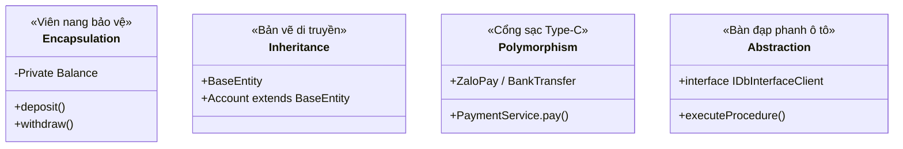

---

### 1. Tính Đóng Gói (Encapsulation)

* 📌 **Định nghĩa**:
  * Là kỹ thuật che giấu thông tin trạng thái nội bộ của đối tượng (dữ liệu biến), ngăn không cho các tác nhân bên ngoài truy cập hoặc sửa đổi trực tiếp. Quyền truy xuất chỉ được cung cấp gián tiếp thông qua các phương thức công khai (`public getter/setter/business methods`) có gắn kèm quy tắc kiểm tra tính hợp lệ.
* ⚙️ **Bản chất kỹ thuật**:
  * Sử dụng các từ khóa chỉ định phạm vi truy cập (Access Modifiers): `private` (chỉ trong nội bộ class), `protected` (trong cùng package hoặc lớp con kế thừa), `default/package-private` (trong cùng package) và `public` (toàn hệ thống).
* 💡 **Ẩn dụ đời sống**:
  * **Cây rút tiền tự động (ATM) hoặc Viên nang thuốc**: Bạn không thể tự mở nắp két sắt của cây ATM để rút tiền (`private balance`), mà bắt buộc phải cắm thẻ, nhập mã PIN và ấn lệnh rút tiền qua bàn phím (`public withdraw()`). Cây ATM sẽ tự kiểm tra xem số dư có đủ hay không trước khi mở khe nhả tiền.
* 💻 **Mã nguồn minh họa**:

```java
public class BankAccount {
    // 1. Giấu kín dữ liệu quan trọng bằng private
    private double balance;

    public BankAccount(double initialBalance) {
        if (initialBalance < 0) {
            throw new IllegalArgumentException("Số dư ban đầu không được âm!");
        }
        this.balance = initialBalance;
    }

    // 2. Cung cấp phương thức đọc có kiểm soát
    public double getBalance() {
        return this.balance;
    }

    // 3. Phương thức nghiệp vụ bảo vệ tính toàn vẹn dữ liệu
    public synchronized void withdraw(double amount) {
        if (amount <= 0) {
            throw new IllegalArgumentException("Số tiền rút phải lớn hơn 0!");
        }
        if (amount > this.balance) {
            throw new IllegalStateException("Số dư trong tài khoản không đủ!");
        }
        this.balance -= amount; // Thay đổi trạng thái an toàn
    }
}
```
* 🎯 **Khi nào sử dụng**: Bắt buộc áp dụng cho 100% các lớp DTO, Entity, Domain Model để bảo vệ tính toàn vẹn dữ liệu, chống gán sai logic từ bên ngoài.

---

### 2. Tính Kế Thừa (Inheritance)

* 📌 **Định nghĩa**:
  * Là cơ chế cho phép một lớp con (Subclass/Derived Class) kế thừa lại toàn bộ các thuộc tính (`fields`) và phương thức (`methods`) không-private của một lớp cha (Superclass/Base Class), đồng thời có thể mở rộng thêm các thuộc tính và phương thức mới hoặc ghi đè (override) lại hành vi có sẵn.
* ⚙️ **Bản chất kỹ thuật**:
  * Sử dụng từ khóa `extends` trong Java. Java hỗ trợ **Đơn kế thừa lớp (Single Class Inheritance)** để tránh bẫy Diamond Problem, nhưng hỗ trợ **Đa kế thừa giao diện (Multiple Interface Inheritance)** thông qua `implements`.
* 💡 **Ẩn dụ đời sống**:
  * **Bản vẽ khung gầm xe ô tô cơ sở**: Nhà máy chế tạo một khung gầm (`BaseVehicle`) có sẵn 4 bánh, động cơ, phanh, đèn xi-nhan. Khi muốn sản xuất xe Bán tải hay xe Thể thao mui trần, kỹ sư chỉ việc kế thừa lại khung gầm đó và gắn thêm thùng hàng hay mui bạt mà không cần chế tạo lại từ đầu 4 bánh xe.
* 💻 **Mã nguồn minh họa (`BaseEntity` $\rightarrow$ `Account`)**:

```groovy
// 1. Lớp cha cơ sở chứa các trường kiểm toán dùng chung
@MappedSuperclass
abstract class BaseEntity {
    @Id
    @GeneratedValue(strategy = GenerationType.IDENTITY)
    Long id
    
    @Column(name = "uuid", nullable = false)
    String uuid = UUID.randomUUID().toString()
    
    @Column(name = "created_at")
    Date createdAt = new Date()
    
    @Column(name = "created_by")
    String createdBy
}

// 2. Lớp con kế thừa toàn bộ id, uuid, createdAt, createdBy và bổ sung trường riêng
@Entity
@Table(name = "tbl_account")
class Account extends BaseEntity {
    @Column(name = "custodycd", unique = true)
    String custodycd // Số tài khoản chứng khoán
    
    @Column(name = "partner_code")
    String partnerCode // Mã ngân hàng đối tác
}
```
* 🎯 **Khi nào sử dụng**: Khi có quan hệ mang bản chất **"IS-A" (Là một)** giữa các đối tượng (ví dụ: `Account` IS-A `BaseEntity`, `Dog` IS-A `Animal`), giúp tái sử dụng mã nguồn và tránh trùng lặp code (DRY).

---

### 3. Tính Đa Hình (Polymorphism)

* 📌 **Định nghĩa**:
  * Là khả năng một đối tượng hoặc một phương thức có thể mang nhiều hình thái biểu hiện khác nhau. Cùng một thông điệp/lời gọi hàm được gửi đi, nhưng các đối tượng thuộc các kiểu khác nhau sẽ thực thi các hành vi nghiệp vụ hoàn toàn khác nhau.
* ⚙️ **Bản chất kỹ thuật**:
  * **Compile-time Polymorphism (Đa hình lúc biên dịch - Nạp chồng / Method Overloading)**: Các hàm cùng tên trong 1 class nhưng khác nhau về số lượng hoặc kiểu dữ liệu của tham số. Quyết định hàm nào chạy ngay lúc compile.
  * **Runtime Polymorphism (Đa hình lúc thực thi - Ghi đè / Method Overriding & Dynamic Binding)**: Lớp con ghi đè phương thức của Interface/Lớp cha. JVM sẽ dựa vào đối tượng thực tế trên vùng nhớ Heap tại thời điểm chạy để quyết định gọi hàm của lớp nào.
* 💡 **Ẩn dụ đời sống**:
  * **Nút bấm POWER trên điều khiển đa năng / Cổng cắm Type-C**:
    * Chĩa vào **Tivi** bấm POWER $\rightarrow$ Tivi bật màn hình hiển thị hình ảnh.
    * Chĩa vào **Điều hòa** bấm POWER $\rightarrow$ Điều hòa bật máy nén phả hơi lạnh.
    * Chĩa vào **Dàn loa** bấm POWER $\rightarrow$ Loa phát ra âm nhạc.
    * Cùng là hành động `power()`, nhưng đối tượng nhận lệnh tự biết xử lý theo bản chất riêng của nó.
* 💻 **Mã nguồn minh họa**:

```java
// 1. Interface giao diện chung
public interface PaymentGateway {
    PaymentResult processPayment(PaymentRequest request);
}

// 2. Triển khai ZaloPay
@Service("zaloPayGateway")
public class ZaloPayGateway implements PaymentGateway {
    @Override
    public PaymentResult processPayment(PaymentRequest request) {
        return new PaymentResult("SUCCESS_ZALO", "Tạo mã QR ZaloPay thành công");
    }
}

// 3. Triển khai Ngân Hàng Vietcombank
@Service("vcbGateway")
public class VcbPaymentGateway implements PaymentGateway {
    @Override
    public PaymentResult processPayment(PaymentRequest request) {
        return new PaymentResult("SUCCESS_VCB", "Chuyển tiền Napas Vietcombank thành công");
    }
}

// 4. Client gọi đa hình động tại Runtime
@Service
public class CheckoutService {
    @Autowired
    private Map<String, PaymentGateway> gateways;

    public void pay(String partnerCode, PaymentRequest req) {
        PaymentGateway gateway = gateways.get(partnerCode + "Gateway");
        // Đa hình: Tự động chạy đúng hàm processPayment của đối tác tương ứng
        PaymentResult res = gateway.processPayment(req);
    }
}
```
* 🎯 **Khi nào sử dụng**: Khi thiết kế các hệ thống mở rộng đa đối tác, đa cổng kết nối (Payment Gateway, SMS Provider, Notification Channel) tuân thủ nguyên lý **Open/Closed Principle (SOLID)**.

---

### 4. Tính Trừu Tượng (Abstraction)

* 📌 **Định nghĩa**:
  * Là quá trình ẩn đi toàn bộ các chi tiết cài đặt phức tạp bên dưới, chỉ hiển thị ra ngoài những tính năng cốt lõi và giao diện cần thiết cho người sử dụng.
* ⚙️ **Bản chất kỹ thuật**:
  * Được triển khai thông qua `abstract class` (lớp trừu tượng) và `interface` (giao diện). Định nghĩa **"Làm cái gì" (WHAT)** nhưng không bắt buộc định nghĩa **"Làm như thế nào" (HOW)**.
* 💡 **Ẩn dụ đời sống**:
  * **Bàn đạp phanh xe ô tô**: Khi lái xe, bạn chỉ cần đạp phanh (`brake()`). Bạn không cần biết áp suất dầu phanh trong xilanh bao nhiêu Bar, hệ thống chống bó cứng phanh ABS phân bổ lực ra sao. Chi tiết cơ khí bị ẩn đi, chỉ có bàn đạp phanh lộ ra cho tài xế điều khiển an toàn.
* 💻 **Mã nguồn minh họa**:

```groovy
// 1. Giao diện trừu tượng: Tầng nghiệp vụ chỉ cần biết hợp đồng gọi hàm
interface IDbInterfaceClient {
    Map<String, Object> executeOpenAccount(OpenAccountDTO dto)
}

// 2. Chi tiết phức tạp ẩn bên dưới: Kết nối Oracle, gọi Package FOPKS_EKYCAPI, map CURSOR
@Service
class DbInterfaceClientImpl implements IDbInterfaceClient {
    @Autowired
    @Qualifier("flexJdbcTemplate")
    JdbcTemplate flexJdbcTemplate

    @Override
    Map<String, Object> executeOpenAccount(OpenAccountDTO dto) {
        // Ẩn giấu hàng chục dòng code phức tạp về CallableStatement, OracleTypes
        return flexJdbcTemplate.call(...)
    }
}
```
* 🎯 **Khi nào sử dụng**: Khi thiết kế kiến trúc phân tầng (Clean Architecture), tách biệt giữa tầng Giao tiếp (API/Controller) và tầng Xử lý Hạ tầng/CSDL (DAO/Database Clients).

---

## 1.2. Phân biệt Class, Object, Interface & Abstract Class

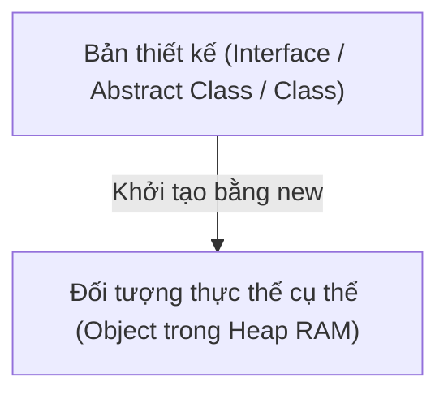

### 1. Định nghĩa Class & Object:
* 📌 **Class (Lớp)**: Là một **Khuôn mẫu / Bản thiết kế (Blueprint)** định nghĩa các thuộc tính (dữ liệu) và phương thức (hành vi) mà các đối tượng tạo ra từ nó sẽ có. Class không chiếm bộ nhớ Heap khi chưa được khởi tạo.
* 📌 **Object (Đối tượng)**: Là một **Thực thể cụ thể (Instance)** được tạo ra từ Class bằng từ khóa `new`. Đối tượng chiếm giữ vùng nhớ vật lý trong bộ nhớ Heap của JVM.

---

### 2. Bảng So Sánh Chi Tiết: Interface vs Abstract Class

| Tiêu Chí So Sánh | `Interface` (Giao Diện) | `Abstract Class` (Lớp Trừu Tượng) |
|---|---|---|
| **📌 Định nghĩa** | Là một hợp đồng cam kết hành vi (Contract), chỉ định nghĩa những gì một lớp PHẢI LÀM. | Là một lớp cha trừu tượng dở dang, dùng làm khung xương cho các lớp con cùng họ kế thừa. |
| **Bản chất Mối quan hệ** | **CAN-DO** (Có khả năng làm gì - ví dụ: `Serializable`, `Runnable`). | **IS-A** (Là một loại gì - ví dụ: `Account` IS-A `BaseEntity`). |
| **Kế thừa / Thực thi** | Một Class có thể `implements` **Nhiều Interface** (Đa kế thừa). | Một Class chỉ có thể `extends` **Duy nhất 1 Abstract Class** (Đơn kế thừa). |
| **Thuộc tính (Fields)** | Chỉ chứa hằng số: mặc định là `public static final`. | Chứa đầy đủ mọi loại biến: `private`, `protected`, `public`, `static`, `non-static`. |
| **Phương thức (Methods)** | Chứa hàm trừu tượng (`abstract`), từ Java 8 hỗ trợ thêm `default` và `static` method. | Chứa cả hàm trừu tượng (`abstract`) và hàm đã có thân cài đặt đầy đủ (`concrete method`). |
| **Constructor** | **KHÔNG CÓ** Constructor (Không thể khởi tạo). | **CÓ THỂ CÓ** Constructor (Dùng để lớp con gọi qua `super()`). |
| **Tốc độ truy xuất** | Chậm hơn 1 chút do cần tìm kiếm trong bảng phương thức ảo (Interface Method Table - itable). | Nhanh hơn do dùng Virtual Method Table (vtable). |
| **🎯 Khi nào sử dụng?** | Khi muốn định nghĩa giao diện chung cho các lớp **hoàn toàn không liên quan họ hàng** (ví dụ: ZaloPay, VCB, MoMo cùng implement `PaymentGateway`). | Khi các lớp có **quan hệ họ hàng mật thiết**, dùng chung nhiều thuộc tính kiểm toán và logic xử lý cốt lõi (`BaseService`, `BaseEntity`). |

---

## 1.3. Mô hình bộ nhớ JVM (Memory Architecture) & Cơ chế Dọn rác (GC)

```
+-----------------------------------------------------------------------------------------+
|                                    JVM MEMORY (RAM)                                     |
+--------------------------------------------+--------------------------------------------+
|                HEAP MEMORY                 |              NON-HEAP MEMORY               |
|         (Dùng chung cho mọi Luồng)         |                                            |
|                                            |  +---------------------------------------+ |
| +----------------------------------------+ |  | Metaspace (Lưu Bytecode, Class info,  | |
| | Young Generation                       | |  |            static variables)          | |
| |   - Eden Space (Nơi sinh ra Object)    | |  +---------------------------------------+ |
| |   - Survivor 0 (S0) | Survivor 1 (S1)  | |  | Thread Stack 1   | Thread Stack 2     | |
| +----------------------------------------+ |  | (Local vars,     | (Local vars,       | |
| | Old Generation (Tenured)               | |  |  method frames)  |  method frames)    | |
| | (Lưu các Object sống thọ >15 chu kỳ GC)| |  +---------------------------------------+ |
+--------------------------------------------+--------------------------------------------+
```

### 1. Định nghĩa các phân vùng bộ nhớ:

* 📌 **Thread Stack Memory (Bộ nhớ Ngăn xếp)**:
  * Là vùng nhớ riêng biệt được cấp phát cho từng Luồng (Thread-safe). Lưu trữ các biến cục bộ (Local variables), kiểu nguyên thủy (`int`, `boolean`, `double`), con trỏ tham chiếu (`reference variables`) và các khung thực thi hàm (Stack Frames). Tự động thu hồi bộ nhớ ngay khi hàm kết thúc. Lỗi tràn stack: `StackOverflowError`.
  * 💡 *Ẩn dụ*: Bàn làm việc riêng của mỗi nhân viên. Xong việc tự dọn sạch ngay.
* 📌 **Heap Memory (Bộ nhớ Đống)**:
  * Là vùng nhớ chung khổng lồ của toàn bộ ứng dụng. Nơi cấp phát cho tất cả các đối tượng (`new Object()`) và mảng. Được quản lý và dọn dẹp tự động bởi tiến trình **Garbage Collector (GC)**. Lỗi tràn heap: `OutOfMemoryError: Java heap space`.
  * 💡 *Ẩn dụ*: Kho tổng chung của toàn công ty chứa các kiện hàng to.
* 📌 **Metaspace (Bộ nhớ Siêu dữ liệu - từ Java 8 thay thế PermGen)**:
  * Nằm trên bộ nhớ RAM vật lý ngoài của Hệ điều hành (Native Memory). Lưu trữ Class Metadata, Bytecode của Method, Constant Pool, thông tin Reflection.
* 📌 **Program Counter (PC) Register**:
  * Con trỏ lưu trữ địa chỉ của dòng lệnh Bytecode tiếp theo mà CPU cần thực thi cho luồng hiện tại.

---

### 2. Định nghĩa Cơ chế Dọn rác (Garbage Collection - GC):

* 📌 **Garbage Collection (GC)**: Là tiến trình chạy nền tự động của JVM có nhiệm vụ phát hiện và thu hồi vùng nhớ Heap của các đối tượng không còn được tham chiếu tới (Unreachable Objects), giải phóng RAM cho ứng dụng.
* ⚙️ **Các thế hệ dọn rác**:
  1. **Young Generation (Eden, S0, S1)**: Nơi các đối tượng mới tạo ra sinh sống. Đa phần các đối tượng trong ứng dụng "chết trẻ" (vừa ra khỏi hàm là hết dùng). Được dọn bởi **Minor GC** (tốc độ cực nhanh, tính bằng mili-giây).
  2. **Old Generation (Tenured)**: Chứa các đối tượng sống sót qua **15 chu kỳ dọn rác** (Max Tenuring Threshold) như Spring Singletons, In-Memory Caches. Được dọn bởi **Major GC / Full GC**.
  3. **Stop-The-World (STW)**: Là khoảnh khắc JVM tạm dừng toàn bộ tất cả các luồng ứng dụng đang chạy để đội dọn rác GC quét sạch bộ nhớ. Cần tối ưu để thời gian STW < 20ms.

---

## 1.4. Java Collections Framework & Bí mật bên trong `HashMap`

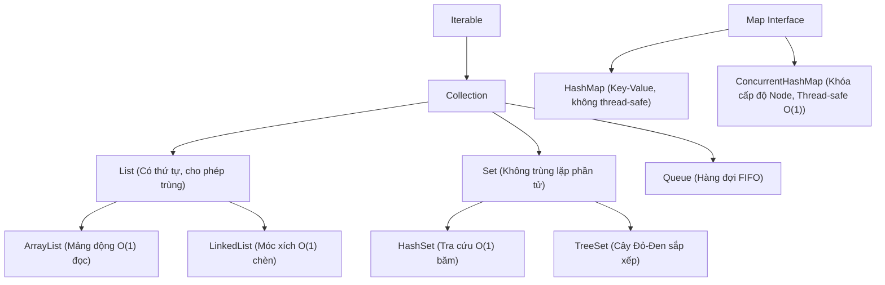

### 1. Định nghĩa các Cấu trúc Dữ liệu Cốt lõi:

* 📌 **`List`**: Tập hợp các phần tử có thứ tự tuần tự (Indexed), cho phép chứa các phần tử trùng lặp (`null`, trùng giá trị).
* 📌 **`Set`**: Tập hợp các phần tử duy nhất, **tuyệt đối KHÔNG chứa phần tử trùng lặp**.
* 📌 **`Map`**: Cấu trúc dữ liệu lưu trữ theo cặp **Khóa - Giá trị (Key-Value)**. Khóa (Key) là duy nhất, Giá trị (Value) có thể trùng.

---

### 2. So sánh `ArrayList` vs `LinkedList`:

| Tiêu Chí | `ArrayList` | `LinkedList` |
|---|---|---|
| **Cấu trúc dữ liệu** | Mảng động có thể co giãn (`Object[] elementData`) | Danh sách liên kết đôi (`Doubly-Linked List`) |
| **Đọc ngẫu nhiên `get(index)`** | ⚡ **$O(1)$** (Truy cập thẳng theo chỉ mục bộ nhớ) | ⏳ **$O(n)$** (Phải duyệt tuần tự từ đầu hoặc cuối danh sách) |
| **Chèn / Xóa ở giữa** | ⏳ **$O(n)$** (Phải dịch chuyển toàn bộ các phần tử phía sau) | ⚡ **$O(1)$** (Chỉ cần đổi con trỏ `prev` và `next` của 2 Node) |
| **Tiêu tốn bộ nhớ** | Tiết kiệm (Chỉ lưu dữ liệu phần tử) | Tốn bộ nhớ hơn (Mỗi Node tốn thêm 2 con trỏ tham chiếu `prev`, `next`) |
| **💡 Ẩn dụ** | Dãy ghế rạp phim có đánh số ghế | Đoàn tàu hỏa móc xích các toa |

---

### 3. Bí mật bên trong `HashMap` (Under The Hood):

* 📌 **Bản chất**: `HashMap` là một mảng gồm các ngăn chứa (**Buckets**): `Node<K,V>[] table`.
* ⚙️ **Quy trình hoạt động từng bước**:
  1. **Tính toán Hash**: Khi gọi `map.put(key, value)`, JVM tính mã băm: `int hash = hash(key.hashCode())`.
  2. **Tìm vị trí Bucket**: Tính chỉ số mảng bằng phép toán bitwise cực nhanh: `index = (n - 1) & hash` (với $n$ là kích thước mảng, mặc định là 16).
  3. **Xử lý Va Chạm Băm (Hash Collision)**: Khi 2 Key khác nhau nhưng ra cùng một `index`:
     - Ban đầu, các Node cùng index sẽ nối đuôi nhau tạo thành một **Danh sách liên kết đơn (Singly Linked List)**.
     - Khi số lượng phần tử trong 1 bucket vượt ngưỡng **`TREEIFY_THRESHOLD = 8`** và kích thước bảng >= 64, danh sách liên kết sẽ tự động chuyển đổi thành **Cây Đỏ-Đen (Red-Black Tree)** để tối ưu tốc độ tìm kiếm từ $O(n)$ xuống $O(\log n)$.
* 💡 **Ẩn dụ**: Tủ gửi đồ siêu thị 16 ngăn. Nếu 1 ngăn có quá 8 người nhét đồ, nhân viên nâng cấp ngăn đó thành giá sách ma thuật tự phân nhánh.

---

### 4. So sánh `HashMap` vs `ConcurrentHashMap`:

* 📌 **`HashMap`**: Không đồng bộ (Non-thread-safe). Nếu nhiều luồng cùng ghi có thể gây lỗi hỏng cấu trúc dữ liệu hoặc vòng lặp vô tận (Infinite Loop trên Java 7).
* 📌 **`ConcurrentHashMap`**: Cấu trúc đồng bộ hiệu năng cao (Thread-safe).
  * **Cơ chế Khóa**: Không khóa toàn bảng như `Hashtable`. Nó sử dụng **Thuật toán CAS (Compare-And-Swap)** cho các thao tác chèn Node rỗng đầu tiên và chỉ sử dụng **`synchronized` trên chính Node gốc của Bucket đó (Bucket/Node-level Lock)**.
  * Các luồng đọc (`get()`) hoàn toàn không bị khóa (Lock-free) nhờ biến `volatile Node.val`.

---

## 1.5. Đa luồng & Đồng thời (Multithreading, Concurrency & Virtual Threads)

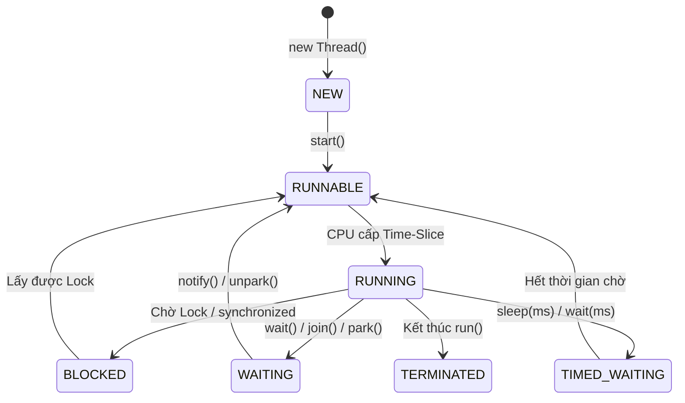

### 1. Định nghĩa các Thuật ngữ Đồng thời:

* 📌 **Process (Tiến trình)**: Một chương trình đang chạy độc lập trong Hệ điều hành, có không gian bộ nhớ RAM riêng biệt.
* 📌 **Thread (Luồng)**: Đơn vị thực thi nhỏ nhất bên trong một Process. Các Thread trong cùng một Process chia sẻ chung vùng nhớ Heap nhưng có Stack riêng.
* 📌 **Race Condition**: Tình trạng lỗi xảy ra khi hai hoặc nhiều luồng cùng truy cập và sửa đổi dữ liệu dùng chung cùng một lúc mà không có cơ chế đồng bộ, dẫn đến kết quả sai lệch.
* 📌 **Deadlock**: Tình trạng bế tắc vĩnh viễn khi Luồng A đang giữ Tài nguyên 1 và chờ Tài nguyên 2, trong khi Luồng B đang giữ Tài nguyên 2 và chờ Tài nguyên 1.

---

### 2. Từ khóa `volatile` & Cơ chế CAS:

* 📌 **Từ khóa `volatile`**:
  * Khai báo một biến luôn được đọc và ghi trực tiếp trên **Bộ nhớ chính (RAM - Main Memory)**, cấm CPU lưu bản sao cục bộ trên CPU Cache L1/L2. Đảm bảo tính **Hiển thị (Visibility)** giữa các luồng.
  * 💡 *Ẩn dụ*: Bảng thông báo điện tử ở sảnh chính công ty. Mọi người đều nhìn thẳng vào bảng, cấm ghi vào sổ tay cá nhân.
* 📌 **Atomic Variables & CAS (Compare-And-Swap)**:
  * Kỹ thuật đồng bộ không dùng khóa (Lock-free Concurrency) ở tầng phần cứng CPU.
  * Kiểm tra xem giá trị tại ô nhớ có đúng bằng giá trị kỳ vọng (Expected) không. Nếu đúng, cập nhật thành giá trị mới (New Value) trong 1 lệnh vi xử lý duy nhất.

```java
// Ví dụ: Đếm số lượng giao dịch thành công đồng thời an toàn tuyệt đối
public class MetricService {
    private final AtomicLong transactionCounter = new AtomicLong(0);

    public void incrementSuccess() {
        // Tăng giá trị nguyên tử không cần block luồng
        long currentCount = transactionCounter.incrementAndGet();
    }
}
```

---

### 3. ThreadPoolExecutor & Virtual Threads (Java 21):

* 📌 **`ThreadPoolExecutor`**: Bộ quản lý tập hợp các Luồng tái sử dụng, giúp kiểm soát số lượng luồng tối đa, tránh việc tạo mới và hủy luồng liên tục làm kiệt quệ tài nguyên CPU/RAM.
  * `corePoolSize`: Số luồng thường trực.
  * `workQueue`: Hàng đợi chứa tác vụ chờ (`BlockingQueue`).
  * `maximumPoolSize`: Số luồng tối đa khi hàng đợi bị tràn.
  * `RejectedExecutionHandler`: Chính sách xử lý khi hệ thống quá tải.
* 📌 **Virtual Threads (Project Loom - Java 21)**:
  * Luồng siêu nhẹ do chính JVM quản lý (chỉ chiếm ~1KB RAM thay vì ~1MB như Platform Thread). Cho phép ứng dụng mở hàng triệu luồng đồng thời. Khi Virtual Thread thực hiện tác vụ I/O (chờ gọi HTTP/DB), JVM tự động tháo nó ra khỏi Carrier OS Thread để OS Thread phục vụ việc khác.

---

## 1.6. Xử Lý Ngoại Lệ Chuẩn Mực trong Hệ thống Tài chính (Exception Handling)

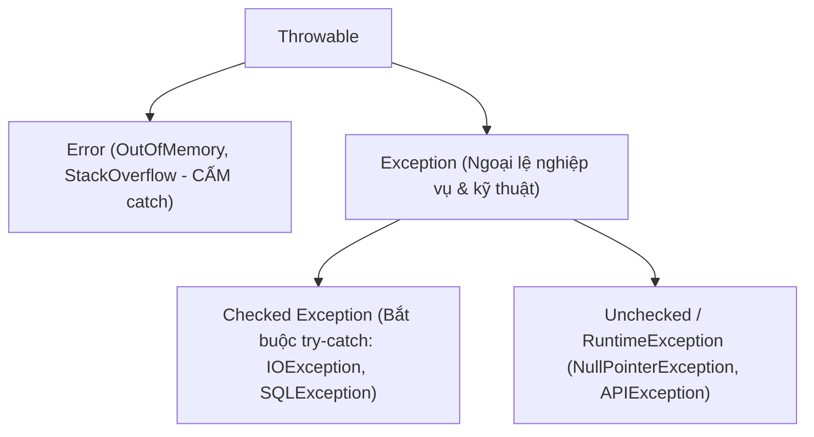

### 1. Định nghĩa Phân cấp Ngoại lệ:
* 📌 **`Error`**: Các sự cố nghiêm trọng của hệ thống hạ tầng JVM (như `OutOfMemoryError`, `StackOverflowError`). Ứng dụng **không được bắt (catch)** vì không thể phục hồi.
* 📌 **`Checked Exception` (Kế thừa từ `Exception`)**: Các ngoại lệ có thể dự đoán trước trong quá trình I/O mạng hoặc tệp tin (như `SQLException`, `IOException`). Trình biên dịch **bắt buộc phải viết `try-catch` hoặc khai báo `throws`**.
* 📌 **`Unchecked Exception` (Kế thừa từ `RuntimeException`)**: Các ngoại lệ xảy ra do lỗi logic lập trình (như `NullPointerException`, `IllegalArgumentException`, `APIException`). Không bắt buộc phải khai báo `throws`.

---

### 2. Ba Nguyên tắc Vàng Xử lý Ngoại lệ trong Hệ thống Tài chính:

> [!CAUTION]
> 1. **Zero Stacktrace Leakage**: Tuyệt đối không bao giờ trả vết lỗi (Stacktrace) hoặc câu lệnh SQL ra phía Client/Đối tác.
> 2. **Exception Wrapping**: Mọi lỗi kỹ thuật tầng dưới (`SQLException`, `RestClientException`) phải được bắt và bọc lại thành mã nghiệp vụ chuẩn trong `throw new APIException(ErrorCodeDetail.XXX)`.
> 3. **CẤM Silent Catch**: Không bao giờ viết `catch (Exception e) {}` rỗng. Mọi lỗi phải được ghi log có cấu trúc qua `LogService.error(LogDTO)`.

---

## 1.7. Java Generics, Reflection & Dynamic Proxy

### 1. Java Generics & Type Erasure:
* 📌 **Generics**: Cơ chế tham số hóa kiểu dữ liệu (`<T>`, `<K, V>`), giúp kiểm tra an toàn kiểu tại thời điểm biên dịch (Compile-time Type Safety), loại bỏ nhu cầu ép kiểu thủ công (`casting`).
* 📌 **Type Erasure**: Khi biên dịch ra mã Bytecode `.class`, JVM xóa bỏ toàn bộ thông tin kiểu Generics `<T>` và thay thế bằng kiểu biên (Bound Type) hoặc `Object` để tương thích ngược với Java 1.4.

---

### 2. Java Reflection API:
* 📌 **Định nghĩa**: Khả năng của chương trình cho phép kiểm tra, phân tích và can thiệp thay đổi cấu trúc, thuộc tính, phương thức của bất kỳ Class nào tại thời điểm chạy (Runtime), kể cả các trường `private`.
* 💡 *Ẩn dụ*: Máy chụp X-quang và cánh tay phẫu thuật nội soi.
* 💻 *Ứng dụng trong `BaseService`*: Dùng `InvokerHelper.setProperties(instance, dto)` để tự động gán dữ liệu động từ DTO vào Entity.

---

### 3. Dynamic Proxy (Nền tảng của Spring AOP & `@Transactional`):
* 📌 **Định nghĩa**: Cơ chế tạo ra một đối tượng đại diện giả lập (Proxy Object) tại thời điểm Runtime để chặn các lời gọi phương thức tới đối tượng thực tế (Target Object).
  * **JDK Dynamic Proxy**: Áp dụng khi Target Class triển khai Interface (Spring dùng mặc định).
  * **CGLIB Proxy**: Tạo Subclass kế thừa Target Class bằng cách can thiệp Bytecode trực tiếp (dùng khi Target Class không có Interface).
* 💡 *Ẩn dụ*: **Thư ký riêng của Tổng giám đốc**. Mọi cuộc gọi đến sếp đều qua thư ký ghi sổ (Logging), kiểm tra bảo mật (Security) và mở hợp đồng (Transaction).

---

## 1.8. Các bước tiến hóa từ Java 8 đến Java 21

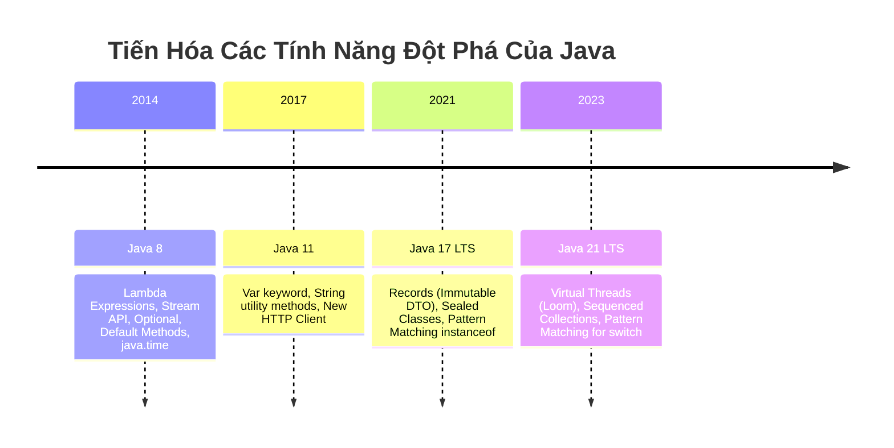

* 📌 **Lambda Expressions & Functional Interfaces**: Cú pháp viết hàm ẩn danh ngắn gọn `(params) -> { body }`, cho phép truyền hành vi (Behavior Parameterization) như một biến.
* 📌 **Stream API**: Xử lý tập hợp dữ liệu theo mô hình đường ống khai báo (Declarative Pipeline): `filter()` $\rightarrow$ `map()` $\rightarrow$ `collect()`.
* 📌 **`Optional<T>`**: Đối tượng bao bọc giá trị có thể null, giải quyết triệt để lỗi `NullPointerException` bằng cách ép lập trình viên phải xử lý nhánh rỗng (`isPresent()`, `orElse()`, `orElseThrow()`).
* 📌 **Records (Java 16+)**: Cú pháp khai báo DTO bất biến (Immutable Data Carriers) siêu ngắn gọn chỉ với 1 dòng code:
```java
public record LoginResponse(String accessToken, String tokenType, long expiresIn) {}
```

---

# PHẦN 2: KIẾN TRÚC LÕI SPRING BOOT & SPRING FRAMEWORK

## 2.1. Triết lý IoC & DI: Sự giải phóng của Lập trình viên

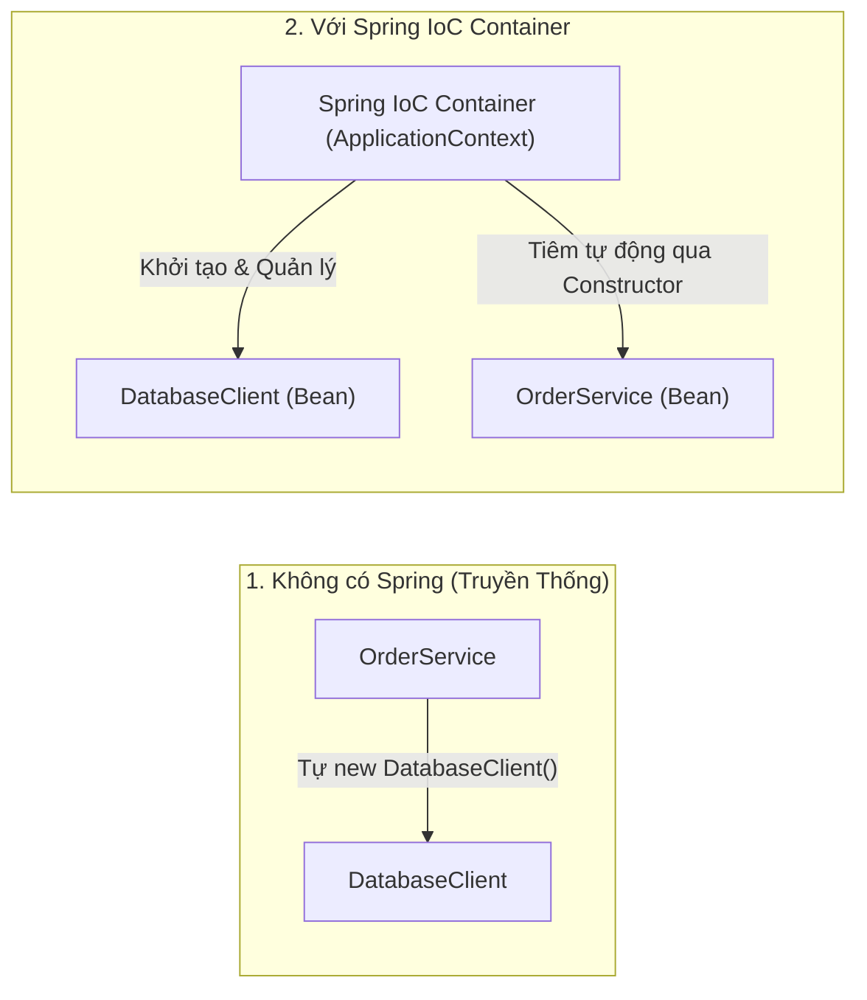

* 📌 **Inversion of Control (IoC - Đảo ngược Điều khiển)**:
  * Nguyên lý thiết kế phần mềm trong đó quyền kiểm soát việc tạo đối tượng, cấu hình và quản lý vòng đời được chuyển giao từ mã nguồn ứng dụng của lập trình viên sang cho một bộ khung quản lý tập trung (**Spring IoC Container / ApplicationContext**).
* 📌 **Dependency Injection (DI - Tiêm Phụ thuộc)**:
  * Là một dạng triển khai cụ thể của IoC, trong đó Spring Container tự động cung cấp (tiêm) các đối tượng phụ thuộc cần thiết vào cho một Bean thông qua:
    1. **Constructor Injection (Khuyến nghị số 1)**: Đảm bảo tính bất biến (`final`), an toàn đa luồng và dễ viết Unit Test.
    2. **Setter Injection**: Dùng cho các phụ thuộc tùy chọn (Optional).
    3. **Field Injection (`@Autowired` trên biến)**: Gọn gàng nhưng khó viết Unit Test cô lập.
* 💡 **Ẩn dụ**: Tự đi chợ nấu ăn vs Ngồi vào bàn ăn nhà hàng 5 sao được phục vụ món ăn tận nơi.

---

## 2.2. Vòng đời Spring Bean (Bean Lifecycle) & Bean Scopes

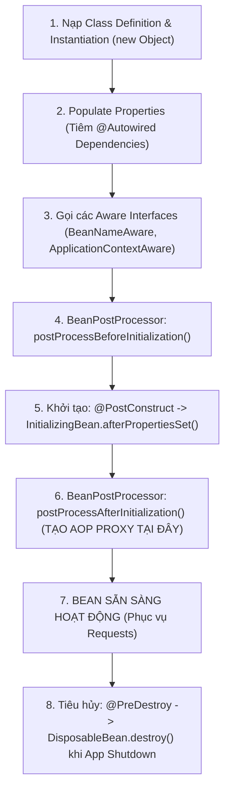

### 1. Định nghĩa Spring Bean:
* 📌 **Spring Bean**: Là một đối tượng được khởi tạo, lắp ráp, cấu hình và quản lý hoàn toàn bởi Spring IoC Container trong suốt vòng đời của ứng dụng.

### 2. Bảng Phân loại Bean Scopes:
* 📌 **`singleton` (Mặc định)**: Duy nhất 1 instance được tạo ra trong toàn bộ Container (Stateless, Thread-safe).
* 📌 **`prototype`**: Mỗi lần được yêu cầu (`@Autowired` hoặc `getBean()`), một instance hoàn toàn mới sẽ được tạo ra.
* 📌 **`request`**: Mỗi HTTP Request có một instance riêng, tự hủy khi request kết thúc.
* 📌 **`session`**: Mỗi HTTP Session có một instance riêng.

---

## 2.3. Spring AOP & Bí mật cơ chế Dynamic Proxy

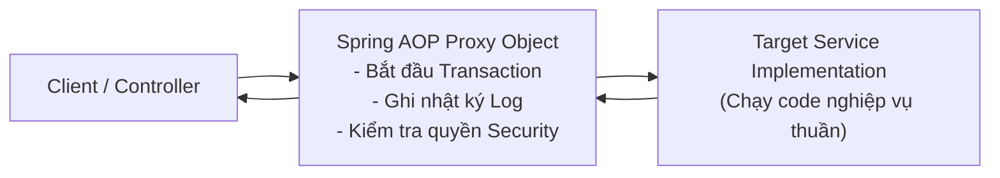

* 📌 **Aspect-Oriented Programming (AOP - Lập trình Hướng khía cạnh)**:
  * Phương pháp lập trình nhằm module hóa các mối quan tâm cắt ngang (Cross-Cutting Concerns) như Logging, Transaction Management, Security, Caching tách biệt khỏi mã logic nghiệp vụ chính.
* 📌 **Các khái niệm cốt lõi trong AOP**:
  * **Aspect**: Khía cạnh cắt ngang (ví dụ: `LoggingAspect`, `TransactionAspect`).
  * **JoinPoint**: Điểm thực thi trong chương trình (ví dụ: khi 1 method trong Service được gọi).
  * **Pointcut**: Biểu thức quy định JoinPoint nào sẽ được áp dụng Aspect (ví dụ: `@annotation(org.springframework.transaction.annotation.Transactional)`).
  * **Advice**: Hành động thực thi tại JoinPoint (`@Before`, `@After`, `@Around`, `@AfterThrowing`).

> [!CAUTION]
> **BẪY CHÍ MẠNG: SELF-INVOCATION (GỌI NỘI BỘ TRONG CÙNG CLASS)**
> Khi `methodA()` gọi `this.methodB()` trong cùng một Service Class: Lời gọi hàm này chạy nội bộ Java, **KHÔNG ĐI QUA SPRING PROXY**. Hậu quả là `@Transactional`, `@Async`, `@Cacheable` trên `methodB()` **HOÀN TOÀN BỊ VÔ HIỆU HÓA**.

---

## 2.4. Bản chất bên dưới Spring Boot Auto-Configuration

* 📌 **Auto-Configuration**: Tính năng của Spring Boot tự động đoán và cấu hình các Bean cần thiết vào Spring Container dựa trên các thư viện jar có mặt trong Classpath và các thuộc tính trong file `application.yml`.
* ⚙️ **Cơ chế hoạt động**:
  * Gốc rễ nằm ở annotation `@EnableAutoConfiguration`.
  * Spring Boot đọc file định nghĩa: `META-INF/spring/org.springframework.boot.autoconfigure.AutoConfiguration.imports`.
  * Đánh giá các điều kiện có điều kiện: `@ConditionalOnClass` (nếu có thư viện HikariCP $\rightarrow$ tự tạo DataSource), `@ConditionalOnMissingBean` (nếu Dev chưa cấu hình $\rightarrow$ lấy cấu hình mặc định).

---

## 2.5. Luồng xử lý Spring MVC & So sánh Filter vs Interceptor

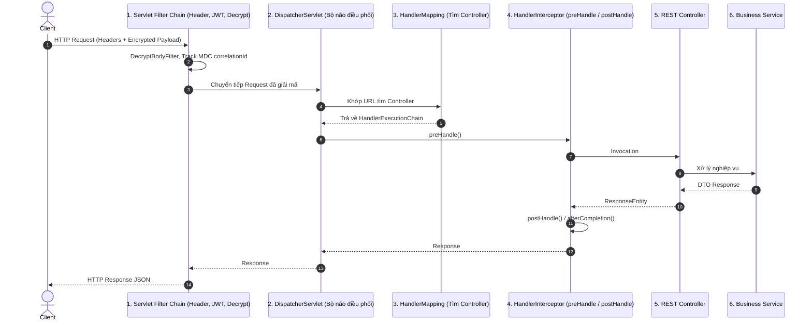

### So sánh Filter vs Interceptor:
* 📌 **Servlet Filter**: Nằm ở tầng Servlet Container ngoài cùng (trước `DispatcherServlet`). Chuyên trách các tác vụ hạ tầng: Giải mã Payload (`DecryptBodyFilter`), CORS, Đọc Headers đối tác (`HeaderIdentifyFilter`).
* 📌 **HandlerInterceptor**: Nằm trong Spring MVC Context (sau `DispatcherServlet`). Có quyền truy cập vào thông tin của Controller Method sắp chạy, thích hợp làm Authorization nâng cao hoặc đo thời gian Controller thực thi.

---

## 2.6. Spring Data JPA, Persistence Context & Bẫy N+1 Query

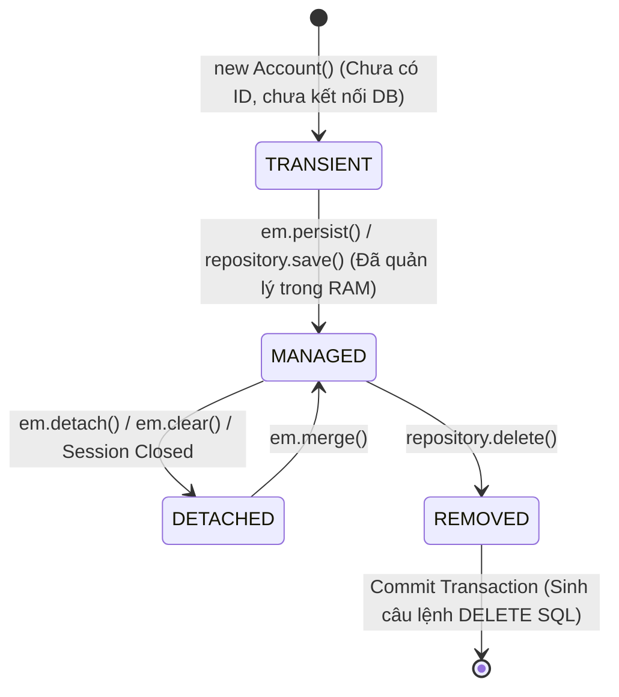

### 1. Định nghĩa Persistence Context & Dirty Checking:
* 📌 **Persistence Context (Ngữ cảnh Lưu trữ)**: Là một bộ đệm trong bộ nhớ RAM cấp 1 (First-Level Cache) do `EntityManager` quản lý. Mọi thực thể trong trạng thái **MANAGED** đều được theo dõi chặt chẽ.
* 📌 **Dirty Checking**: Cuối Transaction, Hibernate tự động so sánh trạng thái hiện tại của Entity với bản chụp nhanh (Snapshot) lúc nạp vào. Nếu có thay đổi, Hibernate **tự động sinh câu lệnh SQL `UPDATE`** mà không cần lập trình viên phải gọi hàm `save()`.

---

### 2. Giải mã Bẫy N+1 Query & 3 Cách Xử Lý Triệt Để:
* 📌 **Hiện tượng N+1 Query**: Khi thực thể cha có quan hệ `@OneToMany` hoặc `@ManyToOne` dạng `FetchType.LAZY`. Câu lệnh đầu tiên lấy ra $N$ bản ghi cha, sau đó khi duyệt vòng lặp lấy bản ghi con, Hibernate bắn thêm $N$ câu SELECT đơn lẻ xuống DB $\rightarrow$ Tổng cộng $1 + N$ queries làm nghẽn CSDL.
* ⚙️ **3 Giải pháp triệt tiêu**:
  1. **`JOIN FETCH` trong JPQL**: `SELECT c FROM Customer c JOIN FETCH c.accounts`.
  2. **`@EntityGraph`**: `@EntityGraph(attributePaths = ["accounts"])`.
  3. **DTO Projection**: Lấy đích danh các cột cần thiết qua Constructor Expression.

---

## 2.7. Quản lý Giao dịch cơ sở dữ liệu (`@Transactional`)

* 📌 **Database Transaction**: Là một đơn vị công việc logic bao gồm một hoặc nhiều thao tác cơ sở dữ liệu, đảm bảo tuân thủ nghiêm ngặt 4 thuộc tính **ACID**:
  * **Atomicity (Nguyên tử)**: Toàn bộ thành công hoặc toàn bộ thất bại (All or Nothing).
  * **Consistency (Nhất quán)**: Dữ liệu luôn hợp lệ theo các ràng buộc toàn vẹn.
  * **Isolation (Cô lập)**: Các giao dịch chạy đồng thời không can thiệp lẫn nhau.
  * **Durability (Bền vững)**: Khi đã commit thì dữ liệu không bao giờ bị mất kể cả khi sập nguồn.

### Cấu hình Chuẩn mực trong Dự án Tài chính:
```groovy
@Transactional(
    propagation = Propagation.REQUIRED,
    isolation = Isolation.READ_COMMITTED, // Chống Dirty Read
    timeout = 5,                          // Timeout 5 giây chống chiếm giữ kết nối
    rollbackFor = [Exception.class]       // BẮT BUỘC: Rollback cho TOÀN BỘ Exception
)
void executeCriticalTransfer(TransferDTO dto) {
    // Thao tác CSDL
}
```

---

## 2.8. Kiến trúc Bảo mật Spring Security Filter Chain

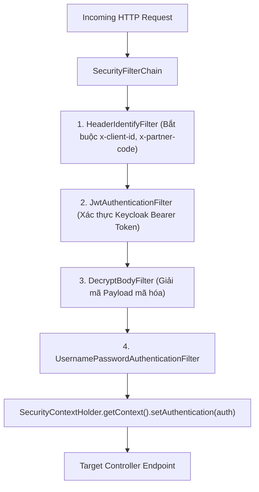

* 📌 **`SecurityFilterChain`**: Chuỗi các bộ lọc an ninh xử lý tuần tự từng HTTP Request đến trước khi vào Controller.
* 📌 **`SecurityContextHolder`**: Nơi lưu trữ thông tin định danh và quyền hạn của người dùng hiện tại (`Authentication` / `Principal`) trong suốt vòng đời của luồng (dựa trên `ThreadLocal`).

---

# PHẦN 3: ĐẠI TỪ ĐIỂN ANNOTATION TOÀN DIỆN

## 3.1. Nhóm Annotation Spring Core & Dependency Injection

| Annotation | Vị Trí Đặt | 📌 Định Nghĩa Kỹ Thuật | 💡 Ẩn Dụ Trực Quan | 💻 Code Ví Dụ Thực Tế |
|---|---|---|---|---|
| `@Component` | Class | Đăng ký một class thành một Spring Bean chung để IoC Container tự động phát hiện và quản lý. | **Thẻ căn cước công dân**: Khai sinh đối tượng trong Spring Container. | `@Component class HeaderLocaleResolver` |
| `@Service` | Class | Đánh dấu Bean thuộc tầng Xử lý Nghiệp vụ (Business Service Layer). | **Phòng nghiệp vụ**: Nơi điều phối xử lý giao dịch. | `@Service class AuthService` |
| `@Repository` | Class / Interface | Đánh dấu Bean thuộc tầng Truy xuất CSDL (DAO), tự động dịch các mã lỗi SQL Exception. | **Thủ kho dữ liệu**: Nơi chuyên trách đọc ghi DB. | `@Repository interface AccountRepository` |
| `@RestController` | Class | Kết hợp giữa `@Controller` và `@ResponseBody`, mọi hàm mặc định serialize dữ liệu trả về JSON. | **Cửa tiếp tân tự động**: Tiếp nhận request và trả kết quả JSON. | `@RestController @RequestMapping("/api/v1")` |
| `@Autowired` | Field / Constructor | Tự động tiêm (inject) Bean tương thích từ Spring Container vào vị trí khai báo. | **Ống truyền dinh dưỡng**: Tự động cấp phát đối tượng phụ thuộc. | `@Autowired LogService log` |
| `@Qualifier("name")`| Field / Parameter | Chỉ định chính xác tên Bean cần tiêm khi có nhiều Bean cùng kiểu triển khai. | **Gọi đích danh tên**: Tránh nhầm lẫn giữa 2 đối tượng cùng loại. | `@Qualifier("flexDataSource") DataSource ds` |
| `@Primary` | Method `@Bean` / Class | Đánh dấu Bean ưu tiên số 1 được tiêm khi xảy ra xung đột nhiều Bean cùng kiểu. | **Con cưng ưu tiên**: Luôn được chọn mặc định. | `@Primary @Bean(name = "appDataSource")` |
| `@Value("${prop}")`| Field | Đọc và tiêm giá trị cấu hình từ file `application.yml` hoặc biến môi trường. | **Ống nhòm đọc file YML**: Đọc tham số động lúc khởi động. | `@Value('${spring.application.name}') String name` |
| `@Configuration` | Class | Đánh dấu class chứa các phương thức định nghĩa Bean (`@Bean`) cho hệ thống. | **Bản thiết kế công xưởng**: Nơi lắp ráp các linh kiện ngoài. | `@Configuration class RedisClusterConfig` |
| `@Bean` | Method | Khai báo phương thức sinh ra một Bean do Spring quản lý (thường dùng cho thư viện bên thứ 3). | **Xưởng đúc linh kiện**: Tạo ra đối tượng từ thư viện ngoài. | `@Bean RestTemplate restTemplate()` |

---

## 3.2. Nhóm Annotation Vòng Đời & Cấu Hình

| Annotation | Vị Trí Đặt | 📌 Định Nghĩa Kỹ Thuật | 💡 Ẩn Dụ Trực Quan | 💻 Code Ví Dụ Thực Tế |
|---|---|---|---|---|
| `@PostConstruct` | Method trong Bean | Phương thức tự động kích hoạt duy nhất 1 lần ngay sau khi Bean được khởi tạo và tiêm xong phụ thuộc. | **Lễ khánh thành**: Tự động nạp bộ nhớ đệm, kiểm tra kết nối mạng. | `@PostConstruct void initCache() { ... }` |
| `@PreDestroy` | Method trong Bean | Phương thức tự động kích hoạt ngay trước khi Bean bị hủy hoặc khi Spring Container shutdown. | **Thu dọn đồ đạc trước khi dỡ nhà**: Đóng socket, dọn dẹp tài nguyên. | `@PreDestroy void cleanup() { ... }` |
| `@ConfigurationProperties`| Class / Method | Ánh xạ toàn bộ cấu trúc phân cấp từ file YAML/Properties vào một đối tượng POJO/Bean. | **Bộ chuyển đổi thông minh**: Đổ cấu hình YAML thành Java Object. | `@ConfigurationProperties(prefix = "spring.datasource")` |
| `@ConditionalOnProperty`| Class / Method | Chỉ khởi tạo Bean khi thuộc tính trong file cấu hình thỏa mãn điều kiện chỉ định. | **Cầu dao tự động**: Bật tắt module dựa trên config. | `@ConditionalOnProperty(name="job.sync", havingValue="true")` |

---

## 3.3. Nhóm Annotation Spring MVC & REST API

| Annotation | Vị Trí Đặt | 📌 Định Nghĩa Kỹ Thuật | 💡 Ẩn Dụ Trực Quan | 💻 Code Ví Dụ Thực Tế |
|---|---|---|---|---|
| `@RequestMapping` | Class / Method | Định tuyến URL gốc, HTTP Methods, Content-Type cho Controller/Method. | **Biển chỉ dẫn ngã tư đường**: Khai báo tiền tố URL. | `@RequestMapping("/api/v1/auth")` |
| `@GetMapping` | Method | Định tuyến HTTP GET Request (tra cứu, đọc dữ liệu an toàn, Idempotent). | **Đọc sách**: Xem dữ liệu mà không làm thay đổi trạng thái. | `@GetMapping(path = ["/{id}"])` |
| `@PostMapping` | Method | Định tuyến HTTP POST Request (tạo mới tài nguyên hoặc thực thi giao dịch). | **Lập tờ khai mới**: Tạo bản ghi mới vào CSDL. | `@PostMapping(path = ["/login"])` |
| `@PutMapping` | Method | Định tuyến HTTP PUT Request (cập nhật toàn bộ bản ghi, Idempotent). | **Đổi mới toàn bộ căn nhà**: Ghi đè toàn bộ dữ liệu. | `@PutMapping(path = ["/{id}"])` |
| `@PatchMapping` | Method | Định tuyến HTTP PATCH Request (cập nhật một phần các trường của bản ghi). | **Sơn lại cánh cửa**: Chỉ cập nhật 1 vài cột. | `@PatchMapping(path = ["/{id}/status"])` |
| `@DeleteMapping` | Method | Định tuyến HTTP DELETE Request (xóa bản ghi khỏi hệ thống). | **Thùng rác**: Xóa bản ghi theo ID. | `@DeleteMapping(path = ["/{id}"])` |
| `@PathVariable("id")`| Tham số | Trích xuất giá trị biến trực tiếp từ đường dẫn URL Path (`/users/{id}`). | **Tọa độ trên bản đồ**: Lấy ID trực tiếp từ URL. | `getDetail(@PathVariable("id") Long id)` |
| `@RequestParam("p")` | Tham số | Trích xuất Query Parameter từ URL sau dấu hỏi chấm (`/users?page=1`). | **Phiếu lọc thông tin**: Lấy tham số tìm kiếm, phân trang. | `search(@RequestParam("page") int page)` |
| `@RequestBody` | Tham số | Đọc HTTP Body, dùng `HttpMessageConverter` (Jackson) chuyển đổi JSON thành DTO. | **Bưu kiện bọc kín**: Nhận gói hàng JSON từ Client. | `login(@Valid @RequestBody LoginDTO dto)` |
| `@RequestHeader("x")`| Tham số | Trích xuất giá trị của một HTTP Header cụ thể từ Request gửi lên. | **Tem niêm phong trên phong bì**: Đọc header đối tác. | `resolveLocale(@RequestHeader("x-lang") String l)` |
| `@RestControllerAdvice`| Class | Định nghĩa bộ xử lý ngoại lệ tập trung toàn cục (Global Exception Handler) cho Controller. | **Trưởng khoa cấp cứu toàn viện**: Bắt mọi lỗi trong hệ thống. | `@RestControllerAdvice class GlobalExceptionHandler` |
| `@ExceptionHandler` | Method trong Advice| Chỉ định hàm chuyên trách bắt và xử lý một loại Exception cụ thể. | **Phác đồ điều trị chuyên biệt**: Bắt riêng lỗi `APIException`. | `@ExceptionHandler(APIException.class)` |

---

## 3.4. Nhóm Annotation Jakarta Validation (Data Integrity)

| Annotation | Mục Đích Kiểm Soát | 📌 Định Nghĩa Kỹ Thuật | 💡 Ẩn Dụ / Tình Huống Bị Chặn | 💻 Code Ví Dụ Thực Tế |
|---|---|---|---|---|
| `@Valid` | Kích hoạt kiểm tra validation trên DTO. | Kích hoạt kiểm tra đệ quy trên đối tượng DTO hoặc tham số Controller. | **Hải quan soi hành lý**: Bắt buộc kiểm tra tem nhãn DTO. | `ResponseEntity save(@Valid @RequestBody DTO dto)` |
| `@NotNull` | Cấm mang giá trị `null`. | Giá trị trường không được là `null` (nhưng chuỗi rỗng `""` vẫn được chấp nhận). | **Bắt buộc có mặt**: Không được để con trỏ null. | `@NotNull(message = "ID_REQUIRED") Long id` |
| `@NotBlank` | Cấm `null`, rỗng `""` và toàn khoảng trắng `"   "`. | Chuỗi không được null, độ dài > 0 và phải chứa ít nhất 1 ký tự không phải khoảng trắng. | **Phải có nội dung thực**: Dành cho Username, CCCD, SĐT. | `@NotBlank(message = "USERNAME_REQUIRED") String user` |
| `@NotEmpty` | Cấm `null` và cấm rỗng (`size > 0`). | Collection, Map, Array hoặc String không được null và số phần tử phải lớn hơn 0. | **Giỏ hàng không được rỗng**: Dành cho danh sách ID xóa. | `@NotEmpty List<Long> deleteIds` |
| `@Size(min, max)` | Giới hạn độ dài chuỗi hoặc list. | Độ dài chuỗi hoặc kích thước danh sách phải nằm trong khoảng `[min, max]`. | **Thước đo chuẩn mực**: Mật khẩu từ 8 đến 32 ký tự. | `@Size(min = 8, max = 32) String password` |
| `@Pattern(regexp)` | So khớp với biểu thức chính quy (Regex). | Chuỗi bắt buộc phải khớp hoàn toàn với mẫu biểu thức chính quy định nghĩa. | **Khuôn đúc chuẩn**: Kiểm tra Số CCCD 12 số, Số điện thoại. | `@Pattern(regexp = "^\\d{12}$") String idCard` |

---

## 3.5. Nhóm Annotation Spring Data JPA & Hibernate ORM

| Annotation | Vị Trí Đặt | 📌 Định Nghĩa Kỹ Thuật | 💡 Ẩn Dụ Trực Quan | 💻 Code Ví Dụ Thực Tế |
|---|---|---|---|---|
| `@Entity` | Class | Đánh dấu class là một thực thể ORM ánh xạ tới một bảng trong cơ sở dữ liệu. | **Đăng ký hộ khẩu Database**: Khai báo bảng ORM. | `@Entity class Account` |
| `@Table(name="tbl")` | Class | Chỉ định tên bảng vật lý thực tế dưới cơ sở dữ liệu MySQL/Oracle. | **Tên biển hiệu vật lý**: Đặt tên bảng trong DB. | `@Table(name = "tbl_account")` |
| `@Id` | Field | Khai báo thuộc tính là Khóa chính (Primary Key) duy nhất của thực thể. | **Số Căn Cước Công Dân**: Định danh duy nhất bản ghi. | `@Id Long id` |
| `@GeneratedValue` | Field | Chỉ định chiến lược tự động sinh khóa chính (`IDENTITY`, `SEQUENCE`, `UUID`). | **Máy bốc số tự động**: Tự sinh ID tự tăng. | `@GeneratedValue(strategy = GenerationType.IDENTITY)`|
| `@Column(name="...")`| Field | Ánh xạ chi tiết cột: tên cột vật lý, độ dài, ràng buộc `nullable = false`. | **Ánh xạ cột vật lý**: Khai báo thuộc tính cột. | `@Column(name = "custodycd", length = 10)` |
| `@MappedSuperclass` | Base Class | Lớp cha chứa các thuộc tính chung (`BaseEntity`), không sinh bảng riêng trong DB. | **Bộ gen gốc**: Cho phép các bảng con kế thừa cột chung. | `@MappedSuperclass class BaseEntity` |
| `@PreUpdate` | Method | Callback tự động kích hoạt trước khi Entity được cập nhật vào Database. | **Đồng hồ bấm giờ trước khi lưu**: Tự cập nhật `updatedAt`. | `@PreUpdate void beforeUpdate() { updatedAt = new Date() }` |
| `@NoRepositoryBean` | Interface | Báo hiệu Spring Data không tự tạo Bean cho Interface trung gian này. | **Hợp đồng mẫu**: Interface Repository cha chung. | `@NoRepositoryBean interface BaseEntityRepository` |
| `@Query` | Method Repo | Tùy biến câu truy vấn HQL/JPQL hoặc Native SQL theo ý muốn lập trình viên. | **Khắc chữ thủ công**: Tự viết câu lệnh truy vấn phức tạp. | `@Query("SELECT a FROM Account a WHERE a.uuid = :uuid")` |
| `@Modifying` | Method Repo | Bắt buộc gắn kèm `@Query` khi thực hiện câu lệnh thay đổi dữ liệu `UPDATE`/`DELETE`. | **Lệnh sửa đổi cấu trúc**: Báo hiệu thao tác ghi dữ liệu. | `@Modifying @Query("UPDATE Account SET status = :s")` |
| `@EntityGraph` | Method Repo | Chỉ định các thuộc tính quan hệ cần nạp Eager tức thì để triệt tiêu N+1 Query. | **Tấm lưới bắt cá gom cụm**: Nạp sẵn bảng con để tránh N+1. | `@EntityGraph(attributePaths = ["customer"])` |

---

## 3.6. Nhóm Annotation Giao Dịch, Bất Đồng Bộ & Định Thời

| Annotation | Vị Trí Đặt | 📌 Định Nghĩa Kỹ Thuật | 💡 Ẩn Dụ Trực Quan | 💻 Code Ví Dụ Thực Tế |
|---|---|---|---|---|
| `@Transactional` | Method / Class | Quản lý ranh giới giao dịch DB, tự động commit khi xong, rollback khi có Exception. | **Hợp đồng công chứng toàn vẹn**: All or Nothing. | `@Transactional(rollbackFor = [Exception.class])` |
| `@Async` | Method | Chạy phương thức bất đồng bộ trên một Thread riêng biệt trong ThreadPool. | **Giao việc cho đệ tử chạy việc**: Không chặn luồng chính. | `@Async void sendEmailNotification(User user)` |
| `@Scheduled(cron)` | Method | Chạy hàm định kỳ tự động theo khoảng thời gian cố định hoặc biểu thức `cron`. | **Đồng hồ báo thức định kỳ**: Chạy tác vụ quét dọn nền. | `@Scheduled(fixedRate = 300000)` |
| `@Cacheable(val)` | Method | Lưu kết quả trả về của hàm vào Redis Cache; lần sau gọi lấy thẳng từ RAM. | **Sổ nhớ tạm trên bàn**: Tra cứu nhanh không cần gọi DB. | `@Cacheable(value = "profiles", key = "#clientId")` |
| `@CacheEvict` | Method | Xóa bỏ một hoặc toàn bộ cache khi dữ liệu nguồn bị thay đổi. | **Xóa sạch bảng nhớ**: Làm mới bộ nhớ đệm khi cập nhật. | `@CacheEvict(value = "profiles", allEntries = true)` |

---

## 3.7. Nhóm Annotation Spring Security

| Annotation | Vị Trí Đặt | 📌 Định Nghĩa Kỹ Thuật | 💡 Ẩn Dụ Trực Quan | 💻 Code Ví Dụ Thực Tế |
|---|---|---|---|---|
| `@EnableWebSecurity` | Configuration | Kích hoạt cấu hình Web Security và chuỗi bộ lọc `SecurityFilterChain`. | **Bật hệ thống an ninh**: Kích hoạt tường lửa ứng dụng. | `@EnableWebSecurity class SecurityConfiguration` |
| `@PreAuthorize` | Method | Kiểm tra quyền hạn/Role của người dùng bằng biểu thức SpEL trước khi cho phép hàm chạy. | **Vệ sĩ kiểm tra vé VIP**: Kiểm tra quyền trước khi vào cửa. | `@PreAuthorize("hasAuthority('ADMIN')")` |

---

## 3.8. Nhóm Annotation Lombok & Groovy Tiện Ích

| Annotation | Vị Trí Đặt | 📌 Định Nghĩa Kỹ Thuật | 💡 Ẩn Dụ Trực Quan | 💻 Code Ví Dụ Thực Tế |
|---|---|---|---|---|
| `@Slf4j` | Class | Tự động sinh đối tượng Logger `log` của thư viện SLF4J lúc compile. | **Máy ghi âm tự động**: Tự sinh đối tượng log chuẩn. | `@Slf4j class BaseController` |
| `@Getter` / `@Setter`| Class / Field | Tự động sinh mã hàm getter và setter tại thời điểm biên dịch. | **Cửa sổ tự động**: Triệt tiêu code thừa get/set. | `@Getter @Setter class LoginDTO` |
| `@Builder` | Class | Triển khai Builder Pattern giúp khởi tạo đối tượng trực quan dạng chuỗi. | **Bộ đồ chơi ghép hình Lego**: Khởi tạo linh hoạt từng trường. | `@Builder class LogDTO` |
| `@NoArgsConstructor`| Class | Tự động sinh Constructor không tham số (bắt buộc cho Jackson/Hibernate reflection). | **Vé vào cửa miễn phí**: Tạo Constructor mặc định. | `@NoArgsConstructor class UserDetail` |
| `@AllArgsConstructor`| Class | Tự động sinh Constructor chứa đầy đủ tất cả các trường dữ liệu. | **Gói quà đầy đủ**: Tạo Constructor nhận đủ mọi trường. | `@AllArgsConstructor class Point` |

---

# TỔNG KẾT BẢN ĐỒ TƯ DUY KIẾN TRÚC ENTERPRISE

```
+---------------------------------------------------------------------------------------------------------+
| [HTTP CLIENT / BROWSER / 3RD PARTNER]                                                                  |
+---------------------------------------------------------------------------------------------------------+
                                      │ (HTTP Request / Headers / Encrypted JSON)
                                      ▼
+---------------------------------------------------------------------------------------------------------+
| SERVLET FILTER CHAIN: HeaderIdentifyFilter -> JwtAuthenticationFilter -> DecryptBodyFilter              |
+---------------------------------------------------------------------------------------------------------+
                                      │ (Valid Authentication & Decrypted Payload)
                                      ▼
+---------------------------------------------------------------------------------------------------------+
| DISPATCHER SERVLET -> HANDLER INTERCEPTOR -> REST CONTROLLER (@RestController, @Valid, @PostMapping)    |
+---------------------------------------------------------------------------------------------------------+
                                      │ (Validated DTO)
                                      ▼
+---------------------------------------------------------------------------------------------------------+
| SERVICE LAYER (@Service, @Transactional, Dynamic Repository Locator, Structured Logging via LogService) |
+---------------------------------------------------------------------------------------------------------+
                    │                                             │
      (In-Memory Cache & Token O(1))                (Database Queries & Batch Inserts)
                    ▼                                             ▼
+---------------------------------------+   +-------------------------------------------------------------+
| REDIS CLUSTER / IN-MEMORY CACHE       |   | SPRING DATA JPA / HIKARI CP (@Primary MySQL / Oracle Flex)   |
| (Lettuce, RedisClusterConfig,         |   | (BaseEntity, BaseEntityRepository, JPABuilder,             |
|  ConcurrentHashMap LangService)       |   |  BulkInsertService via JdbcTemplate)                        |
+---------------------------------------+   +-------------------------------------------------------------+
```
