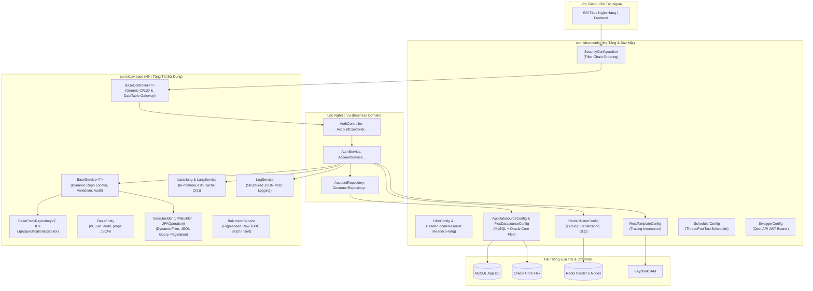
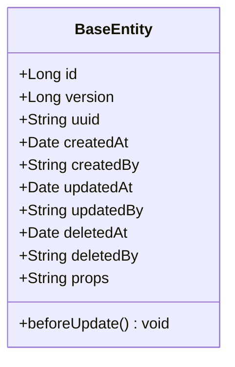
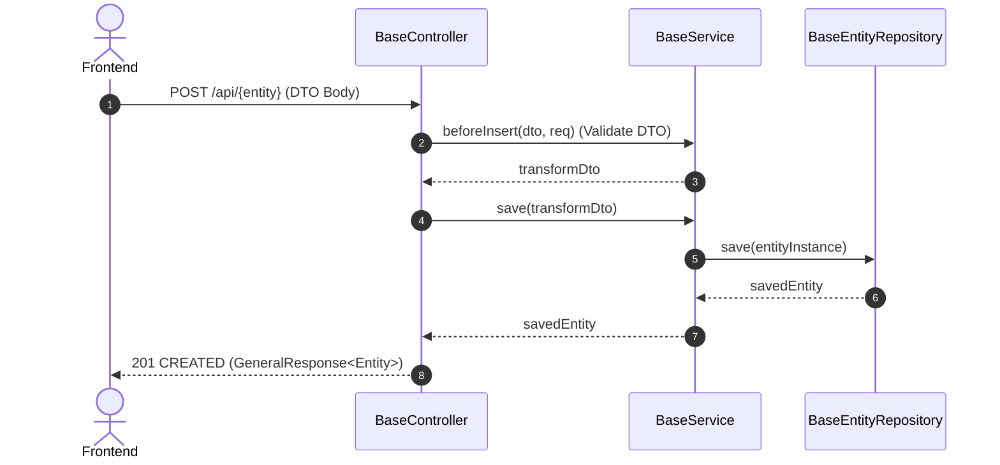
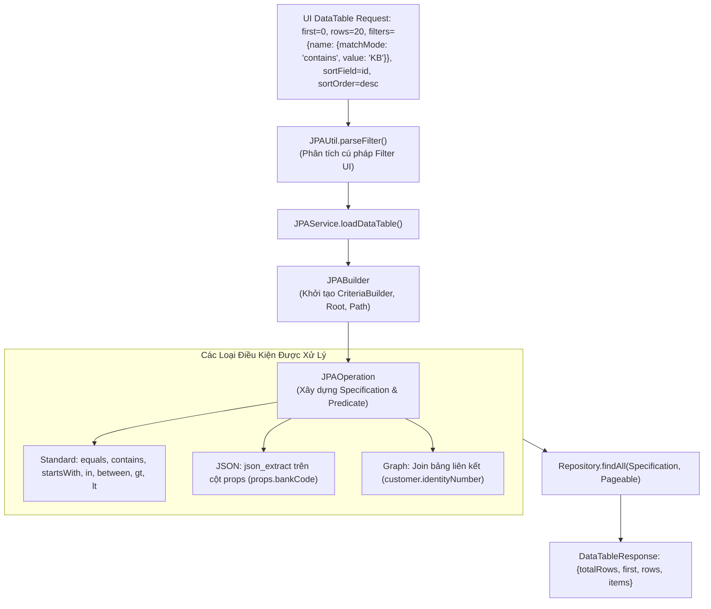
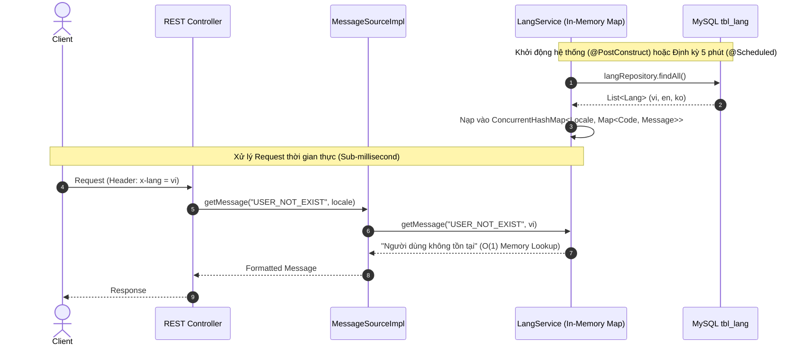
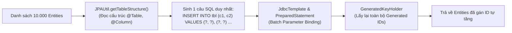
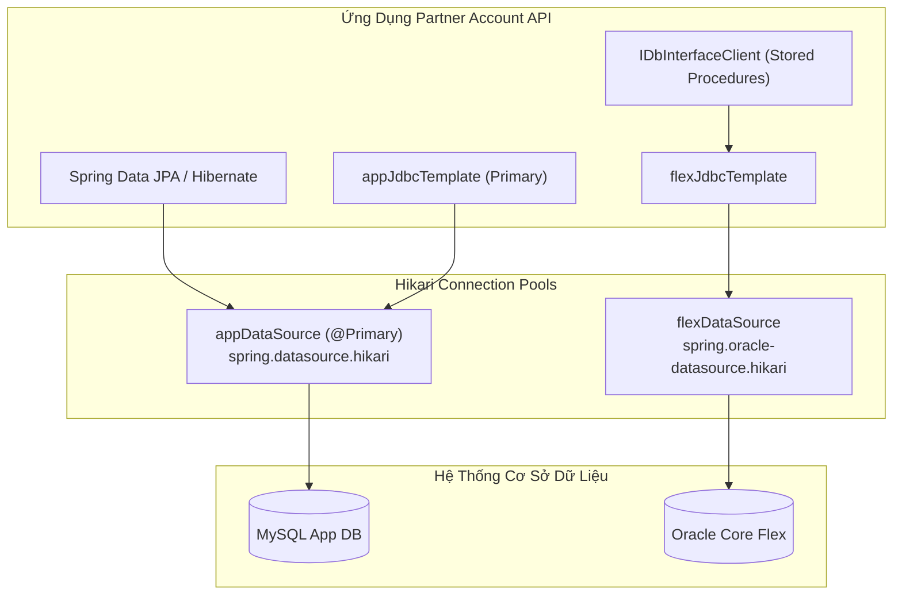
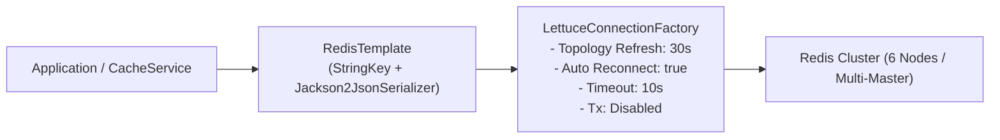
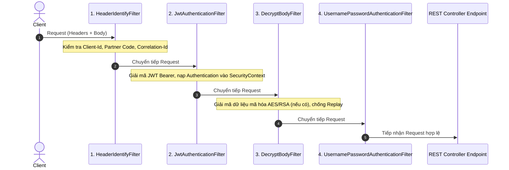
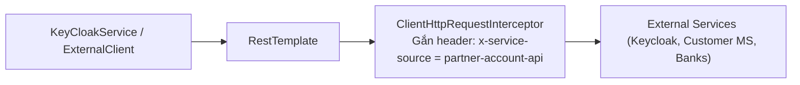

# PHÂN TÍCH VÀ TỔNG HỢP KIẾN TRÚC 2 PACKAGE `BASE` VÀ `CONFIG`
## DỰ ÁN: PARTNER ACCOUNT API (KBSV PNS)

> **Mục tiêu**: Bóc tách chi tiết toàn bộ mã nguồn của 2 package nền tảng cốt lõi `com.kbsv.base` và `com.kbsv.config`. Phân tích tường minh theo mô hình 3 câu hỏi vàng: **Nó là gì? Nó làm gì? Nó sinh ra phục vụ mục đích gì?**

---

# MỤC LỤC TỔNG QUAN

1. [TỔNG QUAN KIẾN TRÚC HỆ THỐNG (THE BIG PICTURE)](#1-tổng-quan-kiến-trúc-hệ-thống-the-big-picture)
2. [DEEP DIVE: PACKAGE `com.kbsv.base` (NỀN TẢNG TÁI SỬ DỤNG VÀ FRAMEWORK MỞ RỘNG)](#2-deep-dive-package-comkbsvbase)
   - 2.1. Nhóm Thực Thể & Truy Vấn Dữ Liệu Cơ Sở (`BaseEntity`, `BaseEntityRepository`)
   - 2.2. Nhóm Điều Phối Nghiệp Vụ & Cổng REST (`BaseService`, `BaseController`)
   - 2.3. Động Cơ Truy Vấn Động & Phân Trang (`base.builder`: `JPABuilder`, `JPAOperation`, `JPAService`, `JPAUtil`, `FieldsUtil`)
   - 2.4. Hệ Thống Đa Ngôn Ngữ Tốc Độ Cao (`base.lang` & `base.service.LangService`, `base.entity.Lang`, `base.repository.LangRepository`)
   - 2.5. Hệ Thống Ghi Log Cấu Trúc Ranh Giới (`base.service.LogService`)
   - 2.6. Động Cơ Chèn Dữ Liệu Hàng Loạt Siêu Tốc (`base.service.BulkInsertService`)
   - 2.7. Động Cơ Xử Lý Mẫu Excel Động (`base.file.ExcelTemplate`)
3. [DEEP DIVE: PACKAGE `com.kbsv.config` (CẤU HÌNH HẠ TẦNG & TÍCH HỢP HỆ THỐNG)](#3-deep-dive-package-comkbsvconfig)
   - 3.1. Cấu Hình Đa Nguồn Dữ Liệu (`AppDatasourceConfig`, `FlexDatasourceConfig`, `JdbcTemplateConfig`)
   - 3.2. Cấu Hình Redis Cluster Phân Tán & Chẩn Đoán Khởi Động (`RedisClusterConfig`, `ClusterHealthChecker`)
   - 3.3. Cấu Hình Chuỗi Bộ Lọc Bảo Mật Chuẩn Enterprise (`SecurityConfiguration`)
   - 3.4. Cấu Hình Bản Địa Hóa Đa Ngôn Ngữ Theo Request Header (`HeaderLocaleResolver`, `I18nConfig`)
   - 3.5. Cấu Hình HTTP Client Liên Dịch Vụ (`RestTemplateConfig`)
   - 3.6. Cấu Hình Đa Luồng Định Thời Chạy Nền (`SchedulerConfig`)
   - 3.7. Cấu Hình Tài Liệu Hóa API Chuẩn OpenAPI 3.0 (`SwaggerConfig`)
4. [BẢNG TỔNG HỢP SO SÁNH, QUY TẮC VÀ MA TRẬN QUYẾT ĐỊNH](#4-bảng-tổng-hợp-so-sánh-quy-tắc-và-ma-trận-quyết-định)

---

# 1. TỔNG QUAN KIẾN TRÚC HỆ THỐNG (THE BIG PICTURE)

Trong kiến trúc Backend của dự án `partner-account-api`, hai package `base` và `config` đóng vai trò là **"Bộ khung xương (Skeleton)"** và **"Hệ thống dây thần kinh hạ tầng (Infrastructure Nervous System)"** của toàn bộ ứng dụng.

---

# 2. DEEP DIVE: PACKAGE `com.kbsv.base`

## 2.1. Nhóm Thực Thể & Truy Vấn Dữ Liệu Cơ Sở

### 📄 `BaseEntity.groovy`

* **1. Nó là gì?**
  * Là lớp thực thể trừu tượng cơ sở được gắn annotation `@MappedSuperclass` và thực thi interface `Serializable`. Mọi Entity trong hệ thống (`Account`, `Customer`, `PartnerProfile`...) đều kế thừa từ lớp này.
* **2. Nó làm gì?**
  * Định nghĩa sẵn bộ thuộc tính tiêu chuẩn:
    * `id`: Khóa chính tự tăng `@Id @GeneratedValue(strategy = GenerationType.IDENTITY)`.
    * `version`: Quản lý khóa lạc quan (Optimistic Locking) chống xung đột dữ liệu đồng thời.
    * `uuid`: Mã định danh duy nhất toàn cầu `UUID.randomUUID().toString()`.
    * `createdAt`, `createdBy`, `updatedAt`, `updatedBy`: Bộ vết kiểm toán tự động (Audit Trail).
    * `deletedAt`, `deletedBy`: Hỗ trợ kỹ thuật xóa mềm (Soft Delete), không xóa vật lý khỏi Database.
    * `props`: Cột định dạng `json` cho phép lưu các thuộc tính động dạng Key-Value mà không cần thay đổi cấu trúc bảng SQL (No-DDL schema extension).
  * Hàm callback `@PreUpdate beforeUpdate()`: Tự động cập nhật `updatedAt = new Date()` mỗi khi bản ghi được sửa đổi.
* **3. Nó sinh ra phục vụ mục đích gì?**
  * **Chuẩn hóa 100% CSDL**: Đảm bảo mọi bảng trong hệ thống tài chính đều có dấu vết kiểm toán (ai tạo lúc nào, ai sửa lúc nào, ai xóa lúc nào).
  * **Linh hoạt mở rộng**: Cột `props` (JSON) giải quyết nỗi đau thay đổi yêu cầu liên tục từ đối tác ngân hàng mà không cần migration bảng trên môi trường Production.

---

### 📄 `BaseEntityRepository.groovy`

* **1. Nó là gì?**
  * Là interface Repository dùng chung, được gắn annotation `@NoRepositoryBean`, kế thừa đồng thời 2 interface cốt lõi của Spring Data JPA: `JpaRepository<T, ID>` và `JpaSpecificationExecutor<T>`.
* **2. Nó làm gì?**
  * Cung cấp sẵn toàn bộ các thao tác CRUD cơ bản (`save`, `findById`, `findAll`, `deleteById`) cùng khả năng thực thi truy vấn động phức tạp thông qua Criteria API (`findAll(Specification spec, Pageable pageable)`).
  * Bổ sung phương thức truy vấn tiện ích: `T findOneById(ID id)`.
* **3. Nó sinh ra phục vụ mục đích gì?**
  * Tạo hợp đồng (Contract) thống nhất cho tầng Data Access. Giúp `BaseService` có thể gọi các thao tác dữ liệu trên bất kỳ Entity nào mà không phụ thuộc vào lớp Repository cụ thể.

---

## 2.2. Nhóm Điều Phối Nghiệp Vụ & Cổng REST

### 📄 `BaseController.groovy`

* **1. Nó là gì?**
  * Là lớp REST Controller trừu tượng tổng quát (`abstract class BaseController<T extends BaseService>`), đóng vai trò là Gateway tiếp nhận và phản hồi HTTP chuẩn mực.
* **2. Nó làm gì?**
  * Định nghĩa sẵn 7 Endpoint RESTful tiêu chuẩn:
    1. `GET /`: Lấy toàn bộ danh sách bản ghi (`getAll`).
    2. `POST /`: Tiếp nhận DTO, gọi hook `beforeInsert` để validate và lưu mới (`save`).
    3. `GET /{id}`: Lấy chi tiết bản ghi theo ID (`getById`).
    4. `PUT /{id}`: Gọi hook `beforeUpdate` và cập nhật bản ghi (`update`).
    5. `DELETE /{id}`: Xóa bản ghi theo ID (`delete`).
    6. `DELETE /deleteIdInList`: Xóa hàng loạt bản ghi theo danh sách ID (`deleteIdInList`).
    7. `GET /loadDataTable`: Phân trang, tìm kiếm lọc động theo tham số UI Grid (`loadDataTable`).
  * Mọi dữ liệu trả về đều được bọc kín bên trong envelope chuẩn `ResponseEntity<GeneralResponse<T>>`.
* **3. Nó sinh ra phục vụ mục đích gì?**
  * **Triệt tiêu Boilerplate Code**: Lập trình viên không cần viết lại các API CRUD cơ bản cho từng màn hình quản trị.
  * **Chuẩn hóa Response Format**: Đảm bảo tính nhất quán của mã HTTP Status (200, 201) và cấu trúc JSON trả về cho Frontend.

---

### 📄 `BaseService.groovy`

* **1. Nó là gì?**
  * Là lớp Service trừu tượng tổng quát (`abstract class BaseService<T>`), chứa toàn bộ logic điều phối dữ liệu, xác thực quyền hạn và tích hợp kiểm tra dữ liệu đầu vào.
* **2. Nó làm gì?**
  * **Dynamic Repository Locator (`loadRepository`)**: Sử dụng `ApplicationContext` để tự động dò tìm và nạp Bean Repository tương ứng với Entity tại runtime dựa trên quy tắc đặt tên (`${EntityName}Repository` hoặc `${EntityName}Repo`).
  * **Jakarta Bean Validation động (`validate`)**: Sử dụng `ObjectMapper` chuyển đổi Map thành DTO Class (`saveDTOClass`/`updateDTOClass`) và gọi `Validator.validate()` để kiểm tra tính hợp lệ dữ liệu.
  * **Tự động gắn vết người dùng (`save`, `edit`)**: Lấy thông tin user đăng nhập từ `SecurityContextHolder.getContext().authentication` và gán tự động vào `createdBy`/`updatedBy`.
  * **Tích hợp Dynamic DataTable**: Khởi tạo `JPAService` để thực thi phân trang và tìm kiếm đa tiêu chí.
  * **Cầu nối Structured Logging**: Cung cấp các hàm `logEL`, `logDB`, `logStep` tạo sẵn cấu trúc `LogDTO`.
* **3. Nó sinh ra phục vụ mục đích gì?**
  * Thực thi triệt để nguyên lý **DRY (Don't Repeat Yourself)**. Một Service con chỉ cần khai báo `getRootClass() = Account.class` là ngay lập tức có đầy đủ năng lực CRUD, Validation, Auditing và Searching mà không cần viết thêm bất kỳ dòng code lặp nào.

---

## 2.3. Động Cơ Truy Vấn Động & Phân Trang (`base.builder`)

Nhóm class này bao gồm: `JPABuilder.groovy`, `JPAOperation.groovy`, `JPAService.groovy`, `JPAUtil.groovy`, `FieldsUtil.groovy`.

* **1. Nó là gì?**
  * Là một **Dynamic Query Engine** tự xây dựng dựa trên nền tảng JPA Criteria API và Hibernate Expressions.
* **2. Nó làm gì?**
  * **`JPAUtil`**: Bóc tách tham số phức tạp gửi lên từ giao diện (PrimeNG/React DataTable), nhận diện tên cột, kiểu dữ liệu, quan hệ bảng và chế độ lọc (`matchMode`).
  * **`JPAOperation`**: Sinh ra các `Predicate` an toàn:
    * Lọc chuỗi (`like %value%`, `startsWith`).
    * Lọc số/ngày tháng (`equals`, `in`, `between`, `greaterThan`, `lessThan`).
    * **Lọc trên cột JSON**: Sử dụng hàm `json_extract(root.props, '$.field')` để tìm kiếm dữ liệu phi cấu trúc trực tiếp dưới MySQL.
    * **Lọc trên Object Graph**: Tự động tạo `root.join()` để lọc qua các bảng quan hệ 1-Nhiều/Nhiều-1.
  * **`JPABuilder`**: Lắp ghép danh sách điều kiện (Specification Chain), áp dụng phân trang (`PageRequest.of(page, pageSize)`), sắp xếp (`Sort.by()`) và chiếu các trường cần lấy (`multiselect`) để tối ưu hiệu năng bộ nhớ.
  * **`JPAService`**: Đóng vai trò là Facade cung cấp cú pháp Fluent API trực quan (`.where().page().sort()`).
* **3. Nó sinh ra phục vụ mục đích gì?**
  * **Triệt tiêu 100% SQL Injection**: Sử dụng hoàn toàn Parameterized Criteria Query thay vì nối chuỗi thô.
  * **Giải phóng lập trình viên**: Không phải viết hàng chục câu lệnh `@Query("SELECT ... WHERE (:name IS NULL OR ...)")` cồng kềnh cho từng màn hình tìm kiếm.

---

## 2.4. Hệ Thống Đa Ngôn Ngữ Tốc Độ Cao (`base.lang` & `base.service.LangService`)

* **1. Nó là gì?**
  * Là hệ thống quản lý và phân giải thông báo đa ngôn ngữ (i18n) động lưu trong bảng `tbl_lang` của MySQL, nạp sẵn vào bộ nhớ RAM và tương thích hoàn toàn với chuẩn `org.springframework.context.MessageSource`.
* **2. Nó làm gì?**
  * **`LangService.groovy`**:
    * Sử dụng `ConcurrentHashMap<String, Map<String, String>> messagesByLocale` để lưu trữ toàn bộ từ điển theo từng ngôn ngữ (`vi`, `en`, `ko`...).
    * `@PostConstruct loadMessages()`: Nạp toàn bộ dữ liệu từ CSDL vào RAM ngay khi ứng dụng khởi động.
    * `@Scheduled(fixedRate = 300000)`: Tự động tải lại từ điển mỗi 5 phút một lần để cập nhật các thông điệp mới sửa trong DB mà không cần khởi động lại Server.
    * `getMessage(code, locale)`: Truy xuất thông điệp với độ phức tạp $O(1)$ trực tiếp trên bộ nhớ.
  * **`MessageSourceImpl.groovy`**:
    * Triển khai `IMessageSource`, hỗ trợ định dạng tham số mảng (`MessageFormat.format`) và **định dạng tham số Map nâng cao** theo mẫu `{user.username}`, `{order.id}` bằng Regular Expression.
* **3. Nó sinh ra phục vụ mục đích gì?**
  * **Hiệu năng cực đỉnh**: Triệt tiêu hoàn toàn I/O Database khi cần lấy câu thông báo lỗi cho API.
  * **Quản trị tập trung**: Thay thế hoàn toàn các file tĩnh `messages_vi.properties`, cho phép chỉnh sửa nội dung lỗi trực tiếp qua cơ sở dữ liệu hoặc giao diện Admin.

---

## 2.5. Hệ Thống Ghi Log Cấu Trúc Ranh Giới (`base.service.LogService`)

* **1. Nó là gì?**
  * Là lớp Service ghi log doanh nghiệp, vừa triển khai interface chuẩn `org.slf4j.Logger`, vừa mở rộng các hàm chuyên biệt `info(LogDTO)`, `error(LogDTO)`, `warn(LogDTO)`.
* **2. Nó làm gì?**
  * Tiếp nhận đối tượng truyền thông `LogDTO` và tự động bổ sung siêu dữ liệu (Metadata):
    * Tên hệ thống (`serverName`, `domain`, `group` trích xuất từ `spring.application.name` và `app_name`).
    * Địa chỉ IP máy chủ (`InetAddress.getLocalHost()`).
    * Thông tin Request: `method`, `url`, `correlationId`, `actor` (username người gọi), `queryString`.
  * Sử dụng `ObjectMapper` để loại bỏ các trường null (`removeIf(Objects::isNull)`) và in ra console/file dưới dạng chuỗi JSON 1 dòng duy nhất (Single-line JSON Log).
* **3. Nó sinh ra phục vụ mục đích gì?**
  * **Tương thích hoàn hảo với ELK / Loki / Grafana**: Định dạng JSON giúp các công cụ thu thập log (Logstash, Fluentbit) parse dữ liệu tự động mà không cần viết regex phức tạp.
  * **Distributed Tracing**: Dễ dàng truy vết toàn bộ chuỗi hành động của một giao dịch tài chính xuyên suốt các microservice dựa trên `correlationId`.

---

## 2.6. Động Cơ Chèn Dữ Liệu Hàng Loạt Siêu Tốc (`base.service.BulkInsertService`)

* **1. Nó là gì?**
  * Là Service thực thi chèn dữ liệu hàng loạt (Bulk Insert) tốc độ cao bằng cách sử dụng JDBC thuần thông qua `JdbcTemplate`, bỏ qua hoàn toàn cơ chế Persistence Context của Hibernate.
* **2. Nó làm gì?**
  * Đọc metadata của Entity (`@Table`, `@Column`, kiểu dữ liệu `String`, `Long`, `Date`).
  * Sinh động một câu lệnh SQL duy nhất: `INSERT INTO table (col1, col2) VALUES (?, ?), (?, ?)...`.
  * Sử dụng `PreparedStatement` bind dữ liệu và `GeneratedKeyHolder` để hứng toàn bộ danh sách Khóa chính (Auto-increment IDs) do Database sinh ra, sau đó gán ngược lại vào từng đối tượng Entity.
* **3. Nó sinh ra phục vụ mục đích gì?**
  * **Khắc phục điểm yếu chí mạng của Hibernate**: Hibernate mặc định khi dùng `@GeneratedValue(strategy = IDENTITY)` sẽ vô hiệu hóa batching và bắn $N$ câu lệnh `INSERT` đơn lẻ, gây sập bộ nhớ và nghẽn mạng khi chèn hàng chục nghìn bản ghi giao dịch/lệnh. `BulkInsertService` giúp tăng tốc độ chèn dữ liệu lên gấp **10 đến 50 lần**.

---

## 2.7. Động Cơ Xử Lý Mẫu Excel Động (`base.file.ExcelTemplate`)

* **1. Nó là gì?**
  * Là bộ công cụ xử lý tệp tin bảng tính Excel (`.xlsx`, `.xls`) xây dựng trên nền tảng thư viện Apache POI.
* **2. Nó làm gì?**
  * Quét các ô (Cell) chứa biến biểu thức dạng `${field}` trong tệp Excel mẫu và tự động thay thế bằng giá trị thực tế của đối tượng.
  * Hỗ trợ lặp danh sách dữ liệu (Looping rows), tự động áp dụng định dạng CellStyle (Font, Border, Alignment, Background Color).
* **3. Nó sinh ra phục vụ mục đích gì?**
  * Tự động hóa việc xuất các báo cáo đối soát tài chính, sao kê tài khoản ngân hàng và cung cấp tệp mẫu nhập liệu hàng loạt cho người dùng.

---

# 3. DEEP DIVE: PACKAGE `com.kbsv.config`

## 3.1. Cấu Hình Đa Nguồn Dữ Liệu

Gồm: `AppDatasourceConfig.groovy`, `FlexDatasourceConfig.groovy`, `JdbcTemplateConfig.groovy`.

### 📄 `AppDatasourceConfig.groovy` & `FlexDatasourceConfig.groovy`
* **1. Nó là gì?**
  * Là các lớp cấu hình `@Configuration` thiết lập cơ chế **Đa nguồn dữ liệu (Multi-DataSource)** độc lập trong cùng một ứng dụng.
* **2. Nó làm gì?**
  * **`AppDatasourceConfig`**:
    * Tạo Bean `@Primary @Bean(name = "appDataSource")` kết nối tới MySQL với cấu hình HikariCP từ `spring.datasource.hikari`.
    * Tạo `@Primary @Bean(name = "appJdbcTemplate")` phục vụ các thao tác JDBC nội bộ.
  * **`FlexDatasourceConfig`**:
    * Tạo Bean `@Bean(name = "flexDataSource")` kết nối tới Oracle Core Flex với cấu hình từ `spring.oracle-datasource.hikari`.
    * Tạo `@Bean(name = "flexJdbcTemplate")` dùng riêng cho việc gọi các Package/Stored Procedure của hệ thống chứng khoán.
* **3. Nó sinh ra phục vụ mục đích gì?**
  * **Phân lập ranh giới an toàn**: Cơ sở dữ liệu ứng dụng (MySQL) và Cơ sở dữ liệu lõi chứng khoán (Oracle Core) có vòng đời kết nối, tham số timeout và quyền hạn khác nhau.
  * Đảm bảo các tác vụ nghiệp vụ nội bộ không chiếm giữ hoặc gây treo Connection Pool của hệ thống Core Flex.

---

## 3.2. Cấu Hình Redis Cluster & Chẩn Đoán Khởi Động

Gồm: `RedisClusterConfig.groovy`, `ClusterHealthChecker.groovy`.

### 📄 `RedisClusterConfig.groovy`
* **1. Nó là gì?**
  * Là lớp cấu hình kết nối tới cụm phân tán **Redis Cluster** sử dụng Driver Lettuce hiệu năng cao.
* **2. Nó làm gì?**
  * Cấu hình `LettuceConnectionFactory` với các thiết lập sống còn:
    * `enablePeriodicRefresh(Duration.ofSeconds(30))`: Tự động làm mới sơ đồ mạng (Topology) của Redis Cluster mỗi 30 giây khi có node bị failover.
    * `enableAllAdaptiveRefreshTriggers()`: Tự động thích ứng làm mới topology ngay khi phát hiện lỗi định tuyến kết nối (`MOVED`, `ASK`).
    * `disconnectedBehavior(REJECT_COMMANDS)`: Từ chối ngay lệnh khi mất kết nối để tránh treo luồng ứng dụng.
  * Cấu hình bộ tuần tự hóa (Serializers):
    * Key: `StringRedisSerializer` (Lưu chuỗi rõ ràng, dễ tra cứu trên Redis CLI).
    * Value/Hash: `GenericJackson2JsonRedisSerializer` (Tự động nạp/xuất JSON kèm thông tin class metadata).
    * Atomic Template: `GenericToStringSerializer<>(Long.class)` (Dành riêng cho các bộ đếm số nguyên).
  * **Tắt tính năng Transaction**: `template.setEnableTransactionSupport(false)` để ngăn chặn giữ kết nối Redis ngoài ý muốn trong Spring Transactions.
* **3. Nó sinh ra phục vụ mục đích gì?**
  * **Zero Connection Leak & High Availability**: Đảm bảo hệ thống chịu lỗi cao khi các Node Redis Cluster trong mạng bị khởi động lại hoặc chuyển đổi Master/Replica.
  * Cung cấp bộ nhớ đệm tốc độ cao (<5ms) cho Token, Session và cơ chế chống trùng lặp Idempotency.

---

### 📄 `ClusterHealthChecker.groovy`
* **1. Nó là gì?**
  * Là một Bean chẩn đoán sức khỏe hệ thống (`@Component`) tự động chạy khi khởi động ứng dụng.
* **2. Nó làm gì?**
  * Gắn hook `@PostConstruct checkClusterHealth()`.
  * Mở kết nối `RedisClusterConnection`, lấy thông tin `ClusterInfo` (state, clusterSize, knownNodes) và duyệt qua toàn bộ các Node trong mạng để kiểm tra trạng thái Master, kết nối mạng và in cảnh báo trực quan ra console.
* **3. Nó sinh ra phục vụ mục đích gì?**
  * **Fail-Fast Detection**: Giúp đội ngũ vận hành (DevOps/SysAdmin) phát hiện ngay lập tức tình trạng lệch node, mất kết nối Redis Cluster ngay khi container vừa bật, trước khi tiếp nhận các giao dịch thực tế.

---

## 3.3. Cấu Hình Chuỗi Bộ Lọc Bảo Mật Chuẩn Enterprise

### 📄 `SecurityConfiguration.groovy`

* **1. Nó là gì?**
  * Là lớp cấu hình bảo mật chính của ứng dụng (`@EnableWebSecurity`) xây dựng theo kiến trúc Spring Security 6 với `SecurityFilterChain`.
* **2. Nó làm gì?**
  * **Vô hiệu hóa CSRF**: `http.csrf(AbstractHttpConfigurer::disable)` do API là Stateless RESTful.
  * **Cấu hình CORS toàn diện**: Cho phép các phương thức `GET, POST, PUT, DELETE, OPTIONS...` với cấu hình `AllowCredentials(true)`.
  * **Xếp đặt thứ tự chuỗi bộ lọc (Filter Chain Ordering)**:
    1. `HeaderIdentifyFilter`: Nhận diện đối tác qua Headers.
    2. `JwtAuthenticationFilter`: Xác thực Token Keycloak.
    3. `DecryptBodyFilter`: Giải mã dữ liệu nhạy cảm trước khi Controller tiếp nhận.
* **3. Nó sinh ra phục vụ mục đích gì?**
  * Tạo một **"Hàng rào bảo mật nhiều lớp"** bảo vệ hệ thống trước các cuộc tấn công giả mạo đối tác, làm lộ thông tin nhạy cảm hoặc tấn công Replay Attack.

---

## 3.4. Cấu Hình Bản Địa Hóa Đa Ngôn Ngữ Theo Request Header

Gồm: `HeaderLocaleResolver.groovy`, `I18nConfig.groovy`.

* **1. Nó là gì?**
  * Là cụm cấu hình định tuyến ngôn ngữ động dựa trên HTTP Request Header.
* **2. Nó làm gì?**
  * **`HeaderLocaleResolver`**: Triển khai `LocaleResolver`, đọc giá trị từ HTTP Header `x-lang`. Nếu header rỗng, mặc định sử dụng `Locale.ENGLISH`.
  * **`I18nConfig`**: Đăng ký `HeaderLocaleResolver` thành `@Bean localeResolver`, đồng thời tiêm `MessageSourceImpl` vào `@Bean messageSource` của Spring Framework.
* **3. Nó sinh ra phục vụ mục đích gì?**
  * Cho phép ứng dụng phục vụ đa ngôn ngữ cho nhiều đối tác trong và ngoài nước (Việt Nam, Hàn Quốc, Anh) một cách liền mạch chỉ thông qua 1 Header `x-lang`.

---

## 3.5. Cấu Hình HTTP Client Liên Dịch Vụ

### 📄 `RestTemplateConfig.groovy`

* **1. Nó là gì?**
  * Là lớp cấu hình Bean `RestTemplate` dùng để gọi các HTTP/REST API ra bên ngoài.
* **2. Nó làm gì?**
  * Đăng ký một `ClientHttpRequestInterceptor` tự động chèn thêm HTTP Header: `x-service-source: ${spring.application.name}` vào mọi cuộc gọi mạng ra ngoài.
* **3. Nó sinh ra phục vụ mục đích gì?**
  * Giúp các hệ thống nhận diện rõ nguồn gốc của cuộc gọi đến (phục vụ Audit và Phân tích nhật ký hệ thống Microservices).

---

## 3.6. Cấu Hình Đa Luồng Định Thời Chạy Nền

### 📄 `SchedulerConfig.groovy`

* **1. Nó là gì?**
  * Là lớp cấu hình bộ lập lịch tác vụ nền `TaskScheduler` của Spring.
* **2. Nó làm gì?**
  * Khởi tạo `ThreadPoolTaskScheduler` với số lượng luồng linh hoạt lấy từ biến cấu hình `spring.scheduler.poolSize`.
  * Đặt tiền tố định danh cho luồng: `Scheduled-Task-`.
  * Bật chế độ tắt an toàn: `setWaitForTasksToCompleteOnShutdown(true)`.
* **3. Nó sinh ra phục vụ mục đích gì?**
  * **Tránh nghẽn đơn luồng**: Ngăn chặn tình trạng một tác vụ nền bị treo (ví dụ: làm mới i18n, đồng bộ dữ liệu) làm đình trệ toàn bộ các tác vụ `@Scheduled` khác trong hệ thống.
  * **Graceful Shutdown**: Đảm bảo khi deploy bản mới, các tác vụ đang chạy dở được hoàn tất an toàn trước khi tiến trình tắt hẳn.

---

## 3.7. Cấu Hình Tài Liệu Hóa API Chuẩn OpenAPI 3.0

### 📄 `SwaggerConfig.groovy`

* **1. Nó là gì?**
  * Là lớp cấu hình sinh tài liệu Swagger / OpenAPI 3.0 tự động (`springdoc-openapi`).
* **2. Nó làm gì?**
  * Khai báo thông tin API: Tiêu đề `"KB Partner Account API - Partner Info"`, Phiên bản `"1.0.0"`.
  * Cấu hình cơ chế bảo mật **JWT Bearer Auth (`bearerAuth`)**: Tự động hiển thị nút bấm `Authorize` trên giao diện Swagger UI để lập trình viên có thể dán Token và kiểm thử trực tiếp các API được bảo vệ.
  * Cấu hình URL Prefix từ biến môi trường `springdoc.swagger-be.url`.
* **3. Nó sinh ra phục vụ mục đích gì?**
  * Cung cấp tài liệu giao tiếp API trực quan, chính xác 100% theo thời gian thực cho đội ngũ Frontend, QA và Đối tác tích hợp mà không cần viết tài liệu Word/Excel thủ công.

---

# 4. BẢNG TỔNG HỢP SO SÁNH, QUY TẮC VÀ MA TRẬN QUYẾT ĐỊNH

## 4.1. Ma Trận 11 File Cấu Hình (`com.kbsv.config`)

| Tên File Config | Bean Được Khởi Tạo | Công Nghệ / Nền Tảng | Mục Đích Cốt Lõi | Tham Số Cấu Hình YML Liên Quan |
|---|---|---|---|---|
| **`AppDatasourceConfig`** | `appDataSource`, `appJdbcTemplate` | HikariCP, MySQL | Kết nối CSDL Nghiệp vụ ứng dụng | `spring.datasource.hikari.*` |
| **`FlexDatasourceConfig`**| `flexDataSource`, `flexJdbcTemplate` | HikariCP, Oracle | Kết nối CSDL Lõi Chứng Khoán Core Flex | `spring.oracle-datasource.hikari.*` |
| **`JdbcTemplateConfig`** | `jdbcTemplate` | Spring JDBC | Thao tác JDBC chung | N/A |
| **`RedisClusterConfig`** | `redisConnectionFactory`, `redisTemplate`, `template` | Lettuce, Redis Cluster | Bộ nhớ đệm phân tán, Token, Idempotency | `spring.data.redis.cluster.nodes`, `password` |
| **`ClusterHealthChecker`**| `ClusterHealthChecker` (@Component) | Spring Lifecycle | Kiểm tra và chẩn đoán Redis khi khởi động | N/A |
| **`SecurityConfiguration`**| `SecurityFilterChain` | Spring Security 6 | Bảo mật, CORS, sắp xếp thứ tự Filter | N/A |
| **`HeaderLocaleResolver`**| `HeaderLocaleResolver` (@Component)| Spring Web MVC | Bóc tách ngôn ngữ từ Header `x-lang` | N/A |
| **`I18nConfig`** | `localeResolver`, `customMessageSource`, `messageSource` | Spring Context i18n | Đăng ký bộ xử lý đa ngôn ngữ | N/A |
| **`RestTemplateConfig`** | `restTemplate` | Spring WebClient | Gọi API ngoài, tự gắn Header nguồn | `spring.application.name` |
| **`SchedulerConfig`** | `taskScheduler` | Spring TaskScheduler | Đa luồng xử lý tác vụ định thời nền | `spring.scheduler.poolSize` |
| **`SwaggerConfig`** | `customOpenAPI` | OpenAPI 3.0 / Swagger | Tài liệu hóa API và kiểm thử JWT Bearer | `springdoc.swagger-be.url` |

---

## 4.2. Ma Trận Các Thành Phần Trong `com.kbsv.base`

| Tên Module / File | Vai Trò Kiến Trúc | Mẫu Thiết Kế (Design Pattern) | Giá Trị & Lợi Ích Mang Lại |
|---|---|---|---|
| **`BaseEntity`** | Persistence Base Model | Mapped Superclass | Chuẩn hóa Audit Trail, khóa lạc quan, mở rộng JSON không cần đổi DDL. |
| **`BaseEntityRepository`** | Data Access Interface | Generic Repository Pattern | Cung cấp sẵn năng lực CRUD và Dynamic Specification Search. |
| **`BaseController`** | REST Presentation Gateway | Template Method / Generic Controller | Cung cấp 7 Endpoint CRUD chuẩn, bọc `GeneralResponse`. |
| **`BaseService`** | Business Logic Coordinator | Service Locator / Dynamic Reflection | Tự động dò tìm Repository, validate DTO, gán user audit. |
| **`base.builder`** | Dynamic Search Engine | Builder Pattern, Criteria API | Triệt tiêu SQL Injection, hỗ trợ lọc chuỗi, lọc JSON, lọc quan hệ bảng. |
| **`LangService` & `MessageSourceImpl`** | In-Memory i18n System | Cache-Aside / In-Memory Lookup | Tra cứu thông báo đa ngữ $O(1)$, không tốn I/O Database, tự động reload. |
| **`LogService`** | Structured Enterprise Logger | Adapter Pattern / Facade Pattern | Định dạng JSON 1 dòng chuẩn hóa cho ELK/Loki, tích hợp Correlation ID. |
| **`BulkInsertService`** | High-Performance Batch Engine | Direct JDBC Batch Execution | Tăng tốc độ chèn dữ liệu hàng loạt gấp 10-50 lần so với Hibernate mặc định. |
| **`ExcelTemplate`** | Reporting & File Utility | Template Processor | Tự động sinh báo cáo Excel theo biểu mẫu `${placeholder}`. |
