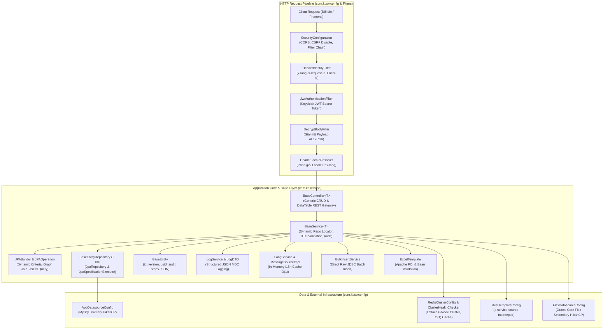
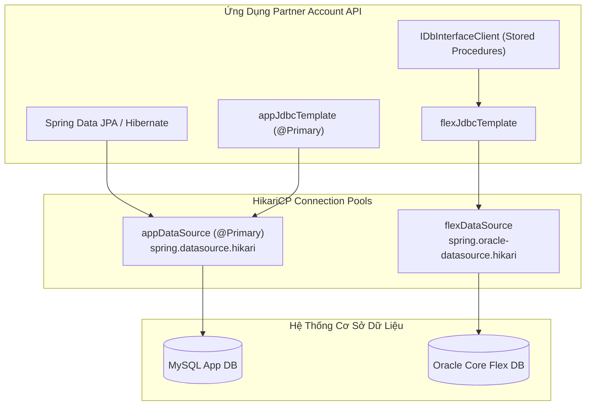
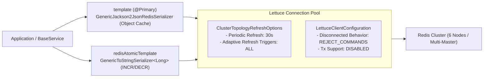
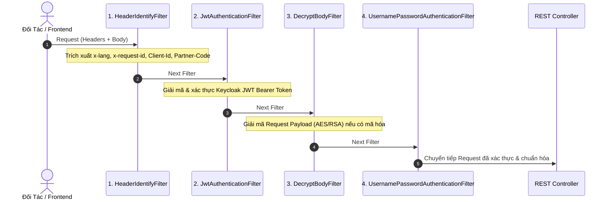
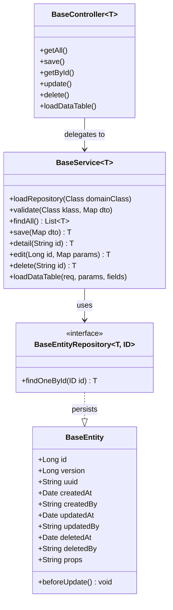
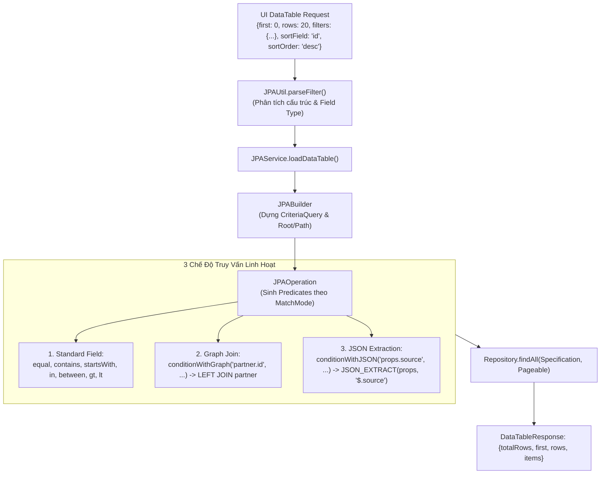
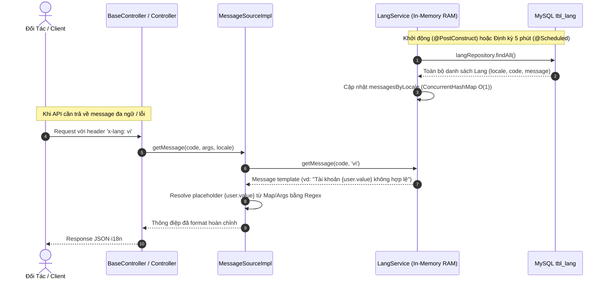
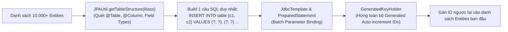

# PHÂN TÍCH VÀ TỔNG HỢP KIẾN TRÚC 2 PACKAGE `BASE` VÀ `CONFIG`
## DỰ ÁN: PARTNER ACCOUNT API (KBSV PNS)

> **Mục tiêu**: Bóc tách chi tiết toàn bộ mã nguồn của 2 package nền tảng cốt lõi `com.kbsv.base` và `com.kbsv.config`. Phân tích tường minh theo mô hình 3 câu hỏi vàng: **Nó là gì? Nó làm gì? Nó sinh ra phục vụ mục đích gì?**

---

# MỤC LỤC TỔNG QUAN

1. [TỔNG QUAN KIẾN TRÚC HỆ THỐNG (THE BIG PICTURE)](#1-tổng-quan-kiến-trúc-hệ-thống-the-big-picture)
2. [DEEP DIVE: PACKAGE `com.kbsv.config` (HẠ TẦNG CẤU HÌNH & TÍCH HỢP)](#2-deep-dive-package-comkbsvconfig)
   - 2.1. Cấu Hình Đa Nguồn Dữ Liệu & JDBC (`AppDatasourceConfig`, `FlexDatasourceConfig`, `JdbcTemplateConfig`)
   - 2.2. Cụm Redis Cluster Phân Tán & Chẩn Đoán Khởi Động (`RedisClusterConfig`, `ClusterHealthChecker`)
   - 2.3. Chuỗi Bộ Lọc Bảo Mật Chuẩn Enterprise (`SecurityConfiguration`)
   - 2.4. Giao Tiếp HTTP Client & Distributed Tracing (`RestTemplateConfig`)
   - 2.5. Đa Luồng Định Thời Chạy Nền (`SchedulerConfig`)
   - 2.6. Đa Ngôn Ngữ & Tài Liệu API (`HeaderLocaleResolver`, `I18nConfig`, `SwaggerConfig`)
3. [DEEP DIVE: PACKAGE `com.kbsv.base` (KIẾN TRÚC NỀN TẢNG DÙNG CHUNG & CORE ENGINE)](#3-deep-dive-package-comkbsvbase)
   - 3.1. Bộ Khung CRUD Trừu Tượng Cốt Lõi (`BaseEntity`, `BaseEntityRepository`, `BaseService`, `BaseController`)
   - 3.2. Động Cơ Truy Vấn Động & JSON Query (`JPABuilder`, `JPAOperation`, `JPAService`, `JPAUtil`, `FieldsUtil`)
   - 3.3. Hệ Thống Đa Ngôn Ngữ Động Qua Database (`Lang`, `LangRepository`, `LangService`, `IMessageSource`, `MessageSourceImpl`)
   - 3.4. Động Cơ Chèn Dữ Liệu Hàng Loạt Siêu Tốc (`BulkInsertService`)
   - 3.5. Bộ Xử Lý File Excel Mẫu Động (`ExcelTemplate`)
   - 3.6. Hệ Thống Ghi Log Cấu Trúc Ranh Giới (`LogService`, `LogDTO`)
4. [TỔNG KẾT MỐI QUAN HỆ TƯƠNG TÁC VÀ MA TRẬN ĐIỀU PHỐI](#4-tổng-kết-mối-quan-hệ-tương-tác-và-ma-trận-điều-phối)
   - 4.1. Ma Trận Các File Cấu Hình (`com.kbsv.config`)
   - 4.2. Ma Trận Các Thành Phần Nền Tảng (`com.kbsv.base`)
   - 4.3. Luồng Tương Tác Giữa Hai Tầng

---

# 1. TỔNG QUAN KIẾN TRÚC HỆ THỐNG (THE BIG PICTURE)

Trong kiến trúc Backend của dự án `partner-account-api`, hai package `base` và `config` đóng vai trò là **"Bộ khung xương (Skeleton)"** và **"Hệ thống dây thần kinh hạ tầng (Infrastructure Nervous System)"** của toàn bộ ứng dụng.



---

# 2. DEEP DIVE: PACKAGE `com.kbsv.config`

Tầng `config` chịu trách nhiệm khởi tạo, tối ưu hóa các kết nối I/O (Database, Redis, HTTP Client), thiết lập cơ chế bảo mật, định tuyến đa ngôn ngữ và điều phối tiến trình chạy nền.

---

## 2.1. Cấu Hình Đa Nguồn Dữ Liệu & JDBC

Gồm 3 file: `AppDatasourceConfig.groovy`, `FlexDatasourceConfig.groovy`, `JdbcTemplateConfig.groovy`.



### 📄 `AppDatasourceConfig.groovy`
* **1. Nó là gì?**
  * Lớp cấu hình `@Configuration` thiết lập Primary DataSource và JdbcTemplate kết nối tới cơ sở dữ liệu MySQL chính của ứng dụng.
* **2. Nó làm gì?**
  * Đọc tiền tố cấu hình `spring.datasource.hikari` từ `application.yml`.
  * Khởi tạo Bean `@Primary @Bean(name = "appDataSource") DataSource appDataSource()` sử dụng HikariCP Connection Pool hiệu năng cao.
  * Khởi tạo Bean `@Primary @Bean(name = "appJdbcTemplate") JdbcTemplate appJdbcTemplate()` làm việc cùng Spring Data JPA để quản lý các Entity nội bộ (`tbl_account`, `tbl_lang`, `tbl_customer`...).
* **3. Nó sinh ra phục vụ mục đích gì?**
  * Cung cấp đường kết nối chính, tối ưu hóa pool kết nối cho toàn bộ các giao dịch nghiệp vụ và truy vấn dữ liệu của dịch vụ.

---

### 📄 `FlexDatasourceConfig.groovy`
* **1. Nó là gì?**
  * Lớp cấu hình `@Configuration` thiết lập Secondary DataSource kết nối sang hệ thống chứng khoán Core Flex (Oracle Database).
* **2. Nó làm gì?**
  * Đọc cấu hình từ tiền tố `spring.oracle-datasource.hikari`.
  * Khởi tạo Bean `@Bean(name = "flexDataSource") DataSource flexDataSource()` và `@Bean(name = "flexJdbcTemplate") JdbcTemplate flexJdbcTemplate()`.
  * Phục vụ riêng cho các adapter/client gọi các Package/Stored Procedure của cổng DB-Interface.
* **3. Nó sinh ra phục vụ mục đích gì?**
  * **Phân lập tài nguyên (Resource Isolation)**: Tách riêng Connection Pool với MySQL để tránh trường hợp các truy vấn chậm hoặc sự cố từ Oracle Core Flex làm cạn kiệt connection pool của hệ thống ứng dụng chính.

---

### 📄 `JdbcTemplateConfig.groovy`
* **1. Nó là gì?**
  * Cung cấp Bean `JdbcTemplate` mặc định trỏ vào `appDataSource`.
* **2. Nó làm gì?**
  * Định nghĩa `@Bean JdbcTemplate jdbcTemplate(@Qualifier("appDataSource") DataSource dataSource)` cho các service sử dụng SQL thuần.
* **3. Nó sinh ra phục vụ mục đích gì?**
  * Chuẩn hóa việc tiêm phụ thuộc `JdbcTemplate` mặc định trên toàn hệ thống.

---

## 2.2. Cụm Redis Cluster Phân Tán & Chẩn Đoán Khởi Động

Gồm: `RedisClusterConfig.groovy`, `ClusterHealthChecker.groovy`.



### 📄 `RedisClusterConfig.groovy`
* **1. Nó là gì?**
  * Cấu hình kết nối cụm phân tán **Redis Cluster** thông qua thư viện Lettuce non-blocking.
* **2. Nó làm gì?**
  * **Dynamic Topology Refresh**:
    ```groovy
    .topologyRefreshOptions(ClusterTopologyRefreshOptions.builder()
            .enablePeriodicRefresh(Duration.ofSeconds(30))
            .enableAllAdaptiveRefreshTriggers()
            .build())
    ```
    * Tự động làm mới danh sách node định kỳ mỗi 30s hoặc ngay khi phát hiện failover/scale nodes (`MOVED`, `ASK`), loại bỏ hoàn toàn lỗi stale connections.
  * **Phân lập Template theo mục đích sử dụng**:
    * `template()` (`@Primary`): Key `StringRedisSerializer`, Value `GenericJackson2JsonRedisSerializer` để serialize/deserialize Object dạng JSON.
    * `redisAtomicTemplate()`: Key `StringRedisSerializer`, Value `GenericToStringSerializer<>(Long.class)` phục vụ các hàm đếm tăng/giảm Atomic (`INCR`/`DECR`).
  * **Vô hiệu hóa Transaction**: `setEnableTransactionSupport(false)` để ngăn chặn connection bị trói buộc vào Spring `@Transactional`.
* **3. Nó sinh ra phục vụ mục đích gì?**
  * Đảm bảo tính sẵn sàng cao (High Availability), độ trễ thấp (<5ms), tự phục hồi khi có node Redis chết hoặc chuyển giao Master-Replica.

---

### 📄 `ClusterHealthChecker.groovy`
* **1. Nó là gì?**
  * Bean kiểm tra và giám sát sức khỏe cụm Redis Cluster (`@Component`).
* **2. Nó làm gì?**
  * Chạy ngay khi ứng dụng khởi động thông qua hook `@PostConstruct checkClusterHealth()`.
  * Lấy thông tin `ClusterInfo` (state, clusterSize, knownNodes), duyệt qua các node Master/Slave và log chi tiết trạng thái kết nối.
* **3. Nó sinh ra phục vụ mục đích gì?**
  * **Fail-Fast Alerting**: Báo động sớm trên console/log ngay khi container khởi động nếu cụm Redis gặp sự cố phân mảnh hoặc mất kết nối.

---

## 2.3. Chuỗi Bộ Lọc Bảo Mật Chuẩn Enterprise

### 📄 `SecurityConfiguration.groovy`



* **1. Nó là gì?**
  * Lớp cấu hình Spring Security 6 (`SecurityFilterChain`) cho ứng dụng RESTful Stateless.
* **2. Nó làm gì?**
  * **Vô hiệu hóa CSRF**: `http.csrf(AbstractHttpConfigurer::disable)` do sử dụng cơ chế Token Bearer.
  * **Cấu hình CORS toàn diện**: Cho phép các methods (`GET, POST, PUT, DELETE, OPTIONS...`) và headers hoạt động an toàn qua API Gateway.
  * **Thiết lập thứ tự Filter Pipeline chuẩn mực**:
    1. `HeaderIdentifyFilter`: Trích xuất Header định danh (`x-lang`, `x-request-id`, `client-id`, `partner-code`).
    2. `JwtAuthenticationFilter`: Xác thực Token Keycloak/JWT, đưa `Authentication` vào `SecurityContextHolder`.
    3. `DecryptBodyFilter`: Giải mã request payload nếu có mã hóa từ đối tác.
    4. Sắp xếp đứng trước `UsernamePasswordAuthenticationFilter.class`.
* **3. Nó sinh ra phục vụ mục đích gì?**
  * Xây dựng hàng rào bảo mật nhiều lớp bảo vệ toàn bộ API, ngăn ngừa Replay Attack và giả mạo danh tính đối tác.

---

## 2.4. Giao Tiếp HTTP Client & Distributed Tracing

### 📄 `RestTemplateConfig.groovy`
* **1. Nó là gì?**
  * Cung cấp Bean `RestTemplate` dùng để gọi các dịch vụ bên ngoài (Keycloak, FPT e-Contract, API Gateway, Customer MS, Banks).
* **2. Nó làm gì?**
  * Đăng ký `ClientHttpRequestInterceptor` tự động chèn header:
    ```
    x-service-source: ${spring.application.name}
    ```
    vào tất cả các request gửi đi.
* **3. Nó sinh ra phục vụ mục đích gì?**
  * Phục vụ **Service Tracing** và **Audit Log** phân tán trong kiến trúc Microservices, giúp các bên nhận biết chính xác nguồn gốc request.

---

## 2.5. Đa Luồng Định Thời Chạy Nền

### 📄 `SchedulerConfig.groovy`
* **1. Nó là gì?**
  * Lớp cấu hình bộ lập lịch tác vụ nền `TaskScheduler` của Spring.
* **2. Nó làm gì?**
  * Khởi tạo `ThreadPoolTaskScheduler` với thread pool riêng biệt (cấu hình qua `spring.scheduler.poolSize`).
  * Đặt tiền tố định danh luồng: `Scheduled-Task-`.
  * Bật cờ `setWaitForTasksToCompleteOnShutdown(true)` để hỗ trợ **Graceful Shutdown**.
* **3. Nó sinh ra phục vụ mục đích gì?**
  * Tránh nghẽn luồng giữa các tác vụ định kỳ (như tải lại đa ngôn ngữ, quét đồng bộ trạng thái tài khoản) và đảm bảo an toàn dữ liệu khi ứng dụng restart.

---

## 2.6. Đa Ngôn Ngữ & Tài Liệu API

### 📄 `HeaderLocaleResolver.groovy` & `I18nConfig.groovy`
* **1. Nó là gì?**
  * Cụm cấu hình định tuyến và phân giải đa ngôn ngữ (i18n) theo Request Header.
* **2. Nó làm gì?**
  * `HeaderLocaleResolver`: Đọc mã ngôn ngữ từ HTTP Header `x-lang` (mặc định fallback về `Locale.ENGLISH` nếu không truyền).
  * `I18nConfig`: Đăng ký `HeaderLocaleResolver` và tích hợp `MessageSourceImpl` lấy từ điển thông điệp từ DB thay vì file `.properties` tĩnh truyền thống.
* **3. Nó sinh ra phục vụ mục đích gì?**
  * Cho phép hệ thống linh hoạt phục vụ thông báo lỗi/thành công đa ngữ (`vi`, `en`, `ko`) mà không cần thay đổi code.

---

### 📄 `SwaggerConfig.groovy`
* **1. Nó là gì?**
  * Cấu hình tài liệu hóa API tự động theo chuẩn **OpenAPI 3.0 / Swagger UI**.
* **2. Nó làm gì?**
  * Thiết lập xác thực JWT Bearer (`bearerAuth`) cho phép test API trực tiếp trên giao diện Swagger.
  * Cấu hình server backend prefix từ biến môi trường `springdoc.swagger-be.url`.
* **3. Nó sinh ra phục vụ mục đích gì?**
  * Cung cấp tài liệu API chuẩn hóa, cập nhật theo thời gian thực cho đối tác và đội ngũ Frontend.

---

# 3. DEEP DIVE: PACKAGE `com.kbsv.base`

Tầng `base` là "trái tim" tái sử dụng mã nguồn của dự án, cung cấp từ CRUD tự động, Dynamic Query Engine, Bulk Insert tốc độ cao, xử lý file Excel đến Logging chuẩn hóa.

---

## 3.1. Bộ Khung CRUD Trừu Tượng Cốt Lõi

Gồm: `BaseEntity.groovy`, `BaseEntityRepository.groovy`, `BaseService.groovy`, `BaseController.groovy`.



### 📄 `BaseEntity.groovy`
* **1. Nó là gì?**
  * `@MappedSuperclass` chuẩn hóa toàn bộ các thuộc tính dùng chung cho mọi Entity trong CSDL.
* **2. Nó làm gì?**
  * Quản lý bộ thuộc tính chuẩn:
    * `id`: Khóa chính tự tăng (`GenerationType.IDENTITY`).
    * `version`: Khóa lạc quan (Optimistic Locking) chống xung đột cập nhật đồng thời.
    * `uuid`: UUID ngẫu nhiên toàn cầu.
    * `createdAt`, `createdBy`, `updatedAt`, `updatedBy`: Dấu vết kiểm toán (Audit Trail).
    * `deletedAt`, `deletedBy`: Hỗ trợ xóa mềm (Soft Delete).
    * `props` (`columnDefinition = "json"`): Lưu trữ các thuộc tính động mở rộng theo định dạng JSON mà không cần DDL Schema Migration.
  * Hook `@PreUpdate beforeUpdate()` tự động cập nhật `updatedAt = new Date()`.
* **3. Nó sinh ra phục vụ mục đích gì?**
  * Chuẩn hóa cấu trúc bảng dữ liệu và hỗ trợ mở rộng schema động linh hoạt khi tích hợp đối tác mới.

---

### 📄 `BaseEntityRepository.groovy`
* **1. Nó là gì?**
  * Interface Repository dùng chung kế thừa đồng thời `JpaRepository<T, ID>` và `JpaSpecificationExecutor<T>`.
* **2. Nó làm gì?**
  * Cung cấp các thao tác CRUD cơ bản và năng lực truy vấn động JPA Criteria (`findAll(Specification, Pageable)`).
  * Bổ sung phương thức `T findOneById(ID id)`.
* **3. Nó sinh ra phục vụ mục đích gì?**
  * Tạo hợp đồng truy xuất dữ liệu chung cho toàn bộ Entity trong hệ thống.

---

### 📄 `BaseService.groovy`
* **1. Nó là gì?**
  * Lớp Service trừu tượng tổng quát (`abstract class BaseService<T>`) chứa toàn bộ logic điều phối dữ liệu.
* **2. Nó làm gì?**
  * **Dynamic Repository Loading (`loadRepository`)**: Tự động tìm bean Repository tương ứng trong `ApplicationContext` dựa theo tên class entity (ví dụ: `Account` -> `accountRepository`).
  * **Dynamic DTO Validation (`validate`)**: Sử dụng Jakarta Bean Validator kiểm tra ràng buộc nghiệp vụ dựa trên `saveDTOClass` và `updateDTOClass`.
  * **Audit Context Extraction**: Tự động trích xuất thông tin người dùng từ `SecurityContextHolder` để gán vào `createdBy`/`updatedBy`.
  * **Dynamic DataTable Orchestration**: Tích hợp `JPAService` để thực hiện phân trang, lọc động.
* **3. Nó sinh ra phục vụ mục đích gì?**
  * Triệt tiêu mã trùng lặp (Boilerplate Code), cung cấp toàn bộ năng lực nghiệp vụ nền tảng chỉ bằng việc kế thừa.

---

### 📄 `BaseController.groovy`
* **1. Nó là gì?**
  * Lớp REST Controller generic mở sẵn trọn bộ CRUD chuẩn mực.
* **2. Nó làm gì?**
  * Cung cấp sẵn 7 Endpoint RESTful:
    1. `GET /`: Lấy toàn bộ danh sách bản ghi (`getAll`).
    2. `POST /`: Tiếp nhận DTO, gọi hook `beforeInsert` để validate và tạo mới (`save`).
    3. `GET /{id}`: Lấy chi tiết bản ghi theo ID (`getById`).
    4. `PUT /{id}`: Gọi hook `beforeUpdate` và cập nhật bản ghi (`update`).
    5. `DELETE /{id}`: Xóa bản ghi (`delete`).
    6. `DELETE /deleteIdInList`: Xóa danh sách bản ghi theo mảng IDs (`deleteIdInList`).
    7. `GET /loadDataTable`: Phân trang, tìm kiếm lọc động theo tham số UI Grid (`loadDataTable`).
  * Mọi kết quả trả về đều bọc trong cấu trúc chuẩn `ResponseEntity<GeneralResponse<T>>`.
* **3. Nó sinh ra phục vụ mục đích gì?**
  * Giúp phát triển nhanh các màn hình quản trị và chuẩn hóa định dạng phản hồi API trên toàn dự án.

---

## 3.2. Động Cơ Truy Vấn Động & JSON Query (`com.kbsv.base.builder`)

Nhóm class: `JPABuilder.groovy`, `JPAOperation.groovy`, `JPAService.groovy`, `JPAUtil.groovy`, `FieldsUtil.groovy`.



### 📄 `JPABuilder.groovy` & `JPAOperation.groovy`
* **1. Nó là gì?**
  * Dynamic Query Engine tự xây dựng trên JPA Criteria API.
* **2. Nó làm gì?**
  * `JPABuilder`: Tiếp nhận tham số `params` (`filters`, `sortField`, `sortOrder`, `first`, `rows`), tự động sinh `Specification` nối kết bằng logic `AND`, đóng gói kết quả thành chuẩn `DataTableResponse`.
  * `JPAOperation`: Hiện thực tất cả các toán tử tìm kiếm: `EQUALS`, `CONTAINS`, `STARTS_WITH`, `ENDS_WITH`, `IN_LIST`, `GREATER_THAN`, `BETWEEN`... với 3 chế độ:
    * **Field thông thường**: `equal("status", "SUCCESS")` -> `WHERE status = 'SUCCESS'`.
    * **Graph Join**: `conditionWithGraph("partner.id", ...)` -> `LEFT JOIN partner WHERE partner.id = ...`.
    * **JSON Extraction**: `conditionWithJSON("props.source", ...)` -> hàm MySQL `JSON_EXTRACT(props, '$.source')`.
* **3. Nó sinh ra phục vụ mục đích gì?**
  * Loại bỏ hoàn toàn nguy cơ SQL Injection và không cần viết các câu truy vấn `@Query` thủ công cho từng màn hình tìm kiếm.

---

### 📄 `JPAUtil.groovy`, `JPAService.groovy` & `FieldsUtil.groovy`
* **`JPAUtil.groovy`**: Sử dụng Reflection quét các thuộc tính có gắn `@Column`, `@JoinColumn`, `@Table` để dựng cấu trúc bảng động (`getTableStructure`, `getTableName`).
* **`JPAService.groovy`**: Fluent Builder cung cấp giao diện gọi trực quan: `.selects([...]).where(...).page(...).sort(...).loadDataTable(...)`.
* **`FieldsUtil.groovy`**: Tiện ích parse ngày tháng thông minh (`tryParseDate`), hỗ trợ cả timestamp Unix epoch và hơn 7 định dạng ISO/String date khác nhau.

---

## 3.3. Hệ Thống Đa Ngôn Ngữ Động Qua Database

Gồm: `Lang.groovy`, `LangRepository.groovy`, `LangService.groovy`, `IMessageSource.groovy`, `MessageSourceImpl.groovy`.



* **`Lang.groovy` & `LangRepository.groovy`**: Entity ánh xạ bảng `tbl_lang` (`locale`, `code`, `message`) và JPA Repository tương ứng.
* **`LangService.groovy`**:
  * Nạp toàn bộ thông điệp vào `ConcurrentHashMap<String, Map<String, String>>` lúc khởi động (`@PostConstruct`).
  * Tự động làm mới định kỳ mỗi 5 phút (`@Scheduled(fixedRate = 300000)`). Truy xuất thông điệp đạt tốc độ tức thì $O(1)$ trong RAM.
* **`IMessageSource.groovy` & `MessageSourceImpl.groovy`**:
  * Mở rộng `MessageSource` chuẩn của Spring.
  * Hỗ trợ format placeholder dạng đối tượng/Map lồng nhau: `{user.name}`, `{field}`, `{value}` bằng Regex Pattern matching.

---

## 3.4. Động Cơ Chèn Dữ Liệu Hàng Loạt Siêu Tốc

### 📄 `BulkInsertService.groovy`



* **1. Nó là gì?**
  * Service thực thi chèn dữ liệu hàng loạt (Batch Insert) tốc độ cao bằng JDBC thuần thông qua `JdbcTemplate`.
* **2. Nó làm gì?**
  * Tự động phân tích metadata entity qua `JPAUtil.getTableStructure(klass)`.
  * Xây dựng câu lệnh SQL `INSERT INTO table (col1, col2) VALUES (?, ?), (?, ?)....`.
  * Sử dụng `GeneratedKeyHolder` lấy toàn bộ Generated IDs trả về từ DB và gán ngược lại trực tiếp vào danh sách entity ban đầu.
* **3. Nó sinh ra phục vụ mục đích gì?**
  * Khắc phục triệt để hạn chế của Hibernate khi dùng `IDENTITY` generation (Hibernate sẽ tắt batching và thực hiện $N$ câu lệnh riêng lẻ). Tăng tốc độ ghi dữ liệu hàng loạt gấp **10 đến 50 lần**.

---

## 3.5. Bộ Xử Lý File Excel Mẫu Động

### 📄 `ExcelTemplate.groovy`
* **1. Nó là gì?**
  * Bộ công cụ đọc, validate và xử lý file Excel (`.xlsx`, `.xls`) hàng loạt sử dụng thư viện Apache POI.
* **2. Nó làm gì?**
  * **Hàng rào bảo vệ & Validate**:
    * Validate đuôi mở rộng (`validateFileExtension`).
    * Validate dung lượng tối đa (`validateFileSize`).
    * Validate số dòng tối đa (`validateFileLine`).
    * Validate cấu trúc cột header (`validateColumns`).
  * **Xử lý dữ liệu đa dạng**:
    * Đọc dữ liệu đa kiểu (`String`, `Numeric`, `Date`, `Formula`, `Boolean`).
    * Hỗ trợ hàm `transform` biến đổi giá trị từng ô.
    * Tự động chuyển đổi từng dòng thành DTO và validate qua Jakarta Bean Validation (`validator.validate(convertedData)`).
    * Tự động đính kèm lỗi dịch qua `messageSource` vào từng dòng dữ liệu sai.
* **3. Nó sinh ra phục vụ mục đích gì?**
  * Phục vụ các nghiệp vụ nhập/xuất dữ liệu hàng loạt (Import danh sách tài khoản, bảng kê giao dịch, đối soát ngân hàng) một cách an toàn và chính xác.

---

## 3.6. Hệ Thống Ghi Log Cấu Trúc Ranh Giới

### 📄 `LogService.groovy` & `LogDTO.groovy`
* **1. Nó là gì?**
  * Hiện thực `org.slf4j.Logger` và cung cấp logging có cấu trúc (Structured Logging) qua `LogDTO`.
* **2. Nó làm gì?**
  * Tự động phân giải và bổ sung metadata máy chủ: `domain`, `group`, `server`, `ip`.
  * Tự động trích xuất thông tin từ `HttpServletRequest`: `method`, `url`, `correlationId`, `actor` (username), `queryString`.
  * Chuyển đổi thành chuỗi JSON chuẩn hóa và tự động loại bỏ các trường null (`removeIf(Objects::isNull)`), in ra 1 dòng JSON duy nhất.
* **3. Nó sinh ra phục vụ mục đích gì?**
  * Phục vụ tích hợp trực tiếp với hệ thống giám sát tập trung (ELK Stack, Grafana Loki, Splunk) và hỗ trợ Distributed Tracing xuyên suốt các microservice.

---

# 4. TỔNG KẾT MỐI QUAN HỆ TƯƠNG TÁC VÀ MA TRẬN ĐIỀU PHỐI

## 4.1. Ma Trận Các File Cấu Hình (`com.kbsv.config`)

| Tên File Config | Bean Được Khởi Tạo | Công Nghệ / Nền Tảng | Mục Đích Cốt Lõi | Tham Số Cấu Hình Liên Quan |
|---|---|---|---|---|
| [AppDatasourceConfig.groovy](file:///d:/Intern_Book/note_book/02_BASE_AND_CONFIG_ARCHITECTURE_ANALYSIS.md#L68) | `appDataSource`, `appJdbcTemplate` | HikariCP, MySQL | Kết nối CSDL Nghiệp vụ ứng dụng | `spring.datasource.hikari.*` |
| [FlexDatasourceConfig.groovy](file:///d:/Intern_Book/note_book/02_BASE_AND_CONFIG_ARCHITECTURE_ANALYSIS.md#L83) | `flexDataSource`, `flexJdbcTemplate` | HikariCP, Oracle | Kết nối CSDL Lõi Chứng Khoán Core Flex | `spring.oracle-datasource.hikari.*` |
| [JdbcTemplateConfig.groovy](file:///d:/Intern_Book/note_book/02_BASE_AND_CONFIG_ARCHITECTURE_ANALYSIS.md#L98) | `jdbcTemplate` | Spring JDBC | Thao tác JDBC mặc định | N/A |
| [RedisClusterConfig.groovy](file:///d:/Intern_Book/note_book/02_BASE_AND_CONFIG_ARCHITECTURE_ANALYSIS.md#L107) | `redisConnectionFactory`, `redisTemplate`, `template`, `redisAtomicTemplate` | Lettuce, Redis Cluster | Cache phân tán, Token, Atomic Counters | `spring.data.redis.cluster.nodes`, `password` |
| [ClusterHealthChecker.groovy](file:///d:/Intern_Book/note_book/02_BASE_AND_CONFIG_ARCHITECTURE_ANALYSIS.md#L137) | `ClusterHealthChecker` (@Component) | Redis Cluster Connection | Kiểm tra chẩn đoán sức khỏe Redis khi boot | N/A |
| [SecurityConfiguration.groovy](file:///d:/Intern_Book/note_book/02_BASE_AND_CONFIG_ARCHITECTURE_ANALYSIS.md#L148) | `SecurityFilterChain` | Spring Security 6 | Bảo mật, CORS, sắp xếp thứ tự chuỗi Filter | N/A |
| [HeaderLocaleResolver.groovy](file:///d:/Intern_Book/note_book/02_BASE_AND_CONFIG_ARCHITECTURE_ANALYSIS.md#L182) | `HeaderLocaleResolver` (@Component) | Spring Web MVC | Bóc tách ngôn ngữ từ Header `x-lang` | N/A |
| [I18nConfig.groovy](file:///d:/Intern_Book/note_book/02_BASE_AND_CONFIG_ARCHITECTURE_ANALYSIS.md#L182) | `localeResolver`, `customMessageSource`, `messageSource` | Spring Context i18n | Đăng ký bộ xử lý đa ngôn ngữ động qua DB | N/A |
| [RestTemplateConfig.groovy](file:///d:/Intern_Book/note_book/02_BASE_AND_CONFIG_ARCHITECTURE_ANALYSIS.md#L196) | `restTemplate` | Spring Client HttpRequest | Gọi API ngoài, tự gắn `x-service-source` | `spring.application.name` |
| [SchedulerConfig.groovy](file:///d:/Intern_Book/note_book/02_BASE_AND_CONFIG_ARCHITECTURE_ANALYSIS.md#L207) | `taskScheduler` | Spring TaskScheduler | Đa luồng xử lý tác vụ định thời nền | `spring.scheduler.poolSize` |
| [SwaggerConfig.groovy](file:///d:/Intern_Book/note_book/02_BASE_AND_CONFIG_ARCHITECTURE_ANALYSIS.md#L223) | `customOpenAPI` | OpenAPI 3.0 / Swagger | Tài liệu hóa API và kiểm thử JWT Bearer | `springdoc.swagger-be.url` |

---

## 4.2. Ma Trận Các Thành Phần Nền Tảng (`com.kbsv.base`)

| Tên Module / File | Vai Trò Kiến Trúc | Mẫu Thiết Kế (Design Pattern) | Giá Trị & Lợi Ích Mang Lại |
|---|---|---|---|
| [BaseEntity.groovy](file:///d:/Intern_Book/note_book/02_BASE_AND_CONFIG_ARCHITECTURE_ANALYSIS.md#L261) | Persistence Base Model | Mapped Superclass | Chuẩn hóa Audit Trail, khóa lạc quan, mở rộng cột `props` (JSON). |
| [BaseEntityRepository.groovy](file:///d:/Intern_Book/note_book/02_BASE_AND_CONFIG_ARCHITECTURE_ANALYSIS.md#L282) | Data Access Interface | Generic Repository Pattern | Cung cấp sẵn năng lực CRUD và Dynamic Specification Criteria. |
| [BaseController.groovy](file:///d:/Intern_Book/note_book/02_BASE_AND_CONFIG_ARCHITECTURE_ANALYSIS.md#L309) | REST Presentation Gateway | Template Method / Generic Controller | Cung cấp 7 Endpoint CRUD chuẩn mực, bọc `GeneralResponse`. |
| [BaseService.groovy](file:///d:/Intern_Book/note_book/02_BASE_AND_CONFIG_ARCHITECTURE_ANALYSIS.md#L292) | Business Logic Coordinator | Service Locator / Reflection | Tự động tìm Repository, validate DTO, trích xuất user audit. |
| [JPABuilder.groovy](file:///d:/Intern_Book/note_book/02_BASE_AND_CONFIG_ARCHITECTURE_ANALYSIS.md#L340) & [JPAOperation.groovy](file:///d:/Intern_Book/note_book/02_BASE_AND_CONFIG_ARCHITECTURE_ANALYSIS.md#L340) | Dynamic Search Engine | Builder Pattern, Criteria API | Triệt tiêu SQL Injection, hỗ trợ lọc chuẩn, lọc Graph Join, lọc JSON MySQL. |
| [LangService.groovy](file:///d:/Intern_Book/note_book/02_BASE_AND_CONFIG_ARCHITECTURE_ANALYSIS.md#L370) & [MessageSourceImpl.groovy](file:///d:/Intern_Book/note_book/02_BASE_AND_CONFIG_ARCHITECTURE_ANALYSIS.md#L370) | In-Memory i18n System | Cache-Aside / In-Memory Map | Tra cứu thông báo đa ngữ $O(1)$, nạp động từ DB, hỗ trợ regex placeholder. |
| [BulkInsertService.groovy](file:///d:/Intern_Book/note_book/02_BASE_AND_CONFIG_ARCHITECTURE_ANALYSIS.md#L400) | High-Performance Batch Engine | Direct JDBC Batch Execution | Tăng tốc độ chèn hàng loạt gấp 10-50 lần so với Hibernate mặc định. |
| [ExcelTemplate.groovy](file:///d:/Intern_Book/note_book/02_BASE_AND_CONFIG_ARCHITECTURE_ANALYSIS.md#L425) | File Processing Utility | Template Processor & Validator | Validate toàn diện file Excel, tự động validate DTO và gắn lỗi dịch i18n. |
| [LogService.groovy](file:///d:/Intern_Book/note_book/02_BASE_AND_CONFIG_ARCHITECTURE_ANALYSIS.md#L446) | Structured Enterprise Logger | Adapter Pattern / Facade Pattern | Định dạng JSON 1 dòng chuẩn hóa cho ELK/Loki, tích hợp Correlation ID. |

---

## 4.3. Luồng Tương Tác Giữa Hai Tầng

1. **`config` dựng nên nền móng vững chắc**:
   - Thiết lập kết nối Pool cho 2 cơ sở dữ liệu riêng biệt (MySQL & Oracle Core Flex).
   - Kích hoạt Lettuce Redis Cluster với cơ chế tự phục hồi topology (30s và adaptive triggers).
   - Dựng chuỗi Filter bảo mật (`HeaderIdentifyFilter` -> `JwtAuthenticationFilter` -> `DecryptBodyFilter`).
   - Gắn kết bộ giải mã ngôn ngữ `HeaderLocaleResolver` với `MessageSourceImpl`.
2. **`base` kế thừa hạ tầng từ `config` để tối ưu hóa năng suất lập trình**:
   - Mọi Controller/Service mới chỉ cần kế thừa `BaseController` / `BaseService` là có sẵn đầy đủ CRUD, validation và phân trang tìm kiếm động.
   - `LangService` và `MessageSourceImpl` lấy dữ liệu từ MySQL (qua `AppDatasourceConfig`) để phục vụ tra cứu đa ngữ $O(1)$ trong bộ nhớ.
   - `BulkInsertService` tận dụng `appJdbcTemplate` từ `config` để thực thi batch insert tốc độ cao.
   - `LogService` chuẩn hóa toàn bộ luồng log ranh giới hệ thống một cách an toàn và tường minh.
