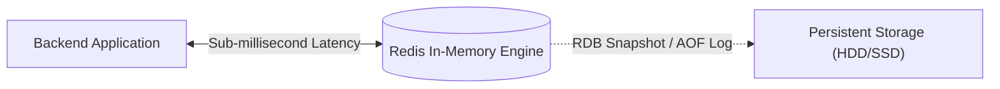
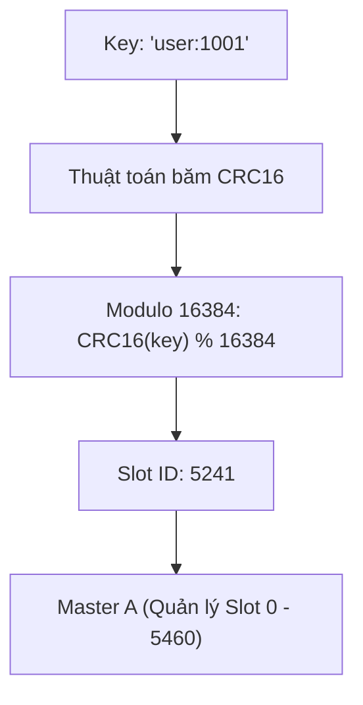
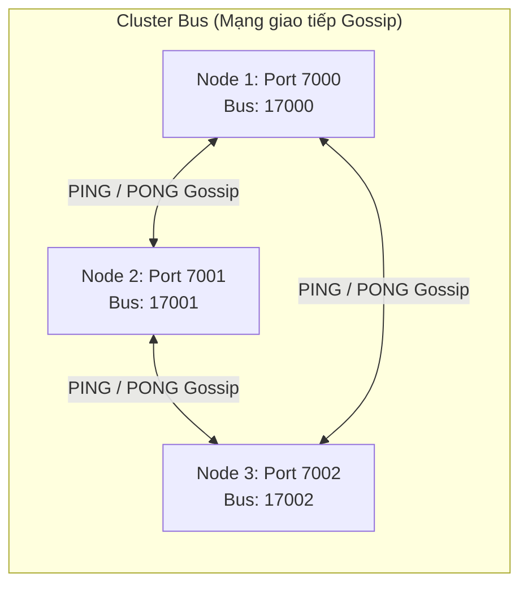
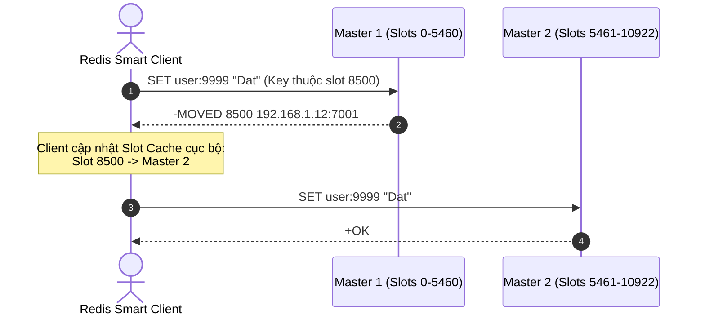
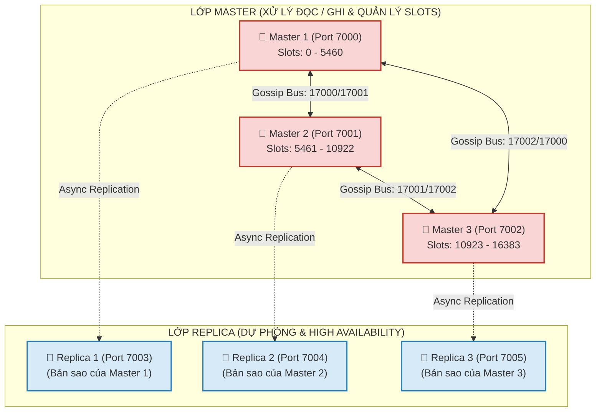
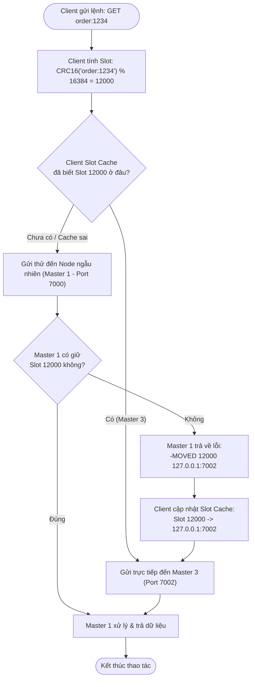
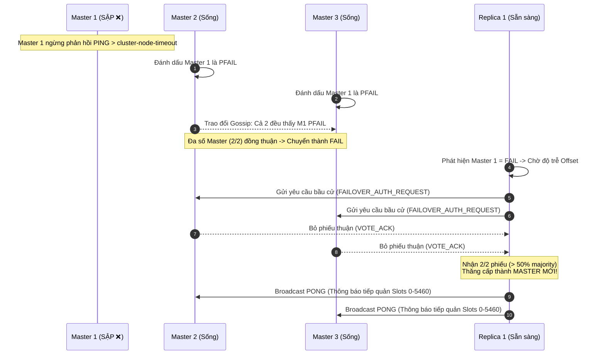
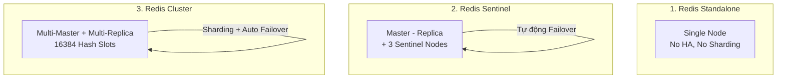

# 🚀 CẨM NANG TOÀN DIỆN VỀ REDIS VÀ REDIS CLUSTER

> **Mục tiêu**: Cung cấp cái nhìn toàn diện từ cơ bản đến nâng cao về Redis và kiến trúc phân tán Redis Cluster. Phân tích chi tiết nguyên lý Hash Slots, Gossip Protocol, Master-Replica Replication, cơ chế định tuyến Client (MOVED/ASK), kỹ thuật triển khai Docker/Native, cùng các bài toán vận hành, bảo trì và tối ưu thực chiến trong hệ thống backend quy mô lớn.

---

# 📑 MỤC LỤC TỔNG QUAN

1. [TỔNG QUAN VỀ REDIS (STANDALONE)](#1-tổng-quan-về-redis-standalone)
   - 1.1. Redis là gì?
   - 1.2. Các cấu trúc dữ liệu cốt lõi và Use Cases
   - 1.3. Vì sao Redis đạt tốc độ cực nhanh?
2. [REDIS CLUSTER LÀ GÌ? VÌ SAO CẦN REDIS CLUSTER?](#2-redis-cluster-là-gì-vì-sao-cần-redis-cluster)
   - 2.1. Đặt vấn đề và Sự cần thiết của Cluster
   - 2.2. Khái niệm Redis Cluster
   - 2.3. Khả năng mở rộng tuyến tính (Linear Scalability)
3. [KIẾN TRÚC VÀ NGUYÊN LÝ HOẠT ĐỘNG CỦA REDIS CLUSTER](#3-kiến-trúc-và-nguyên-lý-hoạt-động-của-redis-cluster)
   - 3.1. Phân mảnh dữ liệu qua Hash Slots (16,384 Slots & CRC16)
   - 3.2. Cấu trúc Master - Replica và Khả năng chịu lỗi
   - 3.3. Giao thức Gossip (Cluster Bus Port `+10000`)
   - 3.4. Cơ chế Client Routing: Lệnh `MOVED` và `ASK`
   - 3.5. Quy trình Bầu chọn và Failover Tự Động (Majority Voting)
4. [SƠ ĐỒ KIẾN TRÚC TRỰC QUAN (MERMAID ARCHITECTURE)](#4-sơ-đồ-kiến-trúc-trực-quan-mermaid-architecture)
   - 4.1. Cấu trúc liên kết Topology 6 Nodes (3 Master - 3 Replica)
   - 4.2. Luồng định tuyến Request & Xử lý MOVED Redirection
   - 4.3. Luồng bầu chọn Failover khi Master sập
5. [HƯỚNG DẪN THIẾT LẬP VÀ TRIỂN KHAI REDIS CLUSTER](#5-hướng-dẫn-thiết-lập-và-triển-khai-redis-cluster)
   - 5.1. Triển khai thủ công (Native Linux / Bare Metal)
   - 5.2. Triển khai chuẩn hóa với Docker & Docker CLI
   - 5.3. Triển khai bằng Docker Compose (Khuyên dùng cho Development/Staging)
6. [TƯƠNG TÁC DỮ LIỆU & LẬP TRÌNH VỚI REDIS CLUSTER](#6-tương-tác-dữ-liệu--lập-trình-với-redis-cluster)
   - 6.1. Kết nối qua `redis-cli` với cờ Cluster (`-c`)
   - 6.2. Bẫy lỗi `CROSSSLOT` trong Multi-key Operations
   - 6.3. Kỹ thuật Hash Tags `{...}` giải quyết bài toán Multi-key
7. [GIÁM SÁT, VẬN HÀNH VÀ BẢO TRÌ NÂNG CAO](#7-giám-sát-vận-hành-và-bảo-trì-nâng-cao)
   - 7.1. Các lệnh kiểm tra sức khỏe và Topology Cluster
   - 7.2. Chủ động Failover thủ công (`CLUSTER FAILOVER`)
   - 7.3. Thêm Node mới vào Cluster (Scale Out)
   - 7.4. Tái phân bổ Hash Slot (Resharding)
   - 7.5. Loại bỏ Node an toàn (Decommissioning)
8. [SO SÁNH KIẾN TRÚC: STANDALONE vs SENTINEL vs CLUSTER](#8-so-sánh-kiến-trúc-standalone-vs-sentinel-vs-cluster)
9. [HẠN CHẾ, RỦI RO VÀ BEST PRACTICES THỰC CHIẾN](#9-hạn-chế-rủi-ro-và-best-practices-thực-chiến)
   - 9.1. Những hạn chế kỹ thuật cần lưu ý
   - 9.2. Rủi ro mất dữ liệu & Network Partition (Split-Brain)
   - 9.3. Danh sách Best Practices chuẩn Enterprise

---

# 1. TỔNG QUAN VỀ REDIS (STANDALONE)

## 1.1. Redis là gì?

**Redis** (viết tắt của **RE**mote **DI**ctionary **S**erver) là một hệ thống lưu trữ cấu trúc dữ liệu trong bộ nhớ (**In-Memory Data Structure Store**) mã nguồn mở, hoạt động như một cơ sở dữ liệu NoSQL dạng Key-Value siêu nhanh, bộ nhớ đệm (Cache), trình môi giới tin nhắn (Message Broker) và hàng đợi (Queue).



## 1.2. Các cấu trúc dữ liệu cốt lõi và Use Cases

Không giống các kho Key-Value thuần túy chỉ lưu String thô, Redis hỗ trợ hệ thống kiểu dữ liệu rất phong phú:

| Cấu Trúc Dữ Liệu | Mô Tả | Use Cases Điển Hình |
| :--- | :--- | :--- |
| **String** | Chuỗi nhị phân an toàn (tối đa 512MB), có thể lưu text, số, JSON, binary | Caching HTML/JSON, Session Token, Atomic Counters (`INCR`), Distributed Locks |
| **List** | Danh sách liên kết đôi (Doubly Linked List), chèn/xóa ở 2 đầu $O(1)$ | Message Queue (`LPUSH`/`RPOP`), Dòng sự kiện gần nhất (Activity Feeds) |
| **Set** | Tập hợp các chuỗi không trùng lặp, không theo thứ tự ($O(1)$ lookup) | Danh sách Tag, Đếm Unique IP/User, Kiểm tra quyền hạn |
| **Sorted Set (ZSet)** | Tập hợp có sắp xếp theo điểm số (`score` dạng float) | Bảng xếp hạng realtime (Leaderboard), Rate Limiting (Sliding Window) |
| **Hash** | Bản đồ ánh xạ giữa field và value (tương tự JSON / HashMap) | Lưu trữ thông tin đối tượng (User Profile, Giỏ hàng, Metadata) |
| **Bitmap / Bitfield** | Thao tác trên từng bit nhị phân | Điểm danh user hàng ngày, tracking trạng thái online/offline với RAM tối thiểu |
| **HyperLogLog** | Cấu trúc xác suất đếm số phần tử duy nhất (Cardinality) với sai số ~0.81% | Đếm hàng triệu Unique Visitors (UV) chỉ với ~12KB RAM |
| **Geospatial (GEO)** | Lưu trữ tọa độ địa lý (kinh độ, vĩ độ) dựa trên Geohash | Tìm tài xế/quán ăn gần nhất trong bán kính $R$ km (`GEOSEARCH`) |
| **Stream** | Cấu trúc nhật ký dữ liệu chỉ thêm (Append-only Log), hỗ trợ Consumer Groups | Hệ thống Message Streaming (tương tự Apache Kafka thu nhỏ) |

## 1.3. Vì sao Redis đạt tốc độ cực nhanh?

1. **In-Memory First**: Mọi dữ liệu đọc/ghi trực tiếp trên RAM, độ trễ chỉ tính bằng micro-seconds ($\mu s$).
2. **I/O Multiplexing & Single-Threaded Core**: Lõi thực thi lệnh đơn luồng loại bỏ hoàn toàn chi phí Context Switching (chuyển ngữ cảnh) và tranh chấp khóa (Lock/Mutex Contention). Kết hợp cơ chế Non-blocking I/O multiplexing (`epoll`/`kqueue`) cho phép xử lý hàng chục nghìn kết nối đồng thời.
3. **Cấu trúc dữ liệu tối ưu ở mức C**: Sử dụng SDS (Simple Dynamic String), SkipList, QuickList, ZipList được căn chỉnh bộ nhớ tối ưu.

---

# 2. REDIS CLUSTER LÀ GÌ? VÌ SAO CẦN REDIS CLUSTER?

## 2.1. Đặt vấn đề và Sự cần thiết của Cluster

Mặc dù một phiên bản Redis Standalone đơn lẻ có thể xử lý hơn **100.000 QPS (Queries Per Second)**, nhưng trong các hệ thống Big Data và Enterprise lớn, Standalone gặp 2 giới hạn vật lý không thể vượt qua:

1. **Giới hạn Dung lượng Bộ nhớ (RAM Ceiling)**: Một máy chủ vật lý chỉ có thể gắn dung lượng RAM nhất định (ví dụ 64GB - 256GB). Khi dữ liệu vượt quá RAM, Redis sẽ bị tràn bộ nhớ (Out-Of-Memory - OOM).
2. **Giới hạn Băng thông & Năng lực CPU (Throughput Ceiling)**: Khi lưu lượng truy cập lên tới hàng trăm nghìn hoặc hàng triệu QPS, một CPU Core đơn lẻ của Redis Standalone sẽ bị bão hòa 100%.

> [!IMPORTANT]
> **Giải pháp**: Phân tán dữ liệu ra nhiều máy chủ khác nhau (**Horizontal Scaling - Mở rộng theo chiều ngang**), đồng thời tự động phân chia tải và dự phòng lỗi. Đó chính là lý do **Redis Cluster** ra đời (từ Redis 3.0).

## 2.2. Khái niệm Redis Cluster

**Redis Cluster** là kiến trúc phân tán (Distributed Architecture) chính thức của Redis, cung cấp:
- **Tự động phân mảnh dữ liệu (Data Sharding)**: Dữ liệu được chia nhỏ và phân phối tự động trên nhiều Master Node.
- **Tính sẵn sàng cao (High Availability)**: Hỗ trợ Master - Replica với cơ chế tự động phát hiện sự cố và chuyển đổi dự phòng (Automatic Failover) mà không cần hệ thống ngoài như Sentinel hay ZooKeeper.
- **Không có Node điều phối trung tâm (Decentralized - Masterless / Peer-to-Peer)**: Mọi node giao tiếp bình đẳng qua giao thức Gossip, loại bỏ hiện tượng Single Point of Failure (SPOF) ở tầng điều phối.

## 2.3. Khả năng mở rộng tuyến tính (Linear Scalability)

- **Mở rộng tuyến tính (Linear Scalability)**: Khi bạn tăng số lượng node trong cụm, tổng throughput (QPS) và dung lượng lưu trữ của toàn hệ thống sẽ tăng tỉ lệ thuận gần như đường thẳng.
- **Ví dụ**:
  - Cụm 3 Master: Đạt ~100.000 QPS, lưu trữ tối đa 120GB RAM.
  - Cụm 6 Master: Đạt ~200.000 QPS, lưu trữ tối đa 240GB RAM.
- Hệ thống có thể mở rộng lên tới **1.000 nodes** (trong thực tế khuyến nghị từ vài node đến vài trăm node để tối ưu băng thông giao thức Gossip).

---

# 3. KIẾN TRÚC VÀ NGUYÊN LÝ HOẠT ĐỘNG CỦA REDIS CLUSTER

## 3.1. Phân mảnh dữ liệu qua Hash Slots (16,384 Slots & CRC16)

Redis Cluster không dùng thuật toán Consistent Hashing truyền thống, mà sử dụng khái niệm cố định **16,384 Hash Slots** (đánh số từ `0` đến `16383`).



### Công thức ánh xạ Key vào Slot:
$$\text{HASH\_SLOT} = \text{CRC16}(\text{key}) \pmod{16384}$$

### Cách phân bổ Slot giữa các Node:
Tổng 16,384 slots sẽ được chia đều cho các Master Node trong cụm:
- **Master 1**: Quản lý dải slots `0` $\to$ `5460` (5,461 slots).
- **Master 2**: Quản lý dải slots `5461` $\to$ `10922` (5,462 slots).
- **Master 3**: Quản lý dải slots `10923` $\to$ `16383` (5,461 slots).

> [!NOTE]
> **Vì sao lại là 16,384 slots mà không phải 65,536 (2^16)?**
> 1. **Kích thước gói tin Heartbeat Gossip**: Gói tin heartbeat định kỳ chứa bitmap đại diện cho các slots mà node đang quản lý. Với 16,384 slots, bitmap chỉ tốn đúng $16384 / 8 = 2\text{ KB}$. Nếu dùng 65,536 slots, kích thước bitmap tăng lên 8KB, gây lãng phí băng thông mạng khi các node liên tục gửi gói tin PING/PONG.
> 2. **Số lượng node thực tế**: Redis Cluster thường triển khai tối đa ~1.000 nodes. Với 16,384 slots, mỗi node trung bình quản lý ~16 slots, đủ độ mịn để tái phân bổ (resharding) mà không cần số lượng slot quá lớn.

## 3.2. Cấu trúc Master - Replica và Khả năng chịu lỗi

Để đảm bảo hệ thống luôn sẵn sàng khi có phần cứng bị hỏng:
- Mỗi **Master Node** sẽ có **1 hoặc nhiều Replica (Slave) Nodes**.
- Dữ liệu từ Master được đồng bộ sang Replica bằng cơ chế **Sao chép Bất đồng bộ (Asynchronous Replication)**.
- **Master**: Tiếp nhận các truy vấn Đọc và Ghi (Read & Write) cho các slots mà nó phụ trách.
- **Replica**: Sao lưu dữ liệu từ Master tương ứng, sẵn sàng nhận quyền lực (Failover) khi Master chết. Mặc định Replica không phục vụ truy vấn đọc (trừ khi client kích hoạt chế độ `READONLY`).

> [!IMPORTANT]
> **Quy tắc triển khai tối thiểu**: Để Redis Cluster hoạt động chuẩn xác và có khả năng tự động Failover, cần **tối thiểu 3 Master Nodes** (mỗi master đi kèm ít nhất 1 replica $\rightarrow$ **tổng tối thiểu 6 instances**). Điều này đảm bảo thuật toán đồng thuận (Quorum Majority) có thể biểu quyết mà không rơi vào bế tắc Split-Brain.

## 3.3. Giao thức Gossip (Cluster Bus Port `+10000`)

Các node trong Redis Cluster không dùng server quản lý trung tâm (như Zookeeper hay Consul), mà kết nối mạng lưới ngang hàng (**Mesh Topology**) thông qua **Gossip Protocol**.



- **Cluster Bus Port**: Luôn bằng `Port dịch vụ + 10000` (Ví dụ: Redis chạy port `7000` thì Cluster Bus chạy port `17000`).
- **Giao thức nhị phân riêng biệt (Binary Protocol)**: Tiết kiệm tối đa băng thông, dùng để truyền tải:
  - **PING/PONG Heartbeat**: Kiểm tra trạng thái sống còn của các node lân cận.
  - **Node Join/Leave**: Thông báo node mới gia nhập hoặc rời cluster.
  - **Failover Election**: Phát lệnh yêu cầu bỏ phiếu bầu chọn Master mới.
  - **Slot Migration Status**: Cập nhật thông tin phân phối slot khi resharding.

## 3.4. Cơ chế Client Routing: Lệnh `MOVED` và `ASK`

Redis Cluster không dùng Load Balancer hay Reverse Proxy ở giữa. Client có thể kết nối tới **bất kỳ node nào** trong cụm. Nếu node nhận được request không quản lý slot của key đó, nó sẽ phản hồi mã điều hướng.



### Phân biệt `MOVED` và `ASK`:

| Tiêu Chí | `MOVED` Redirection | `ASK` Redirection |
| :--- | :--- | :--- |
| **Ý nghĩa** | Slot đã được chuyển giao **vĩnh viễn** sang node mới. | Slot đang trong quá trình **Resharding/Migrating dở dang**. |
| **Hành vi Client** | Client chuyển hướng request đến node mới, đồng thời **cập nhật lại bảng ánh xạ (Slot Cache)** của mình cho các truy vấn tương lai. | Client chỉ gửi tạm thời 1 lệnh `ASKING` trước khi gửi lệnh chính tới node đích. Client **KHÔNG** cập nhật bảng Slot Cache. |
| **Tần suất** | Xảy ra khi topology thay đổi hoặc client cache bị cũ. | Chỉ xuất hiện trong lúc đang chạy tác vụ chuyển dữ liệu giữa các node. |

## 3.5. Quy trình Bầu chọn và Failover Tự Động (Majority Voting)

Khi một Master Node gặp sự cố mạng hoặc tắt đột ngột:

1. **Phát hiện nghi ngờ (`PFAIL` - Possible Failure)**:
   - Node A gửi `PING` tới Node B nhưng không nhận được `PONG` sau thời gian `cluster-node-timeout` (mặc định 15000ms / 15s).
   - Node A đánh dấu Node B là `PFAIL`.
2. **Xác nhận chết tập thể (`FAIL`)**:
   - Qua giao thức Gossip, nếu **đa số (Majority > N/2)** các Master trong cụm cũng đồng ý Node B đang `PFAIL`, trạng thái của Node B được nâng lên `FAIL`. Thông báo `FAIL` được broadcast toàn cụm.
3. **Replica kích hoạt ứng cử (Election Initiation)**:
   - Các Replica của Master bị lỗi sẽ đợi một khoảng trễ (dựa trên mức độ đồng bộ dữ liệu `replication offset` - replica nào cập nhật mới nhất sẽ được quyền ứng cử trước).
   - Replica gửi thông điệp `FAILOVER_AUTH_REQUEST` tới tất cả các Master còn sống.
4. **Bỏ phiếu Quorum (Master Voting)**:
   - Mỗi Master còn sống chỉ được bỏ đúng 1 phiếu thuận cho mỗi kỳ bầu cử (`currentEpoch`).
   - Nếu Replica nhận được số phiếu **> N/2** (đa số phiếu từ các Master), nó trúng cử.
5. **Thăng cấp & Tiếp quản (Promotion)**:
   - Replica trúng cử chuyển trạng thái thành **Master mới**.
   - Nó tiếp quản toàn bộ hash slots của Master cũ và broadcast thông điệp `PONG` qua Cluster Bus để toàn cụm cập nhật `clusterState`.

---

# 4. SƠ ĐỒ KIẾN TRÚC TRỰC QUAN (MERMAID ARCHITECTURE)

## 4.1. Cấu trúc liên kết Topology 6 Nodes (3 Master - 3 Replica)



## 4.2. Luồng định tuyến Request & Xử lý MOVED Redirection



## 4.3. Luồng bầu chọn Failover khi Master sập



---

# 5. HƯỚNG DẪN THIẾT LẬP VÀ TRIỂN KHAI REDIS CLUSTER

## 5.1. Triển khai thủ công (Native Linux / Bare Metal)

Mô hình chuẩn bị: 6 instances chạy trên các port từ `7000` đến `7005` trên cùng 1 máy chủ (hoặc phân tán qua nhiều máy vật lý).

### Bước 1: Cài đặt Redis Server
```bash
sudo apt update && sudo apt install redis-server -y
```

### Bước 2: Tạo thư mục và khởi tạo 6 instance cấu hình Cluster
Tạo các thư mục riêng cho từng node và khởi chạy:

```bash
for port in 7000 7001 7002 7003 7004 7005; do
  mkdir -p ./redis-cluster/$port
  cat <<EOF > ./redis-cluster/$port/redis.conf
port $port
cluster-enabled yes
cluster-config-file nodes.conf
cluster-node-timeout 5000
appendonly yes
dir ./redis-cluster/$port/
pidfile ./redis-cluster/$port/redis.pid
logfile ./redis-cluster/$port/redis.log
daemonize yes
protected-mode no
EOF
  redis-server ./redis-cluster/$port/redis.conf
done
```

### Bước 3: Khởi tạo Cluster với `redis-cli`
Sử dụng tham số `--cluster-replicas 1` (nghĩa là với 6 node, sẽ tự động gán 3 Master và mỗi Master có 1 Replica):

```bash
redis-cli --cluster create \
  127.0.0.1:7000 127.0.0.1:7001 127.0.0.1:7002 \
  127.0.0.1:7003 127.0.0.1:7004 127.0.0.1:7005 \
  --cluster-replicas 1
```
> Nhập `yes` khi hệ thống hỏi xác nhận cấu hình phân bổ Hash Slots.

---

## 5.2. Triển khai chuẩn hóa với Docker CLI

### Bước 1: Tạo Docker Bridge Network
```bash
docker network create redis-cluster-net
```

### Bước 2: Khởi chạy 6 Container Redis
```bash
for port in 7000 7001 7002 7003 7004 7005; do
  docker run -d --name redis-$port \
    --net redis-cluster-net \
    -p $port:$port -p 1$port:1$port \
    -v redis-$port-data:/data \
    redis:7-alpine redis-server \
      --port $port \
      --cluster-enabled yes \
      --cluster-config-file nodes.conf \
      --cluster-node-timeout 5000 \
      --appendonly yes \
      --protected-mode no
done
```

### Bước 3: Khởi tạo Cluster
```bash
# Lấy danh sách IP nội bộ của các container trong Docker Network
ips=""
for port in 7000 7001 7002 7003 7004 7005; do
  ip=$(docker inspect -f '{{range .NetworkSettings.Networks}}{{.IPAddress}}{{end}}' redis-$port)
  ips="$ips $ip:$port"
done

# Tạo Cluster từ bên trong container redis-7000
docker exec -it redis-7000 redis-cli --cluster create $ips --cluster-replicas 1
```

---

## 5.3. Triển khai bằng Docker Compose (Khuyên dùng)

Tạo file `docker-compose.yml` để quản lý tập trung toàn bộ cụm:

```yaml
version: '3.8'

networks:
  redis-cluster-net:
    driver: bridge
    ipam:
      config:
        - subnet: 172.28.0.0/16

services:
  redis-node-1:
    image: redis:7-alpine
    container_name: redis-node-1
    command: ["redis-server", "--port", "7000", "--cluster-enabled", "yes", "--cluster-config-file", "nodes.conf", "--cluster-node-timeout", "5000", "--appendonly", "yes", "--protected-mode", "no"]
    networks:
      redis-cluster-net:
        ipv4_address: 172.28.0.10
    ports:
      - "7000:7000"
      - "17000:17000"

  redis-node-2:
    image: redis:7-alpine
    container_name: redis-node-2
    command: ["redis-server", "--port", "7001", "--cluster-enabled", "yes", "--cluster-config-file", "nodes.conf", "--cluster-node-timeout", "5000", "--appendonly", "yes", "--protected-mode", "no"]
    networks:
      redis-cluster-net:
        ipv4_address: 172.28.0.11
    ports:
      - "7001:7001"
      - "17001:17001"

  redis-node-3:
    image: redis:7-alpine
    container_name: redis-node-3
    command: ["redis-server", "--port", "7002", "--cluster-enabled", "yes", "--cluster-config-file", "nodes.conf", "--cluster-node-timeout", "5000", "--appendonly", "yes", "--protected-mode", "no"]
    networks:
      redis-cluster-net:
        ipv4_address: 172.28.0.12
    ports:
      - "7002:7002"
      - "17002:17002"

  redis-node-4:
    image: redis:7-alpine
    container_name: redis-node-4
    command: ["redis-server", "--port", "7003", "--cluster-enabled", "yes", "--cluster-config-file", "nodes.conf", "--cluster-node-timeout", "5000", "--appendonly", "yes", "--protected-mode", "no"]
    networks:
      redis-cluster-net:
        ipv4_address: 172.28.0.13
    ports:
      - "7003:7003"
      - "17003:17003"

  redis-node-5:
    image: redis:7-alpine
    container_name: redis-node-5
    command: ["redis-server", "--port", "7004", "--cluster-enabled", "yes", "--cluster-config-file", "nodes.conf", "--cluster-node-timeout", "5000", "--appendonly", "yes", "--protected-mode", "no"]
    networks:
      redis-cluster-net:
        ipv4_address: 172.28.0.14
    ports:
      - "7004:7004"
      - "17004:17004"

  redis-node-6:
    image: redis:7-alpine
    container_name: redis-node-6
    command: ["redis-server", "--port", "7005", "--cluster-enabled", "yes", "--cluster-config-file", "nodes.conf", "--cluster-node-timeout", "5000", "--appendonly", "yes", "--protected-mode", "no"]
    networks:
      redis-cluster-net:
        ipv4_address: 172.28.0.15
    ports:
      - "7005:7005"
      - "17005:17005"

  # Service tự động khởi tạo Cluster khi các node đã up
  redis-cluster-creator:
    image: redis:7-alpine
    container_name: redis-cluster-creator
    depends_on:
      - redis-node-1
      - redis-node-2
      - redis-node-3
      - redis-node-4
      - redis-node-5
      - redis-node-6
    networks:
      redis-cluster-net:
        ipv4_address: 172.28.0.20
    command: >
      sh -c "sleep 3 &&
             echo 'yes' | redis-cli --cluster create
             172.28.0.10:7000 172.28.0.11:7001 172.28.0.12:7002
             172.28.0.13:7003 172.28.0.14:7004 172.28.0.15:7005
             --cluster-replicas 1"
```

Khởi chạy bằng 1 lệnh duy nhất:
```bash
docker compose up -d
```

---

# 6. TƯƠNG TÁC DỮ LIỆU & LẬP TRÌNH VỚI REDIS CLUSTER

## 6.1. Kết nối qua `redis-cli` với cờ Cluster (`-c`)

Khi thao tác với Redis Cluster bằng dòng lệnh, **BẮT BUỘC** phải thêm tham số `-c` (Cluster mode) để CLI tự động xử lý các phản hồi `MOVED`:

```bash
# Kết nối vào bất kỳ port nào
redis-cli -c -p 7000
```

Ví dụ thực hiện thao tác:
```text
127.0.0.1:7000> SET mykey "Hello Cluster"
-> Redirected to slot [14687] located at 127.0.0.1:7002
OK
127.0.0.1:7002> GET mykey
"Hello Cluster"
```
*(CLI tự động nhận phản hồi `MOVED 14687 127.0.0.1:7002` và chuyển socket sang port 7002 mà người dùng không cần gõ lại lệnh)*.

Kiểm tra vị trí Hash Slot của một key bất kỳ:
```bash
127.0.0.1:7002> CLUSTER KEYSLOT mykey
(integer) 14687
```

---

## 6.2. Bẫy lỗi `CROSSSLOT` trong Multi-key Operations

Trong Redis Standalone, bạn có thể thoải mái thực hiện các lệnh multi-key hoặc Transaction:
```text
MGET key1 key2 key3
MSET k1 "v1" k2 "v2"
```

Tuy nhiên trong Redis Cluster, mỗi key có thể rơi vào **các Hash Slot khác nhau** nằm trên **các Master Node vật lý khác nhau**. Khi đó, Redis sẽ trả về lỗi nghiêm trọng:
```text
(error) CROSSSLOT Keys in request don't hash to the same slot
```

---

## 6.3. Kỹ thuật Hash Tags `{...}` giải quyết bài toán Multi-key

Để cho phép các thao tác Multi-key (như `MGET`, `MSET`, `EVAL Lua Scripts`, `MULTI/EXEC Transaction`), Redis cung cấp cơ chế **Hash Tags**.

> [!TIP]
> **Quy tắc Hash Tag**: Khi một key chứa cặp ngoặc nhọn `{...}`, Redis sẽ **chỉ lấy phần chuỗi bên trong `{...}`** để băm hàm `CRC16`, bỏ qua toàn bộ phần tiền tố hoặc hậu tố bên ngoài.

### Ví dụ minh họa:
Xét 3 keys của cùng người dùng `user:1001`:
- `{user:1001}:profile` $\rightarrow$ Chuỗi băm: `user:1001`
- `{user:1001}:orders` $\rightarrow$ Chuỗi băm: `user:1001`
- `{user:1001}:cart` $\rightarrow$ Chuỗi băm: `user:1001`

Vì cùng chuỗi băm `user:1001`, cả 3 keys này chắc chắn rơi vào **cùng 1 Hash Slot duy nhất**, cho phép thực hiện lệnh multi-key trơn tru:

```text
127.0.0.1:7000> MSET {user:1001}:name "Alice" {user:1001}:email "alice@kbsv.vn"
OK
127.0.0.1:7000> MGET {user:1001}:name {user:1001}:email
1) "Alice"
2) "alice@kbsv.vn"
```

---

# 7. GIÁM SÁT, VẬN HÀNH VÀ BẢO TRÌ NÂNG CAO

## 7.1. Các lệnh kiểm tra sức khỏe và Topology Cluster

| Lệnh CLI | Ý Nghĩa / Mục Đích Sử Dụng |
| :--- | :--- |
| `CLUSTER INFO` | Xem trạng thái tổng quát: `cluster_state:ok` hay `fail`, số slot đã gán, số master node |
| `CLUSTER NODES` | Xem danh sách toàn bộ các node, ID, Role (master/slave), IP:Port, dải slot quản lý, trạng thái kết nối |
| `CLUSTER SLOTS` | Xem bản đồ chi tiết từng dải slot từ start $\to$ end thuộc về Master và Replica nào |
| `CLUSTER REPLICAS <node-id>` | Xem danh sách các replica đang phục vụ cho một master node cụ thể |
| `CLUSTER KEYSLOT <key>` | Tính toán ra mã slot ID $(0 \to 16383)$ của một key cụ thể |
| `MONITOR` | Xem dòng lệnh realtime đang được gửi tới node hiện tại (chỉ dùng khi debug, không bật trên production lâu) |

---

## 7.2. Chủ động Failover thủ công (`CLUSTER FAILOVER`)

Khi cần bảo trì, nâng cấp phần cứng hoặc restart máy chủ của một Master Node mà **không muốn gây downtime**:

```bash
# 1. SSH hoặc kết nối trực tiếp vào REPLICA của Master cần bảo trì
redis-cli -p 7003

# 2. Gửi lệnh Failover có kiểm soát (Graceful Failover)
CLUSTER FAILOVER
```

- **Graceful Failover**: Replica sẽ yêu cầu Master tạm dừng ghi vài mili-giây, chờ đồng bộ dữ liệu offset cuối cùng đạt 100%, sau đó mới thăng cấp Replica lên Master. **Không mất bất kỳ byte dữ liệu nào**.
- **Force Failover (khi Master đã chết hẳn)**:
  ```bash
  CLUSTER FAILOVER FORCE
  ```

---

## 7.3. Thêm Node mới vào Cluster (Scale Out)

Giả sử hệ thống đang tải cao, cần thêm 2 node mới: `127.0.0.1:7006` (làm Master) và `127.0.0.1:7007` (làm Replica).

### Bước 1: Khởi động 2 instance Redis mới
```bash
redis-server --port 7006 --cluster-enabled yes --cluster-config-file nodes.conf --daemonize yes
redis-server --port 7007 --cluster-enabled yes --cluster-config-file nodes.conf --daemonize yes
```

### Bước 2: Thêm Node làm Master mới
```bash
# Cú pháp: redis-cli --cluster add-node <IP_NODE_MỚI>:<PORT> <IP_NODE_ĐANG_CÓ_TRONG_CỤM>:<PORT>
redis-cli --cluster add-node 127.0.0.1:7006 127.0.0.1:7000
```

### Bước 3: Thêm Node làm Replica cho Master mới (Node 7006)
```bash
# Lấy ID của node 7006 từ lệnh CLUSTER NODES, sau đó gán 7007 làm slave của nó:
redis-cli --cluster add-node 127.0.0.1:7007 127.0.0.1:7000 \
  --cluster-slave \
  --cluster-master-id <ID_CỦA_NODE_7006>
```

---

## 7.4. Tái phân bổ Hash Slot (Resharding)

Sau khi thêm Master mới (`7006`), node này hiện có `0 slots`. Ta cần di chuyển một phần slots từ các master cũ sang master mới:

```bash
redis-cli --cluster reshard 127.0.0.1:7000
```

Hệ thống tương tác CLI sẽ yêu cầu các thông số:
1. `How many slots do you want to move (from 1 to 16384)?` $\rightarrow$ Nhập số lượng slot muốn chuyển (ví dụ: `1000`).
2. `What is the Target Node ID?` $\rightarrow$ Nhập ID của Node nhận (`7006`).
3. `Source node IDs:` $\rightarrow$ Nhập `all` để lấy đều từ tất cả các master cũ, hoặc nhập ID cụ thể của node nguồn.
4. Xác nhận `yes` để bắt đầu di chuyển slot và dữ liệu realtime.

---

## 7.5. Loại bỏ Node an toàn (Decommissioning)

> [!CAUTION]
> Tuyệt đối **KHÔNG** xóa trực tiếp một Master Node còn đang giữ Hash Slots. Phải reshard đưa số slot của node đó về `0` trước khi xóa!

### Bước 1: Di chuyển toàn bộ slots ra khỏi node cần xóa
Sử dụng `redis-cli --cluster reshard` để chuyển toàn bộ slots của node đó sang các master khác.

### Bước 2: Thực hiện xóa node
```bash
# Cú pháp: redis-cli --cluster del-node <IP>:<PORT> <NODE_ID_CẦN_XÓA>
redis-cli --cluster del-node 127.0.0.1:7000 <NODE_ID_CỦA_NODE_CẦN_XÓA>
```

---

# 8. SO SÁNH KIẾN TRÚC: STANDALONE vs SENTINEL vs CLUSTER



| Tiêu Chí So Sánh | Redis Standalone | Redis Sentinel | Redis Cluster |
| :--- | :--- | :--- | :--- |
| **Mục đích chính** | Cache đơn giản, Dev/Test, hệ thống nhỏ | Tính sẵn sàng cao (High Availability) | Cả HA lẫn Mở rộng dung lượng (Scalability + HA) |
| **Data Sharding (Phân mảnh)** | ❌ Không (1 node duy nhất) | ❌ Không (Dữ liệu master copy 100% sang replica) | ✅ **Có** (Chia đều dữ liệu qua 16,384 slots) |
| **Dung lượng RAM tối đa** | Giới hạn bởi 1 máy chủ vật lý | Giới hạn bởi 1 máy chủ vật lý | **Vô hạn** (Gộp tổng RAM của toàn bộ Master nodes) |
| **Throughput ghi (Write QPS)** | ~100k QPS (1 Master) | ~100k QPS (1 Master) | **Mở rộng tuyến tính** (Hàng triệu QPS với N Master) |
| **Cơ chế Failover** | ❌ Thủ công | ✅ Tự động qua các tiến trình Sentinel độc lập | ✅ **Tự động tích hợp sẵn** qua Gossip Protocol & Quorum |
| **Hỗ trợ Multi Database** | Có (DB 0 $\to$ DB 15) | Có (DB 0 $\to$ DB 15) | ❌ **Chỉ duy nhất DB 0** |
| **Hỗ trợ Multi-key / Transactions** | ✅ Hoàn toàn tự do | ✅ Hoàn toàn tự do | ⚠️ Giới hạn: Phải dùng **Hash Tags `{...}`** |
| **Độ phức tạp vận hành** | Rất thấp | Trung bình | Khá cao (cần kiến thức sharding, resharding) |

---

# 9. HẠN CHẾ, RỦI RO VÀ BEST PRACTICES THỰC CHIẾN

## 9.1. Những hạn chế kỹ thuật cần lưu ý

1. **Chỉ hỗ trợ Database 0**: Trong Cluster mode, lệnh `SELECT <index>` bị vô hiệu hóa; toàn bộ dữ liệu chỉ nằm trong DB 0.
2. **Hạn chế Multi-key & Lua Scripting**: Các lệnh liên quan đến nhiều key (`MGET`, `MSET`, `SUNION`, Lua scripts) chỉ được phép chạy khi tất cả các keys cùng nằm trên 1 hash slot (dùng Hash Tag `{...}`).
3. **Không hỗ trợ Transaction lồng nhiều slot**: Lệnh `MULTI/EXEC` bị cấm nếu các lệnh bên trong can thiệp vào nhiều slot khác nhau.

## 9.2. Rủi ro mất dữ liệu & Network Partition (Split-Brain)

Redis Cluster ưu tiên **Hiệu Năng (Performance)** và **Tính Sẵn Sàng (Availability)** hơn tính Nhất Quán Tuyệt Đối (Strong Consistency) theo định lý CAP:

> [!WARNING]
> **Bẫy Asynchronous Replication & Failover Lag**:
> 1. Client ghi dữ liệu vào Master A thành công (Master A trả về `+OK` ngay mà không đợi Replica đồng bộ xong).
> 2. Master A bị sập nguồn ngay lập tức trước khi kịp đẩy dữ liệu qua mạng sang Replica A1.
> 3. Replica A1 được bầu làm Master mới $\rightarrow$ **Một vài thao tác ghi cuối cùng của Master A sẽ bị mất vĩnh viễn**.
>
> **Bẫy Split-Brain**: Khi xảy ra sự cố cô lập mạng (Network Partition), một Master bị rơi vào phân vùng thiểu số (Minority Partition) có thể vẫn tiếp tục nhận ghi từ client cũ trong một khoảng thời gian trước khi nhận diện mình bị ngắt kết nối.

## 9.3. Danh sách Best Practices chuẩn Enterprise

1. **Cấu hình `cluster-node-timeout` hợp lý**:
   - Mặc định: `15000ms` (15s). Trong môi trường mạng nội bộ (LAN / AWS VPC), nên hạ xuống `3000ms - 5000ms` để rút ngắn thời gian phát hiện lỗi và failover nhanh hơn.
2. **Khai thác Thư viện Smart Client (Lettuce / ioredis)**:
   - Sử dụng các driver có khả năng **Auto-Topology Refresh** (Ví dụ: Lettuce trong Spring Boot, `ioredis` trong Node.js) để client tự động cập nhật bảng Slot khi có node bị sập hoặc resharding mà không cần restart backend.
3. **Phân bổ Master - Replica trên các Rack / Availability Zones khác nhau**:
   - Tránh đặt Master và Replica của cùng một shard trên cùng một máy chủ vật lý hoặc cùng một Switch mạng.
4. **Giám sát chặt chẽ thông số Throughput & Slot Skewing**:
   - Thiết kế key với Hash Tag hợp lý, tránh gom quá nhiều dữ liệu vào một Hash Tag dẫn đến tình trạng **Hot Slot / Data Skew** (1 node bị quá tải trong khi các node khác rảnh rỗi).
5. **Cấu hình `min-replicas-to-write` nếu cần an toàn dữ liệu cao**:
   - Thiết lập `min-replicas-to-write 1` để Master từ chối nhận ghi nếu mất kết nối với tất cả các replica của nó.

---

<div align="center">
  <sub>Sổ tay kiến trúc hệ thống • Cập nhật: <b>Tháng 09/2026</b> • Repository: <b>TienDat-Vna/note_book</b></sub>
</div>
