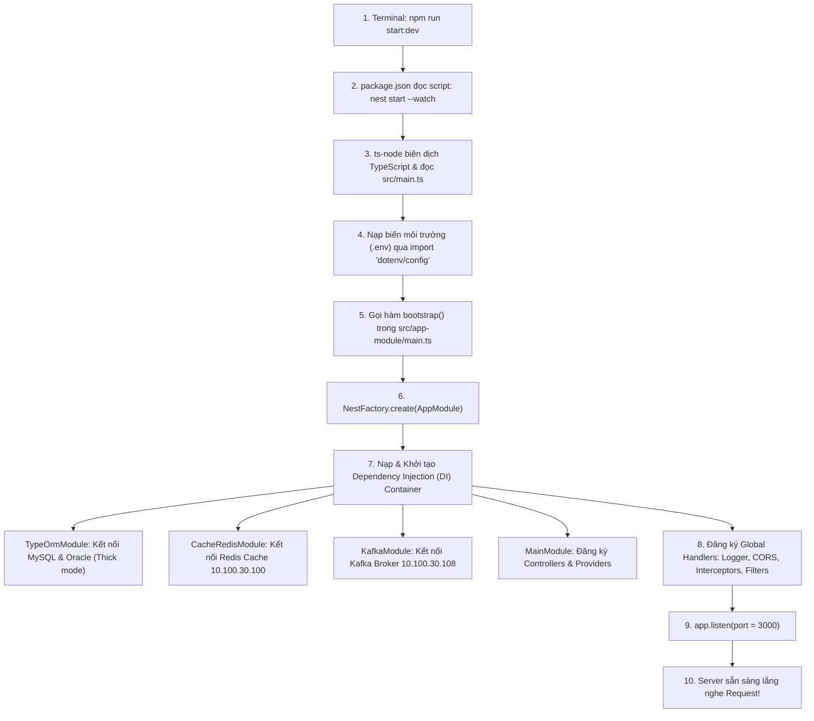
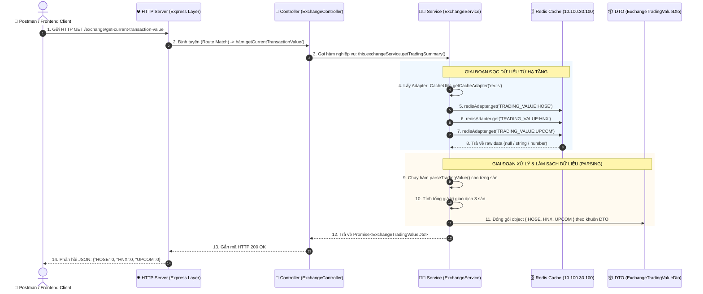

# 📘 CẨM NANG TOÀN DIỆN: TỪ CƠ BẢN ĐẾN CHUYÊN SÂU CÁCH XÂY DỰNG, VẬN HÀNH & KIỂM THỬ API TRONG NESTJS
> **Tài liệu tổng hợp kiến thức và kinh nghiệm thực chiến từ dự án Broker Dashboard Realtime**

---

## 📑 MỤC LỤC
1. [Tổng Quan Kiến Trúc Dự Án & Mô Hình Modular trong NestJS](#1-tổng-quan-kiến-trúc-dự-án--mô-hình-modular-trong-nestjs)
2. [Vòng Đời Khởi Động Ứng Dụng (Application Bootstrap Lifecycle)](#2-vòng-đời-khởi-động-ứng-dụng-application-bootstrap-lifecycle)
3. [Vòng Đời Của Một HTTP Request (Request Lifecycle & Data Flow)](#3-vòng-đời-của-một-http-request-request-lifecycle--data-flow)
4. [Quy Trình Chuẩn 4 Bước Xây Dựng Một API Mới](#4-quy-trình-chuẩn-4-bước-xây-dựng-một-api-mới)
5. [Kỹ Thuật Xử Lý Dữ Liệu An Toàn (Defensive Programming & Best Practices)](#5-kỹ-thuật-xử-lý-dữ-liệu-an-toàn-defensive-programming--best-practices)
6. [Cẩm Nang Vận Hành, Kiểm Thử & Xử Lý Lỗi (Testing & Troubleshooting)](#6-cẩm-nang-vận-hành-kiểm-thử--xử-lý-lỗi-testing--troubleshooting)
7. [Bí Quyết & Kinh Nghiệm Đúc Kết Dành Cho Developer](#7-bí-quyết--kinh-nghiệm-đúc-kết-dành-cho-developer)

---

## 1. TỔNG QUAN KIẾN TRÚC DỰ ÁN & MÔ HÌNH MODULAR TRONG NESTJS

### 1.1. Bản chất của NestJS
NestJS là một Framework Node.js tiến bộ được xây dựng trên nền tảng **TypeScript**, kế thừa các nguyên lý thiết kế kinh điển của lập trình hướng đối tượng (OOP), lập trình hàm (FP) và lập trình hướng phản ứng (FRP). Đặc biệt, NestJS áp dụng mô hình kiến trúc rất chặt chẽ tương tự như Spring Boot (Java) hay Angular.

### 1.2. Cấu trúc Submodule trong dự án Thực tế (`broker-dashboard`)
Dự án được chia thành 2 phần tách biệt:
* **Các Module Nền Tảng (Git Submodules):** Chứa các thư viện dùng chung cho toàn bộ hệ thống công ty, không sửa trực tiếp.
  * `src/app-module`: Chứa file khởi chạy (`bootstrap`), cấu hình global (CORS, Interceptor, Logger).
  * `src/broker-authen-module`: Xác thực quyền truy cập qua JWT / Core API.
  * `src/cache-redis-module`: Quản lý kết nối và bộ nhớ đệm Redis.
  * `src/common-module`: Các tiện ích chung (`CacheUtils`, `ModuleRefUtils`...).
  * `src/kafka-module`: Kết nối và xử lý Message Broker Kafka.
  * `src/ws-module`: Xử lý Gateway Socket.IO kết nối realtime tới Client.
* **Module Nghiệp Vụ Chính (`src/main-module`):** Nơi Developer thực hiện các task nghiệp vụ:
  * `controller/`: Nơi tiếp nhận các Request từ Client.
  * `service/`: Nơi xử lý logic nghiệp vụ và tính toán.
  * `dto/`: Định nghĩa khuôn mẫu dữ liệu (Data Transfer Object).
  * `entity/`: Định nghĩa bảng cơ sở dữ liệu MySQL / Oracle.

---

## 2. VÒNG ĐỜI KHỞI ĐỘNG ỨNG DỤNG (APPLICATION BOOTSTRAP LIFECYCLE)

> **Câu hỏi quan trọng:** *Khi bạn gõ lệnh `npm run start:dev`, điều gì thực sự diễn ra dưới nền tảng? File nào chạy trước, nạp cái gì trước?*



### Chi tiết từng bước khởi chạy:

1. **`package.json` & Nest CLI:**
   Lệnh `npm run start:dev` kích hoạt `nest start --watch`. Nest CLI sẽ đọc `tsconfig.json` và theo dõi sự thay đổi của file để tự động hot-reload khi bạn sửa code.

2. **File thực thi đầu tiên - `src/main.ts`:**
   ```typescript
   import 'dotenv/config'; // Nạp toàn bộ key-value trong file .env vào process.env
   import { bootstrap } from './app-module/main';

   void bootstrap(); // Bắt đầu kích hoạt ứng dụng
   ```

3. **File cấu hình ứng dụng - `src/app-module/main.ts`:**
   * Lắng nghe các sự cố bất ngờ của hệ thống: `uncaughtException`, `unhandledRejection`.
   * Tạo **IoC Container** (Inversion of Control) thông qua:
     ```typescript
     const app = await NestFactory.create(AppModule, {});
     ```
   * Kích hoạt CORS (cho phép frontend gọi sang), nạp Custom Logger, Interceptors, Filters.
   * Lấy cổng `server.port` từ `.env` (mặc định `3000`) và mở cổng lắng nghe: `await app.listen(port)`.

4. **Trái tim điều phối - `src/app.module.ts`:**
   Tại đây, NestJS khởi tạo toàn bộ kết nối hạ tầng:
   * **MySQL DataSource**: Quản lý connection pool lưu trữ dữ liệu.
   * **Oracle Flex DataSource**: Khởi tạo `thickMode: true` để giao tiếp với Oracle Core Flex (`FLXOMS`).
   * **Redis Cache Module**: Mở pool kết nối Redis.
   * **MainModule**: Module chứa API của bạn.

---

## 3. VÒNG ĐỜI CỦA MỘT HTTP REQUEST (REQUEST LIFECYCLE & DATA FLOW)

> **Ví dụ trực quan từ task Exchange API:** Client gửi `GET http://localhost:3000/exchange/get-current-transaction-value`.



---

## 4. QUY TRÌNH CHUẨN 4 BƯỚC XÂY DỰNG MỘT API MỚI

Khi nhận bất kỳ một task xây dựng API nào trong NestJS, bạn chỉ cần tuân thủ đúng **4 bước vàng** sau:

```
[Bước 1: Tạo DTO] ──> [Bước 2: Viết Service] ──> [Bước 3: Viết Controller] ──> [Bước 4: Đăng ký Module]
```

### Bước 1: Định nghĩa Hợp Đồng Dữ Liệu (DTO - Data Transfer Object)
* **Vị trí:** `src/main-module/dto/exchange.dto.ts`
* **Nhiệm vụ:** Quy định rõ Client sẽ nhận về cái gì hoặc gửi lên cái gì.
```typescript
export class ExchangeTradingValueDto {
    HOSE: number;
    HNX: number;
    UPCOM: number;
}
```

### Bước 2: Xây dựng Trái Tim Nghiệp Vụ (Service)
* **Vị trí:** `src/main-module/service/exchange.service.ts`
* **Nhiệm vụ:**
  1. Đánh dấu `@Injectable()` để NestJS hiểu đây là một Service có thể Inject.
  2. Khai báo `Logger` để theo dõi quá trình chạy và gỡ lỗi.
  3. Tương tác với Database / Redis / External API.
  4. Viết hàm chuyển đổi dữ liệu an toàn (`parseTradingValue`).
```typescript
import { Injectable, Logger } from '@nestjs/common';
import { CacheUtils } from 'src/common-module/utils/cache/cache.utils';
import { ICacheAdapter } from 'src/common-module/utils/cache/i-cache-adapter';
import { ExchangeTradingValueDto } from '../dto/exchange.dto';

@Injectable()
export class ExchangeService {
    private readonly logger = new Logger(ExchangeService.name);

    private readonly REDIS_KEY_HOSE = 'TRADING_VALUE:HOSE';
    private readonly REDIS_KEY_HNX = 'TRADING_VALUE:HNX';
    private readonly REDIS_KEY_UPCOM = 'TRADING_VALUE:UPCOM';

    async getTradingSummary(): Promise<ExchangeTradingValueDto> {
        this.logger.log('Bắt đầu lấy dữ liệu tổng GTGD từ Redis...');
        const redisAdapter: ICacheAdapter = CacheUtils.getCacheAdapter('redis');

        if (!redisAdapter) {
            this.logger.error('Không tìm thấy Redis Cache Adapter!');
            return { HOSE: 0, HNX: 0, UPCOM: 0 };
        }

        const rawHose = await redisAdapter.get(this.REDIS_KEY_HOSE);
        const rawHnx = await redisAdapter.get(this.REDIS_KEY_HNX);
        const rawUpcom = await redisAdapter.get(this.REDIS_KEY_UPCOM);

        const hoseValue = this.parseTradingValue(rawHose);
        const hnxValue = this.parseTradingValue(rawHnx);
        const upcomValue = this.parseTradingValue(rawUpcom);

        return {
            HOSE: hoseValue,
            HNX: hnxValue,
            UPCOM: upcomValue,
        };
    }

    public parseTradingValue(rawValue: any): number {
        if (rawValue === null || rawValue === undefined || rawValue === '') {
            return 0;
        }
        if (typeof rawValue === 'number') {
            return isNaN(rawValue) ? 0 : rawValue;
        }
        if (typeof rawValue === 'string') {
            const parsed = parseFloat(rawValue);
            return isNaN(parsed) ? 0 : parsed;
        }
        if (typeof rawValue === 'object' && rawValue.value !== undefined) {
            return this.parseTradingValue(rawValue.value);
        }
        return 0;
    }
}
```

### Bước 3: Người Gác Cổng Tiếp Nhận Request (Controller)
* **Vị trí:** `src/main-module/controller/exchange.controller.ts`
* **Nhiệm vụ:**
  1. Đánh dấu `@Controller('exchange')` để tạo tiền tố đường dẫn `/exchange`.
  2. Tiêm Service vào thông qua constructor: `constructor(private readonly exchangeService: ExchangeService) {}`.
  3. Định nghĩa Method `@Get('get-current-transaction-value')` và `@HttpCode(HttpStatus.OK)`.
```typescript
import { Controller, Get, HttpCode, HttpStatus } from '@nestjs/common';
import { ExchangeService } from '../service/exchange.service';
import { ExchangeTradingValueDto } from '../dto/exchange.dto';

@Controller('exchange')
export class ExchangeController {
  constructor(private readonly exchangeService: ExchangeService) {}

  @Get('get-current-transaction-value')
  @HttpCode(HttpStatus.OK)
  async getCurrentTransactionValue(): Promise<ExchangeTradingValueDto> {
    return await this.exchangeService.getTradingSummary();
  }
}
```

### Bước 4: Khai Báo & Ráp Nối Vào Hệ Thống (Module)
* **Vị trí:** `src/main-module/main.module.ts`
* **Nhiệm vụ:** Đăng ký `ExchangeController` vào mảng `controllers` và `ExchangeService` vào mảng `providers`.
```typescript
@Module({
  imports: [ ... ],
  controllers: [
    MainController, 
    JobController, 
    ExchangeController // <-- ĐĂNG KÝ CONTROLLER TẠI ĐÂY
  ],
  providers: [
    CustomLoggerService, 
    KafkaRealtimeService, 
    RealtimeEvent, 
    CoreFlexAdapter, 
    JobService, 
    CacheService, 
    ExchangeService   // <-- ĐĂNG KÝ SERVICE TẠI ĐÂY
  ],
})
export class MainModule {}
```

---

## 5. KỸ THUẬT XỬ LÝ DỮ LIỆU AN TOÀN (DEFENSIVE PROGRAMMING & BEST PRACTICES)

Trong môi trường thực tế của công ty chứng khoán, dữ liệu lấy từ Redis/Kafka/Oracle có thể ở nhiều định dạng bất ngờ hoặc bị `null` khi thị trường chưa mở cửa. Nếu không viết code phòng vệ, hệ thống sẽ gặp lỗi `Cannot read property of undefined` hoặc trả về `NaN` làm crash ứng dụng Frontend.

### Bảng Phân Tích Logic Hàm `parseTradingValue`:

| Dữ liệu đầu vào (`rawValue`) | Kiểu dữ liệu (`typeof`) | Kết quả sau xử lý | Giải thích |
| :--- | :--- | :---: | :--- |
| `null` hoặc `undefined` | `object` / `undefined` | `0` | Không có key trên Redis -> Fallback về 0 an toàn. |
| `""` (Chuỗi rỗng) | `string` | `0` | Tránh lỗi `parseFloat("")` sinh ra `NaN`. |
| `15000.5` | `number` | `15000.5` | Đã là số chuẩn -> giữ nguyên. |
| `"25000.75"` | `string` | `25000.75` | Dữ liệu dạng text -> chuyển sang số thực float. |
| `"invalid_string"` | `string` | `0` | Text không phải số -> `isNaN` bắt lại và trả về 0. |
| `{"value": 1200.5}` | `object` | `1200.5` | Dữ liệu bị bọc trong object -> đệ quy lấy `rawValue.value`. |

---

## 6. CẨM NANG VẬN HÀNH, KIỂM THỬ & XỬ LÝ LỖI (TESTING & TROUBLESHOOTING)

### 6.1. Kiểm tra Sức khỏe Hệ thống (Health Check)
Trước khi test bất kỳ API nào, luôn kiểm tra xem kết nối tới UAT có thông suốt không:
* **Endpoint:** `GET http://localhost:3000/health`
* **Response chuẩn:**
  ```json
  {
    "status": "ok",
    "dependencies": {
      "mysql": "up",
      "redis": "up",
      "kafka": "up"
    }
  }
  ```

### 6.2. Kiểm thử bằng Postman
1. **Tạo Request mới:** Chọn tab **Params** hoặc **Body**.
2. **Method:** Chọn đúng `GET`, `POST`, `PUT`, `DELETE`.
3. **URL:** `http://localhost:3000/<đường_dẫn_api>`.
4. **Đối với POST API:**
   - Chọn tab con **Body** -> Tích chọn **raw** -> Chọn kiểu **JSON**.
   - Nhập payload JSON chuẩn (không để thừa dấu phẩy cuối cùng).

### 6.3. Lưu ý sống còn khi dùng cURL trên Windows PowerShell
* ❌ `curl -X GET ...`: Bị lỗi vì PowerShell hiểu nhầm `curl` là `Invoke-WebRequest`.
* ✅ `curl.exe -X GET ...`: Dùng trực tiếp binary `curl.exe` chuẩn của Windows.
* ✅ `irm http://localhost:3000/...`: Dùng lệnh gốc của PowerShell (`Invoke-RestMethod`).

### 6.4. Bảng tra cứu mã lỗi HTTP thường gặp (HTTP Status Codes)

| Mã lỗi | Tên lỗi | Nguyên nhân thường gặp & Cách xử lý |
| :---: | :--- | :--- |
| **`200 OK`** | Thành công | Request hợp lệ, xử lý và trả về dữ liệu đúng chuẩn. |
| **`201 Created`**| Tạo thành công | Thường gặp ở các API `POST` khi tạo mới bản ghi thành công. |
| **`400 Bad Request`**| Sai định dạng đầu vào | Body JSON sai cú pháp (thiếu ngoặc, sai dấu nháy kép `"`). |
| **`404 Not Found`** | Không tìm thấy Route | Gõ sai URL hoặc chưa khai báo Controller trong `main.module.ts`. |
| **`409 Conflict`** | Xung đột tài nguyên | Đang có 1 tiến trình sync đang chạy, không thể chạy đè. |
| **`500 Internal Error`**| Lỗi code backend | Code bị crash trong Service (ví dụ: null pointer, lỗi query DB). Xem log console để gỡ lỗi. |
| **`503 Unavailable`** | Mất kết nối hạ tầng | Database MySQL, Redis hoặc Kafka bị mất mạng/timeout. |

---

## 7. BÍ QUYẾT & KINH NGHIỆM ĐÚC KẾT DÀNH CHO DEVELOPER

1. **Nguyên tắc Phân Tách Trách Nhiệm (Separation of Concerns):**
   * *Controller:* Chỉ làm bồi bàn (bắt request, gọi service, trả response).
   * *Service:* Làm đầu bếp (chứa toàn bộ logic tính toán, gọi DB/Redis).
   * *DTO:* Làm khuôn dĩa (chuẩn hóa dữ liệu ra/vào).
2. **Luôn đăng ký vào Module:**
   * Tạo Controller mới hay Service mới mà quên khai báo trong `@Module({ controllers: [...], providers: [...] })` thì NestJS sẽ không thể nhận diện (báo lỗi 404 hoặc lỗi `Nest can't resolve dependencies`).
3. **An toàn dữ liệu trên môi trường UAT chung:**
   * Tuyệt đối không tự ý chạy script xóa (flush) cache hoặc thay đổi cấu trúc bảng chung của dự án khi chưa có sự cho phép của Tech Lead.
   * Viết code xử lý fallback an toàn cho trường hợp dữ liệu rỗng.

---
*Tài liệu được biên soạn phục vụ học tập, bàn giao và phát triển các tính năng tiếp theo trong hệ thống Broker Dashboard.*
