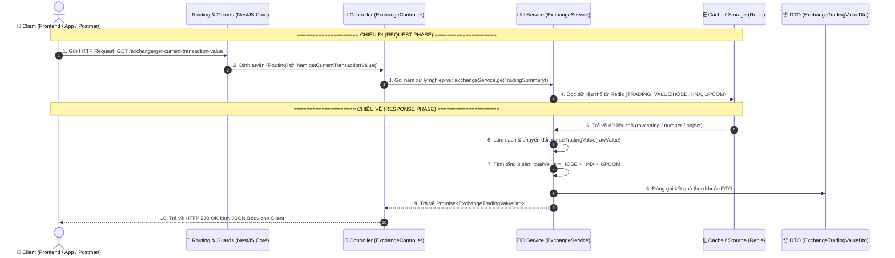
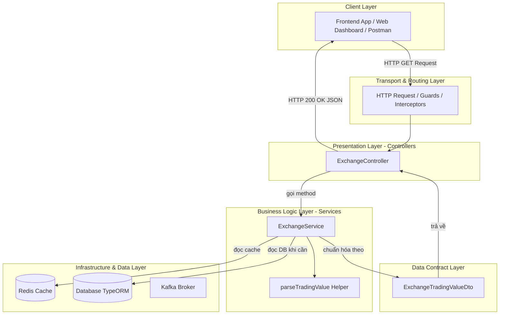

# 🚀 Luồng Dữ Liệu (Data Flow) & Kiến Trúc Chi Tiết của một API trong NestJS

Tài liệu này giải thích chi tiết, tường minh nhất về **luồng đi của dữ liệu (Data Flow)**, **vai trò và trách nhiệm của từng bộ phận** trong một API, kèm theo ví dụ thực tế từ module `Exchange` (`exchange.controller.ts`, `exchange.service.ts`, `exchange.dto.ts`).

---

## 🍽️ 1. Ẩn Dụ Thực Tế: Mô Hình Nhà Hàng Ẩm Thực

Để dễ hình dung nhất:

```
[Khách Hàng]  ---> (Order) ---> [Bồi Bàn]  ---> (Phiếu Bếp) ---> [Đầu Bếp]  ---> (Lấy Đồ) ---> [Kho / Tủ Đông]
    📱                             🤵                                👨‍🍳                                🗄️
  Client                       Controller                          Service                         Database / Redis
                                                                      │
[Khách Hàng]  <--- (Thưởng Thức) <--- [Bồi Bàn] <--- (Món Ăn DTO) <───┘
```

| Thành phần API | Ẩn dụ Nhà Hàng | Trách nhiệm tương đương |
| :--- | :--- | :--- |
| **Client** *(Frontend / Postman)* | **Khách hàng** | Gửi yêu cầu đặt món và nhận kết quả món ăn. |
| **DTO** *(Data Transfer Object)* | **Menu / Khuôn dĩa chuẩn** | Định dạng chuẩn cấu trúc dữ liệu đầu vào hoặc đầu ra. |
| **Controller** | **Bồi bàn / Tiếp tân** | Lắng nghe yêu cầu, kiểm tra cơ bản, chuyển cho Bếp xử lý, bưng món trả lại khách. |
| **Service** | **Đầu bếp trưởng** | Trái tim xử lý nghiệp vụ, tính toán, chế biến nguyên liệu thô thành kết quả chuẩn. |
| **Redis / DB / Kafka** | **Kho nguyên liệu / Tủ đông** | Nơi lưu trữ dữ liệu thô bền vững hoặc bộ nhớ đệm tốc độ cao. |
| **Module** | **Sơ đồ tổ chức nhà hàng** | Nơi đăng ký và kết nối bồi bàn nào đi với bếp nào qua Dependency Injection (DI). |

---

## 📊 2. Sơ Đồ Luồng Đi Của Data (Mermaid Diagrams)

### 2.1. Sơ đồ tuần tự từng bước (Sequence Diagram)



---

### 2.2. Sơ đồ phân tầng kiến trúc (Architecture Layers)



---

## 🔍 3. Chi Tiết Vai Trò & Phần Việc Từng Bộ Phận

### 3.1. DTO (`src/main-module/dto/exchange.dto.ts`)
* **Vai trò:** Hợp đồng dữ liệu (Data Contract).
* **Nhiệm vụ:**
  - Định nghĩa chính xác cấu trúc dữ liệu gửi lên (`Request DTO`) hoặc dữ liệu gửi về (`Response DTO`).
  - Đảm bảo tính nhất quán (Type Safety) giữa các tầng và giữa Client - Server.
* **Code thực tế trong dự án:**
  ```typescript
  export class ExchangeTradingValueDto {
      HOSE: number;
      HNX: number;
      UPCOM: number;
  }
  ```

---

### 3.2. Controller (`src/main-module/controller/exchange.controller.ts`)
* **Vai trò:** Người gác cổng / Lắng nghe Request (Presentation Layer).
* **Nhiệm vụ:**
  - Lắng nghe đường dẫn (URL) và method (`@Get`, `@Post`, `@Put`, `@Delete`).
  - Thiết lập HTTP Status Code (`@HttpCode(HttpStatus.OK)`).
  - Trích xuất dữ liệu đầu vào từ `@Body()`, `@Query()`, `@Param()`, `@Headers()`.
  - Chuyển giao việc xử lý cho Service tương ứng.
  - **Quy tắc vàng:** Không viết logic tính toán, không truy vấn DB trực tiếp tại Controller.
* **Code thực tế trong dự án:**
  ```typescript
  @Controller('exchange')
  export class ExchangeController {
    constructor(private readonly exchangeService: ExchangeService) {}

    @Get('get-current-transaction-value')
    @HttpCode(HttpStatus.OK)
    async getCurrentTransactionValue(): Promise<ExchangeTradingValueDto> {
      return await this.exchangeService.getTradingSummary();
    }
  }
  ```

---

### 3.3. Service (`src/main-module/service/exchange.service.ts`)
* **Vai trò:** Trái tim nghiệp vụ (Business Logic Layer).
* **Nhiệm vụ:**
  - Chứa toàn bộ các thuật toán, quy tắc tính toán, xử lý logic.
  - Gọi xuống tầng Data (Redis, Database, External APIs).
  - Chuẩn hóa dữ liệu thô, lọc dữ liệu rác, xử lý `null`/`undefined` (`parseTradingValue`).
  - Ghi Log hệ thống (`Logger`) để giám sát và debug.
* **Code thực tế trong dự án:**
  ```typescript
  @Injectable()
  export class ExchangeService {
    private readonly logger = new Logger(ExchangeService.name);

    async getTradingSummary(): Promise<ExchangeTradingValueDto> {
      // 1. Lấy adapter kết nối
      const redisAdapter = CacheUtils.getCacheAdapter('redis');
      
      // 2. Lấy dữ liệu thô từ Redis
      const rawHose = await redisAdapter.get('TRADING_VALUE:HOSE');
      const rawHnx = await redisAdapter.get('TRADING_VALUE:HNX');
      const rawUpcom = await redisAdapter.get('TRADING_VALUE:UPCOM');

      // 3. Chuẩn hóa dữ liệu & tính toán
      const hoseValue = this.parseTradingValue(rawHose);
      const hnxValue = this.parseTradingValue(rawHnx);
      const upcomValue = this.parseTradingValue(rawUpcom);

      // 4. Trả về đúng chuẩn DTO
      return {
        HOSE: hoseValue,
        HNX: hnxValue,
        UPCOM: upcomValue,
      };
    }
  }
  ```

---

### 3.4. Module (`src/main-module/main.module.ts`)
* **Vai trò:** Bộ khung quản lý và kết nối (Dependency Injection Container).
* **Nhiệm vụ:**
  - Khai báo danh sách các `controllers` để NestJS đăng ký các Route HTTP.
  - Khai báo danh sách `providers` (Service, Adapter...) để NestJS tự động tiêm (inject) vào Controller.
  - `imports` các module phụ trợ: Redis, Database (TypeORM), Kafka, Config.

---

## 📋 4. Bảng Phân Công Trách Nhiệm (Do's & Don'ts)

| Bộ phận | ✅ Việc NÊN LÀM (DO) | ❌ Việc TUYỆT ĐỐI TRÁNH (DON'T) |
| :--- | :--- | :--- |
| **DTO** | Khai báo trường, kiểu dữ liệu, validate (`class-validator`). | Không viết logic xử lý, không gọi Database hay hàm tính toán. |
| **Controller** | Bắt Route, bắt HTTP Header/Body/Query, gọi Service, trả Response. | Không query DB/Redis, không viết vòng lặp xử lý data phức tạp. |
| **Service** | Xử lý logic, tính toán, tương tác DB/Redis, bắt lỗi nghiệp vụ, ghi log. | Không phụ thuộc trực tiếp vào HTTP Request/Response (`req`, `res`). |
| **Module** | Gom nhóm, cấu hình dependencies, export service dùng chung. | Không chứa mã thực thi xử lý dữ liệu. |

---

## 🎯 5. Tóm Tắt 1 Câu Ghi Nhớ
> **"Client gửi yêu cầu -> Controller tiếp nhận -> Service nấu nướng & lấy nguyên liệu từ DB/Redis -> Đóng hộp chuẩn theo DTO -> Controller trao lại cho Client."**
