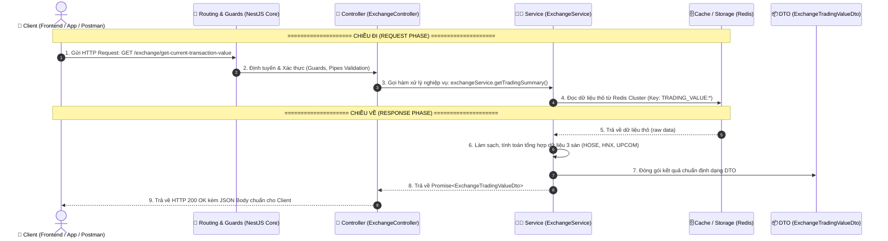

# 📚 KHO TRI THỨC KIẾN TRÚC BACKEND ENTERPRISE (BACKEND KNOWLEDGE HUB)
> **Dự án Tài liệu & Cẩm nang Kỹ thuật Thực chiến**: Java Core, Spring Boot, Base-Config Architecture (KBSV PNS) & NestJS Realtime Microservices.

[](https://www.oracle.com/java/)
[](https://spring.io/projects/spring-boot)
[](https://nestjs.com/)
[](https://www.typescriptlang.org/)
[](https://redis.io/)
[](https://kafka.apache.org/)
[](https://www.mysql.com/)

---

## 🧭 MỤC LỤC TỔNG QUAN (TABLE OF CONTENTS)

1. [🌟 Giới Thiệu Tổng Quan](#-giới-thiệu-tổng-quan)
2. [🗺️ Bản Đồ Cấu Trúc Tài Liệu (Knowledge Map)](#️-bản-đồ-cấu-trúc-tài-liệu-knowledge-map)
3. [📖 Tổng Hợp Chuyên Mục 1: Java Core & Spring Boot Toàn Diện](#-chuyên-mục-1-java-core--spring-boot-toàn-diện)
4. [🏛️ Tổng Hợp Chuyên Mục 2: Phân Tích Kiến Trúc Package `Base` & `Config`](#️-chuyên-mục-2-phân-tích-kiến-trúc-package-base--config-kbsv-pns)
5. [⚡ Tổng Hợp Chuyên Mục 3: NestJS Backend & Realtime Architecture](#-chuyên-mục-3-nestjs-backend--realtime-architecture)
6. [📊 Bảng Đối Chiếu Kiến Trúc: Spring Boot vs NestJS](#-bảng-đối-chiếu-kiến-trúc-spring-boot-vs-nestjs)
7. [🎓 Lộ Trình Học Tập Cho Intern & Developer Mới](#-lộ-trình-học-tập-cho-intern--developer-mới)
8. [🛠️ Hướng Dẫn Sử Dụng & Đóng Góp](#️-hướng-dẫn-sử-dụng--đóng-góp)

---

## 🌟 GIỚI THIỆU TỔNG QUAN

Repository này là **Bộ tài liệu cẩm nang kỹ thuật thực chiến**, chuẩn hóa toàn bộ nền tảng lý thuyết và kiến trúc code của các hệ thống Backend quy mô lớn trong lĩnh vực **Tài chính - Chứng khoán (Fintech)**. 

Toàn bộ tài liệu được đúc kết từ các dự án thực tế:
- **Hệ thống Chứng khoán KBSV PNS (Partner Account API)**: Thiết kế framework backend Java/Spring Boot đa tầng, xử lý đa nguồn dữ liệu (MySQL + Oracle Flex), bộ đệm Redis Cluster tốc độ cao, dynamic query engine và bulk operations.
- **Hệ thống Realtime Broker Dashboard**: Xây dựng kiến trúc module NestJS, TypeORM, streaming dữ liệu với Apache Kafka, caching Redis và truyền phát thời gian thực tới hàng nghìn client thông qua WebSocket Gateway.

Mỗi khái niệm trong kho tài liệu đều tuân thủ nguyên tắc sư phạm **5 yếu tố vàng**:
1. 📌 **Định nghĩa chuẩn xác (Formal Definition)**
2. ⚙️ **Bản chất kỹ thuật & Cơ chế hoạt động (Technical Mechanism)**
3. 💡 **Ẩn dụ trực quan đời sống (Real-world Metaphor)**
4. 💻 **Mã nguồn minh họa thực tế (Production Code Examples)**
5. 🎯 **Khi nào sử dụng & Giá trị mang lại (Use Cases & Best Practices)**

---

## 🗺️ BẢN ĐỒ CẤU TRÚC TÀI LIỆU (KNOWLEDGE MAP)

```
d:/Intern_Book/note_book/
├── 📄 README.md                                         <-- Cổng thông tin trung tâm & Hướng dẫn học tập
│
├── ☕ 01_JAVA_CORE_SPRING_BOOT_COMPREHENSIVE_GUIDE.md    <-- Chuyên mục 1: Java Core, Spring Boot & Annotations
│   ├── Phần 1: Nền Tảng Java Core Nâng Cao (OOP, JVM, Collections, Concurrency, Virtual Threads...)
│   ├── Phần 2: Kiến Trúc Lõi Spring Boot (IoC, DI, Bean Lifecycle, AOP, MVC, JPA, @Transactional, Security...)
│   └── Phần 3: Đại Từ Điển Annotation Toàn Diện (Core, MVC, Validation, JPA, Async, Security, Lombok...)
│
├── 🏛️ 02_BASE_AND_CONFIG_ARCHITECTURE_ANALYSIS.md       <-- Chuyên mục 2: Phân Tích Kiến Trúc Base & Config
│   ├── Phần 1: Tổng Quan Kiến Trúc 4 Tầng (Client -> Config -> Base -> Biz -> Storage)
│   ├── Phần 2: Deep Dive com.kbsv.base (BaseEntity, BaseService, JPABuilder, LangService, BulkInsert...)
│   ├── Phần 3: Deep Dive com.kbsv.config (Multi-DS, RedisCluster, SecurityChain, I18n, RestTemplate...)
│   └── Phần 4: Ma Trận Quyết Định & Quy Tắc Thiết Kế Chuẩn Enterprise
│
├── ⚡ NESTJS_API_DEVELOPMENT_GUIDE.md                   <-- Chuyên mục 3.1: Cẩm Nang Phát Triển API NestJS
│   ├── 1. Tổng Quan Kiến Trúc Modular & Submodule System
│   ├── 2. Vòng Đời Khởi Động Ứng Dụng (Application Bootstrap Lifecycle)
│   ├── 3. Vòng Đời HTTP Request & Bộ Lọc (Guards, Interceptors, Pipes, Filters)
│   ├── 4. Quy Trình Chuẩn 4 Bước Xây Dựng API Mới (DTO -> Service -> Controller -> Module)
│   ├── 5. Kỹ Thuật Lập Trình Phòng Thủ (Defensive Programming)
│   └── 6. Vận Hành, Kiểm Thử & Xử Lý Lỗi Thực Chiến (Testing, Debugging, PM2)
│
├── 🔄 API_DATA_FLOW.md                                  <-- Chuyên mục 3.2: Luồng Dữ Liệu API Chi Tiết
│   ├── 1. Ẩn Dụ Nhà Hàng Ẩm Thực (Client -> Controller -> Service -> Redis/DB -> DTO)
│   ├── 2. Sơ Đồ Tuần Tự (Sequence Diagram) & Data Flow
│   ├── 3. Bóc Tách Chi Tiết Từng Bước Trong Code Thực Tế (Module Exchange)
│   └── 4. Bảng Tra Cứu Trách Nhiệm Từng Thành Phần
│
└── 🖼️ webSocket.png                                     <-- Sơ đồ kiến trúc WebSocket Realtime Gateway
```

---

## 📖 CHUYÊN MỤC 1: JAVA CORE & SPRING BOOT TOÀN DIỆN
📁 **File chi tiết**: [01_JAVA_CORE_SPRING_BOOT_COMPREHENSIVE_GUIDE.md](file:///d:/Intern_Book/note_book/01_JAVA_CORE_SPRING_BOOT_COMPREHENSIVE_GUIDE.md)

Tài liệu cung cấp nền tảng từ cơ bản đến chuyên sâu về ngôn ngữ Java và Spring Framework:

```mermaid
mindmap
  root((Java & Spring Ecosystem))
    Java Core Nâng Cao
      OOP & 4 Trụ Cột (Đóng gói, Kế thừa, Đa hình, Trừu tượng)
      JVM Memory (Heap Eden/Survivor/Old, Metaspace, GC)
      Java Collections (HashMap Rehashing, Treeify O(log N))
      Concurrency (Threads, Locks, Virtual Threads Java 21)
      Exception Handling & Best Practices
      Generics, Reflection & Dynamic Proxy
    Kiến Trúc Lõi Spring Boot
      IoC Container & Dependency Injection
      Bean Lifecycle & Scopes (Singleton, Prototype, Request...)
      Spring AOP & CGLIB/JDK Proxy
      Spring Boot Auto-Configuration Mechanism
      Spring MVC Request Flow (Filter vs Interceptor)
      Spring Data JPA & Giải mã bẫy N+1 Query
      Transaction Management (@Transactional & Rollback Rules)
      Spring Security Filter Chain
    Đại Từ Điển Annotation
      Spring Core & DI (@Component, @Service, @Autowired...)
      Configuration & Lifecycle (@Configuration, @Bean, @Lazy...)
      Spring MVC & REST (@RestController, @RequestMapping...)
      Jakarta Validation (@NotNull, @Size, @Valid...)
      Data JPA & Hibernate (@Entity, @Table, @OneToMany...)
      Async & Scheduling (@Async, @Scheduled...)
      Spring Security (@EnableWebSecurity, @PreAuthorize...)
      Lombok Tiện Ích (@Data, @Builder, @Slf4j...)
```

### 💡 Các Điểm Nhấn Kiến Thức Nổi Bật:
- **Mô hình bộ nhớ JVM & Garbage Collection**: Giải mã phân vùng Heap (Eden, S0, S1, Old/Tenured), Metaspace và thuật toán dọn rác (G1GC, ZGC).
- **Cơ chế hoạt động của `HashMap`**: Phân tích mảng Bucket, danh sách liên kết Node, thuật toán tính Hash và cơ chế tự động chuyển thành cây đỏ đen (Red-Black Tree) khi độ dài nhánh vượt quá `TREEIFY_THRESHOLD = 8`.
- **Giải mã bẫy N+1 Query trong JPA**: Nguyên nhân gây sụt giảm hiệu năng nghiêm trọng do Lazy Loading và 3 giải pháp xử lý triệt để: `JOIN FETCH`, `@EntityGraph`, và `BatchSize`.
- **Cơ chế `@Transactional` & Bẫy Self-Invocation**: Vì sao gọi nội bộ phương thức trong cùng một class khiến Transaction hoặc AOP Aspect bị vô hiệu hóa (do bỏ qua Spring Dynamic Proxy).

---

## 🏛️ CHUYÊN MỤC 2: PHÂN TÍCH KIẾN TRÚC PACKAGE `BASE` & `CONFIG` (KBSV PNS)
📁 **File chi tiết**: [02_BASE_AND_CONFIG_ARCHITECTURE_ANALYSIS.md](file:///d:/Intern_Book/note_book/02_BASE_AND_CONFIG_ARCHITECTURE_ANALYSIS.md)

Bóc tách toàn bộ mã nguồn của 2 package nền tảng cốt lõi trong dự án **Partner Account API (KBSV PNS)**:

```mermaid
graph TB
    subgraph ClientLayer["Lớp Client / Đối Tác Ngoài"]
        Partner["Đối Tác / Ngân Hàng / Frontend"]
    end

    subgraph ConfigLayer["com.kbsv.config (Hạ Tầng & Bảo Mật)"]
        SecConfig["SecurityConfiguration<br/>(Filter Chain, Stateless JWT)"]
        I18nConf["I18nConfig & HeaderLocaleResolver<br/>(Header x-lang)"]
        RedisConf["RedisClusterConfig & HealthChecker<br/>(Lettuce Pool, Cluster Topology)"]
        DataConf["AppDatasourceConfig & FlexDatasourceConfig<br/>(MySQL + Oracle Core Flex)"]
        RestConf["RestTemplateConfig<br/>(Tracing Interceptor, Timeout)"]
        SchedConf["SchedulerConfig<br/>(ThreadPoolTaskScheduler)"]
        SwagConf["SwaggerConfig<br/>(OpenAPI 3.0 JWT Bearer)"]
    end

    subgraph BaseLayer["com.kbsv.base (Nền Tảng Tái Sử Dụng)"]
        BCtrl["BaseController&lt;T&gt;<br/>(Generic CRUD & DataTable Gateway)"]
        BSrv["BaseService&lt;T&gt;<br/>(Dynamic Repo Locator, Audit Log)"]
        BRepo["BaseEntityRepository&lt;T, ID&gt;<br/>(JpaSpecificationExecutor)"]
        BEnt["BaseEntity<br/>(id, uuid, create_date, update_date, props JSON)"]
        BuilderEngine["base.builder (JPABuilder, JPAOperation)<br/>(Dynamic Filter, JSON Query, Pagination)"]
        LangEngine["base.lang & LangService<br/>(In-memory i18n Cache O(1))"]
        LogEngine["LogService<br/>(Structured JSON MDC Logging)"]
        BulkEngine["BulkInsertService<br/>(Raw JDBC Batch Insert Siêu Tốc)"]
    end

    subgraph BizLayer["Lớp Nghiệp Vụ (Business Domain)"]
        BizCtrl["AuthController, AccountController..."]
        BizSrv["AuthService, AccountService..."]
        BizRepo["AccountRepository, CustomerRepository..."]
    end

    subgraph StorageLayer["Hệ Thống Lưu Trữ & 3rd Party"]
        MySQL[(MySQL App DB)]
        OracleCore[(Oracle Core Flex)]
        Redis[(Redis Cluster)]
    end

    ClientLayer --> ConfigLayer
    ConfigLayer --> BaseLayer
    BaseLayer --> BizLayer
    BizLayer --> StorageLayer
```



### 💡 Các Thành Phần Cốt Lõi Được Phân Tích:
1. **Generic CRUD & Dynamic Query**: `BaseController` và `BaseService` kết hợp với `base.builder` (`JPABuilder`, `JPAOperation`) cho phép tìm kiếm phân trang nhiều tiêu chí động trực tiếp từ Request Parameters mà không cần viết lặp lại câu lệnh SQL.
2. **Cơ chế Đa Ngôn Ngữ Tốc Độ Cao (`LangService`)**: Tự động tải từ điển vào `ConcurrentHashMap` trên RAM khi khởi động ứng dụng, cho phép tra cứu thông điệp phản hồi đa ngôn ngữ với độ phức tạp $O(1)$ mà không cần truy vấn lại cơ sở dữ liệu.
3. **Động Cơ Chèn Dữ Liệu Hàng Loạt Siêu Tốc (`BulkInsertService`)**: Sử dụng JDBC thuần (`PreparedStatement.addBatch()`) bỏ qua chi phí chuyển đổi của Hibernate ORM, nâng cao hiệu năng chèn dữ liệu lên đến hàng chục nghìn bản ghi mỗi giây.
4. **Cấu hình Đa Nguồn Dữ Liệu (Multi-Datasource)**: Phân tách minh bạch giữa **MySQL** (lưu trữ nghiệp vụ ứng dụng) và **Oracle Core Flex** (truy vấn dữ liệu tài khoản chứng khoán lõi).

---

## ⚡ CHUYÊN MỤC 3: NESTJS BACKEND & REALTIME ARCHITECTURE
📁 **Files chi tiết**:
- [NESTJS_API_DEVELOPMENT_GUIDE.md](file:///d:/Intern_Book/note_book/NESTJS_API_DEVELOPMENT_GUIDE.md) - Cẩm nang xây dựng và vận hành API toàn diện.
- [API_DATA_FLOW.md](file:///d:/Intern_Book/note_book/API_DATA_FLOW.md) - Bóc tách luồng dữ liệu API (Data Flow) kèm ẩn dụ trực quan.
- [webSocket.png](file:///d:/Intern_Book/note_book/webSocket.png) - Sơ đồ phân luồng kết nối WebSocket Gateway.



### 💡 Các Điểm Nhấn Kỹ Thuật Trong NestJS:
- **Kiến trúc Modular & Git Submodules**: Phân tách rõ ràng giữa các thư viện dùng chung (`broker-authen-module`, `cache-redis-module`, `kafka-module`, `ws-module`) và module nghiệp vụ (`main-module`).
- **Quy trình chuẩn 4 bước tạo API**:
  1. `DTO`: Định nghĩa khuôn dữ liệu, validation qua `class-validator`.
  2. `Service`: Xử lý nghiệp vụ, gọi Redis/DB/Kafka, áp dụng lập trình phòng thủ (Defensive Programming).
  3. `Controller`: Định tuyến, gán HTTP Decorator, Swagger document.
  4. `Module`: Đăng ký Controller & Provider vào Dependency Injection Container.
- **Lập trình phòng thủ (Defensive Programming)**: Đảm bảo API luôn hoạt động an toàn trước dữ liệu `null`, `undefined` hoặc sai kiểu từ các dịch vụ bên thứ ba bằng cách sử dụng Optional Chaining (`?.`), Nullish Coalescing (`??`), và ép kiểu an toàn.

---

## 📊 BẢNG ĐỐI CHIẾU KIẾN TRÚC: SPRING BOOT VS NESTJS

Để giúp lập trình viên chuyển đổi linh hoạt giữa hệ sinh thái **Java (Spring Boot)** và **Node.js (NestJS)**, dưới đây là bảng đối chiếu tương đương các thành phần kiến trúc:

| Khái niệm Kiến trúc | Spring Boot (Java) | NestJS (TypeScript) | Vai trò & Mục đích |
| :--- | :--- | :--- | :--- |
| **Quản lý Dependency (DI)** | Spring IoC Container (`ApplicationContext`) | NestJS DI Container (`ModuleRef`) | Tự động tiêm phụ thuộc, giảm khớp nối lỏng lẻo. |
| **Đơn vị Đóng gói** | Spring Package / `@Configuration` | `@Module({ controllers, providers })` | Gom cụm các tính năng liên quan thành một khối logic. |
| **Định tuyến & Tiếp nhận** | `@RestController`, `@GetMapping`... | `@Controller()`, `@Get()`... | Tiếp nhận HTTP Request từ client và trả về response. |
| **Xử lý Nghiệp vụ** | `@Service` Component | `@Injectable()` Service / Provider | Trái tim xử lý tính toán, logic kinh doanh. |
| **Khuôn mẫu Dữ liệu** | Java DTO / Java Record / Lombok `@Data` | TypeScript Class DTO (`class-validator`) | Kiểm tra tính hợp lệ và định hình dữ liệu vào/ra. |
| **Tương tác Cơ sở dữ liệu** | Spring Data JPA (`JpaRepository`) | TypeORM (`@EntityRepository`, `Repository`) | Ánh xạ Object - Quan hệ (ORM) và truy vấn dữ liệu. |
| **Xác thực & Ủy quyền** | `OncePerRequestFilter`, Spring Security | `CanActivate` (Guards) | Kiểm tra JWT token, vai trò người dùng (Roles/Permissions). |
| **Chuyển đổi & Validate** | Jakarta Validation (`@Valid`, `@NotNull`) | `ValidationPipe` (`class-validator`) | Kiểm tra dữ liệu đầu vào trước khi đến tay Controller. |
| **Xử lý Xuyên suốt (AOP)** | Spring AOP (`@Aspect`, `@Around`) | `NestInterceptor` / `NestMiddleware` | Ghi log thời gian thực thi, định dạng chuẩn response. |
| **Xử lý Ngoại lệ Tập trung** | `@ControllerAdvice` + `@ExceptionHandler` | `@Catch()` (Exception Filters) | Bắt ngoại lệ và chuẩn hóa JSON lỗi trả về cho Client. |

---

## 🎓 LỘ TRÌNH HỌC TẬP CHO INTERN & DEVELOPER MỚI

Để tiếp thu kiến thức một cách hiệu quả nhất, khuyến nghị học viên và intern học tập theo lộ trình 4 tuần sau:

```
┌──────────────────────────────────────────────────────────────────────────────────┐
│                             LỘ TRÌNH HỌC TẬP THỰC CHIẾN                          │
├──────────────────────────────────────────────────────────────────────────────────┤
│                                                                                  │
│  [Tuần 1: Nền tảng Core]                                                         │
│   ├── Đọc 01_JAVA_CORE... Phần 1 (OOP, JVM Memory, HashMap, Multithreading)      │
│   └── Nắm vững nguyên lý Dependency Injection & IoC                              │
│                                │                                                 │
│                                ▼                                                 │
│  [Tuần 2: Spring Boot & Data Persistence]                                        │
│   ├── Đọc 01_JAVA_CORE... Phần 2 & Phần 3 (Spring MVC, JPA, @Transactional)     │
│   └── Thực hành tra cứu Đại từ điển Annotation                                  │
│                                │                                                 │
│                                ▼                                                 │
│  [Tuần 3: Kiến trúc Base & Config Enterprise]                                   │
│   ├── Đọc 02_BASE_AND_CONFIG... (Generic BaseController, JPABuilder)             │
│   └── Phân tích mô hình Multi-Datasource (MySQL + Oracle) & Redis Cluster        │
│                                │                                                 │
│                                ▼                                                 │
│  [Tuần 4: NestJS & Realtime Data Streaming]                                      │
│   ├── Đọc API_DATA_FLOW.md & NESTJS_API_DEVELOPMENT_GUIDE.md                     │
│   └── Thực hành quy trình 4 bước xây dựng API, kết nối Kafka & WebSocket         │
│                                                                                  │
└──────────────────────────────────────────────────────────────────────────────────┘
```

---

## 🛠️ HƯỚNG DẪN SỬ DỤNG & ĐÓNG GÓP

### 1. Cách Duyệt Tài Liệu
- Mở trực tiếp các liên kết Markdown trong trình soạn thảo (VSCode, Antigravity IDE) hoặc trên GitHub giao diện Web.
- Sử dụng sơ đồ **Mermaid Diagram** được tích hợp sẵn để hình dung nhanh luồng xử lý trước khi đi sâu vào mã nguồn.

### 2. Quy Chuẩn Đóng Góp (Contribution Guidelines)
- Khi bổ sung kiến thức hoặc cập nhật tài liệu mới:
  - Giữ nguyên cấu trúc định dạng chuẩn mực (Định nghĩa -> Bản chất -> Ẩn dụ -> Code -> Lưu ý).
  - Đảm bảo mã nguồn ví dụ đã được kiểm tra tính đúng đắn.
  - Cập nhật mục lục tại file tương ứng và liên kết tại [README.md](file:///d:/Intern_Book/note_book/README.md).

---

<div align="center">
  <sub>Tài liệu được biên soạn và chuẩn hóa bởi <b>Antigravity AI Assistant</b> • Kho kiến thức Backend Thực chiến KBSV</sub>
</div>
